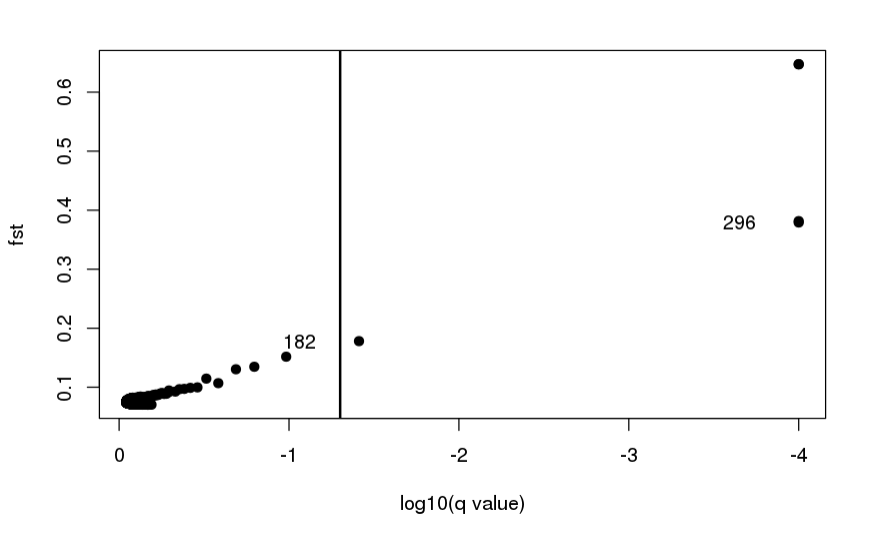

# Week7_Fst_Outliers.Girard

Goal: 

Use simulated data to:
1. Filter and subset SNPs using dDocent
2. Use filtered dataset to search for outliers using Fst and various programs
3. Output plots of Fst outlier analysis and produce a markdown document.

## Setting up environment

Making initial directories, linking files, and producing the conda environment

Starting working directory `/home/jgirard`

````
```bash
mkdir wk7
cd wk7

ln -s /home/BIO594/Exercises/Week07_and_Week_08/simulated/* . #data file location

mamba create -n wk7ddocent ddocent

conda activate wk7ddocent
```
````
Start `dDocent`

````
```bash
dDocent
```
````
Settings
* Processors 20
* Max mem 0
* Trimming yes
* Assembly yes
* Type of Assembly PE
* Clusting sim% 0.9
* Mapping reads yes
* mapping match value 1
* Mapping mismatch val 4
* Gap open penalty 6
* Calling SNPs yes

dDocent output

````
```bash
dDocent has finished with an analysis in /home/jgirard/wk7

After filtering, kept 2978 out of a possible 3025 Sites
```
````
>2978 SNPs

## SNP Filtering 

Making new directory, linking data, running vcf tools
````
```bash
mkdir Filter
cd Filter

ln -s ../TotalRawSNPs.vcf .

vcftools --vcf TotalRawSNPs.vcf --max-missing 0.5 --maf 0.001 --minQ 20 --recode --recode-INFO-all --out TRS
```
````
> Kept 2993 of 3025 SNPs

Adding minDP filter
````
```bash
vcftools --vcf TRS.recode.vcf --minDP 5 --recode --recode-INFO-all --out TRSdp5
```
````
* `minDP` setting the minimum depth e.g. < x reads

>Kept 2993 of 2993

Filtering SNPs based on the percentatge of missing data. Using a 5%(0.05) value for this. Not sure why the popnumber is set to 1 the original data had pops A-D (4) will run both ways and see how this changes things
````
```bash
pop_missing_filter.sh TRSdp5.recode.vcf ../popmap 0.05 1 TRSdp5p05
pop_missing_filter.sh TRSdp5.recode.vcf ../popmap 0.05 4 TRSdp5p05.4p
```
````
> One pop 2816 of 2993

> Four pops 2978 of 2993 retains more SNPs.

Further dDocet filtering

````
```bash
dDocent_filters TRSdp5p05.recode.vcf TRSdp5p05 #one pop

dDocent_filters TRSdp5p05.4p.recode.vcf TRSdp5p05.4p #four popns
```
````
dDocent prompts 
>Are reads expected to overlap?  In other words, is fragment size less than 2X the read length?

I do not know in this simulated dataset and will answer "no"
Printed figure visually is different yet the values are the same. For one pop analysis.

More propmts follow
* changing max mean depth cutoff to 75

> Remaining SNPs 2208 one pop

> Remaining SNps 2349 four pops

Further vcf filtering - INDEL removal. Initially using Jon's code to change file names. 

````
```bash
vcfallelicprimitives -k -g TRSdp5p05.FIL.recode.vcf |sed 's:\.|\.:\.\/\.:g' > TRSdp5p05F.prim
vcftools --vcf TRSdp5p05F.prim --recode --recode-INFO-all --remove-indels --out SNP.TRSdp5p05F

vcfallelicprimitives -k -g TRSdp5p05.4p.FIL.recode.vcf |sed 's:\.|\.:\.\/\.:g' > TRSdp5p05F.4p.prim
vcftools --vcf TRSdp5p05F.4p.prim --recode --recode-INFO-all --remove-indels --out SNP.TRSdp5p05F.4p
```
````
> 1918 of 2364 one pop

> 2030 of 2517 four pops

Hardy-Weinburg Eq filter

````
```bash
filter_hwe_by_pop.pl -v SNP.TRSdp5p05F.recode.vcf -p ../popmap -c 0.5 -out SNP.TRSdp5p05FHWE

filter_hwe_by_pop.pl -v SNP.TRSdp5p05F.4p.recode.vcf -p ../popmap -c 0.5 -out SNP.TRSdp5p05FHWE.4p
```
````
> 1918 of 1918 one pop

> 2030 of 2030 4 pops

Back to vcf tools to add the maf filter (minor allele frequencies). Threshold set to 5%

````
```bash
vcftools --vcf SNP.TRSdp5p05FHWE.recode.vcf --maf 0.05 --recode --recode-INFO-all --out SNP.TRSdp5p05FHWEmaf05

vcftools --vcf SNP.TRSdp5p05FHWE.4p.recode.vcf --maf 0.05 --recode --recode-INFO-all --out SNP.TRSdp5p05FHWEmaf05.4p
```
````
* `--maf` include only sites with minor allele frequency greater than or equal to (this is a proportion)

> 943 of 1918 one pop

> 1000 of 2030 four pops

## Converting from VCF to other outputs

Uses PGDspider config file and file to map individuals to popns

````
```bash
cp /home/BIO594/DATA/Week7/example/BSsnp.spid .

ln -s ../popmap .
```
````
PGDspider needs to run in a java environemt

````
```bash
java -jar /usr/local/bin/PGDSpider2-cli.jar -inputfile SNP.TRSdp5p05FHWEmaf05.recode.vcf -outputfile SNP.TRSdp5p05FHWEBS -spid BSsnp.spid #one pop

java -jar /usr/local/bin/PGDSpider2-cli.jar -inputfile SNP.TRSdp5p05FHWEmaf05.4p.recode.vcf -outputfile SNP.TRSdp5p05FHWEBS.4p -spid BSsnp.spid #four pop
```
````

## Outlier Detection

### BayScan

[Link to BayScan](http://cmpg.unibe.ch/software/BayeScan/)

````
```bash
BayeScan2.1_linux64bits SNP.TRSdp5p05FHWEBS -nbp 30 -thin 20

BayeScan2.1_linux64bits SNP.TRSdp5p05FHWEBS.4p -nbp 30 -thin 20 #four pop
```
````
This output can be used in Rstudio.

Manually copied the `plot_R.r` from `wk7` into `Filter` directory then plotted

> Ask in class about file names and outputs for Bayscan. It seems that the code that was run in class works and the files were created. However, it looks like multiple readable files `_fst.txt` are made for one analysis. The bayscan documentation doesn't say it outputs multiple of these kinds of text files. It is my interpretation that three different files are made each with an extension to the original name. If you look at the code the plotted figure doesn't have the WEBS in the name, yet, bayscan was run with the file we make with WEBS in the name. The output shows a normal `_fst.txt` file and a WEBS `_fst.txt` file. Further when I run this command again on the four popultion data the program runs however I do not see any output with `.4p_fst.txt` file names.

*Note above text – analysis for bayscan now follows the class pipeline, drops the four popultion analysis and follows the WEBS, non-WEBS output split*

### Open Rstudio
````
```r
source("plot_R.r")
plot_bayescan("SNP.TRSdp5p05FH_fst.txt")

source("plot_R.r")
plot_bayescan("SNP.TRSdp5p05FHWEB_fst.txt")
```
````

#### Output Figures



One Population non-WEBS
> Outliers: SNPs 182, 295, 296, 651, 652.
> nb_outliers: 5

~~*Ask in class about nb outliers*~~ nb = "number of"


WEBS
> Outliers: 189, 312, 313, 697 698
> nb_outliers: 5

## More outlier detection and filtering

Other analytical methods will need the SNPs limited to those that are biallelic.

````
```bash
vcftools --vcf SNP.TRSdp5p05FHWEmaf05.recode.vcf --max-alleles 2 --recode --recode-INFO-all --out SNP.TRSdp5p05FHWE2A

vcftools --vcf SNP.TRSdp5p05FHWEmaf05.4p.recode.vcf --max-alleles 2 --recode --recode-INFO-all --out SNP.TRSdp5p05FHWE2A.4p
```
````
> 940 of 943 one pop

> 996 of 1000 four pops


## PCA Adapt
Runs solely in R [documentation](https://bcm-uga.github.io/pcadapt/)

### R Code

```r
library(pcadapt) # load library

#Loading biallelic data
#One Pop
PCA.1p.dat <- read.pcadapt("SNP.TRSdp5p05FHWE2A.recode.vcf", type = "vcf")
#Four pops
PCA.4p.dat <- read.pcadapt("SNP.TRSdp5p05FHWE2A.4p.recode.vcf", type = "vcf")

#Creating One Pop PCA
#Create first PCA
x <- pcadapt(input = PCA.1p.dat, K = 20)

#Plot the likelihoods
plot(x, option = "screeplot")
#Plot Plot the likelihoods for only first 10 K
plot(x, option = "screeplot", K = 10)

#Create population designations
PCA.1p.names <- c(rep("POPA", 20),rep("POPB", 20),rep("POPC", 20), rep("POPD",20))

#Plot the actual PCA (first two PCAs)
plot(x, option = "scores", pop = PCA.1p.names)
#Plot PCA with PCA 2 and PCA 3
plot(x, option = "scores", i = 2, j = 3, pop = PCA.1p.names)
#Plot PCA with PCA 3 and PCA 4
plot(x, option = "scores", i = 3, j = 4, pop = PCA.1p.names)

#Redo PCA with only 3 K
x <- pcadapt(PCA.1p.dat, K = 3)

summary(x)
```

One Pop Outputs

Variation explained figures


PCAs


Summary: Population D shows the greatest difference of the 4 populations along the main axis of explained variance (PC1). Population C begins to cluster from the remaining 2 along PC2. PC2 v PC3 shows a better spread of the data in one space however the clustering is minimal. PC 3v PC4 is rather unhelpful. Visually a 3-D PCA of 1, 2, 3 would give the most clear picture of these clusters.

Four population analysis figures

Variation explained figures


PCAs


Summary: Conclusions between the different analysis types remains the same. Note that in the four popn analysis the PC2 axis is inverted and the PC3 axis has been slightly compressed (in the spread of points) than in the single popn analysis. Overally we are concerned with spacing between points here and there are no major differences among the groups relative to one another. Futher without a stress metric on these PCAs it is hard to know how reliable the present visualization truely is. The differences may be a product of the multivariate permuatation process instead of the differential filtering.

> Moving forward the four popn comparison will be dropped.

### R Code
```r
#Start looking for outliers

##Make Manhattan Plot

plot(x , option = "manhattan")

#Make qqplot

plot(x, option = "qqplot", threshold = 0.1) #using alpha threshold

# Look at P-value distribution

plot(x, option = "stat.distribution") # Histogram

# Set FDR

library(qvalue)
qval <- qvalue(x$pvalues)$qvalues
alpha <- 0.1

# Saving outliers

outliers <- which(qval < alpha)

# Testing for library effects

PCA.1p.names <- c(rep("LIB1", 40),rep("LIB2", 40)) #coloring based on lib prep
x <- pcadapt(input = PCA.1p.dat, K = 20)

plot(x, option = "scores", pop = PCA.1p.names)
plot(x, option = "scores", i = 2, j = 3, pop = PCA.1p.names)

x <- pcadapt(PCA.1p.dat, K = 2) #plotting PCA

summary(x)

plot(x , option = "manhattan") #manhattan plot
plot(x, option = "qqplot", threshold = 0.1) #Plotting qqp with alpha threshold

plot(x, option = "stat.distribution") # plotting histograms

```
Outputs

Showing the last set of plots made after thresholding alpha 0.1.


## Outflank
[documentation](https://github.com/whitlock/OutFLANK)

### R Code

```r
library(OutFLANK)  # outflank package
library(vcfR)
library(bigsnpr)   # package for LD pruning

my_vcf <- read.vcfR("Filter/SNP.TRSdp5p05FHWE2A.recode.vcf") # r is unable to find this file despite it being listed in the working directory. Needs the file folder `Filter` listed in the path despite `Filter` being the present working directory.


geno <- extract.gt(my_vcf) # Character matrix containing the genotypes

position <- getPOS(my_vcf) # Positions in bp

chromosome <- getCHROM(my_vcf) # Chromosome information

G <- matrix(NA, nrow = nrow(geno), ncol = ncol(geno))# matrix with the same number of rows and columns as the genome charater matrix

#####I Do not understand the code block below. Building or subsetting the G matrix? Might be changing values of cells based on the critera listed. Looks like based on the presence or absence of an allele.
G[geno %in% c("0/0", "0|0")] <- 0
G[geno  %in% c("0/1", "1/0", "1|0", "0|1")] <- 1
G[geno %in% c("1/1", "1|1")] <- 2

G[is.na(G)] <- 9

head(G[,1:10])
################

pop <- read.table("~/wk7/popmap", header=FALSE)
pop <- pop$V2 #pop table is now only the v2 col

#Making fst and distance matricies from variables above

my_fst <- MakeDiploidFSTMat(t(G), locusNames = paste0(chromosome,"_", position), popNames = pop)

my_dist <- OutFLANK(my_fst, NumberOfSamples = 4, qthreshold=0.1, RightTrimFraction=0.1, LeftTrimFraction=0.1)

#Creating output plots

OutFLANKResultsPlotter(my_dist)

plot(my_dist$results$FST, col=as.numeric(as.factor(chromosome))) #color by chromosome


my_dist$results[which(my_dist$results$OutlierFlag == TRUE),]
```
### Output


## BayEnv2

[Documentation](https://bitbucket.org/tguenther/bayenv2_public/src)

Step one create proper file output for BayEnv

````
```bash
cp /home/BIO594/DATA/Week7/example/SNPBayEnv.spid . #copying from jon's files for class. Need to run command

cp /home/BIO594/DATA/Week7/example/environ . #Same comment as above

java -jar /usr/local/bin/PGDSpider2-cli.jar -inputfile SNP.TRSdp5p05FHWE2A.recode.vcf -outputfile SNP.TRSdp5p05FHWEBayEnv.txt -spid SNPBayEnv.spid 
```
````
Use BayEnv to create a covariance matrix

````
```bash
bayenv2 -i SNP.TRSdp5p05FHWEBayEnv.txt -p 4 -k 100000 -r 63479 > matrix.out
```
````
Taking the last interation of 100,000

````
```bash
tail -5 matrix.out | head -4 > matrix
```
````
Using the envi factor file with the new matrix

````
```bash
cat environ
```
````
Our output matches Jon's!
>The environmental files are standardized environmental data with each line representing an environemtal factor with the value for each population tab delimited. This dummy file has 2 variables for 4 populations

Calculating the Bayes Factor for each SNP for each envi variable

````
```bash
ln -s /usr/local/bin/bayenv2 .

calc_bf.sh SNP.TRSdp5p05FHWEBayEnv.txt environ matrix 4 10000 2
```
````
Converting Output for R

````
```bash
paste <(seq 1 923) <(cut -f2,3 bf_environ.environ ) > bayenv.out

cat <(echo -e "Locus\tBF1\tBF2") bayenv.out > bayenv.final

##Getting error in R that states the line 924 doesn't have three fields like all the others. Upon inspection below 924 the first column is empty. 

#Removing rows 925 and up

sed '925, 942d' bayenv.final > bayenv.final.sub
```
````
Transition to R and slop the data in

### R Code

```r
table_bay <- read.table("bayenv.final.sub",header=TRUE)
plot(table_bay$BF1)

table_bay[which(table_bay$BF1 > 100),]
```

### Output

> Outlier loci: 2 Locus 648 and 649


Goals Complete!
