# Week 7 take home problem sets

## Goals:
1) Call SNPS 
2) Filter SNPS
3) Perform and document all analysis done in class
4) Upload to github 

## Setting up the conda environment

Create conda env for week 7 work uploading ddocent

```
cd repos/BIO594_work/Week7/
conda create -n week7 ddocent
conda activate week7
```

Link to the fq files from another BIO594 folder

```
ln -s /home/BIO594/Exercises/Weekd
```
## Intital docent run and first pass at filtering
Run docent on the fq files in hte directory with the fq files with proper name conventions

```bash
dDocent
```

Filter using vcftools copied from a similar command to Week 6 tutorial. We are calculating mor missingness, allele frequency, and quality. The --recode flag tells the program to write a new vcf file with the filters, --recode-INFO-all keeps all the INFO flags from the old vcf file in the new one. Lastly --out designates the name of the output

```bash
mkdir Filter
cd Filter/
ln -s ../TotalRawSNPs.vcf .
vcftools --vcf TotalRawSNPs.vcf --max-missing 0.5 --maf 0.001 --minQ 20 --recode --recode-INFO-all --out TRS
```

Filter using a minimum depth of 5

```bash
vcftools --vcf TRS.recode.vcf --minDP 5 --recode --recode-INFO-all --out TRSdp5
```

The pop_missing_filter is a script to automate much of the filter process.

```bash
pop_missing_filter.sh TRSdp5.recode.vcf ../popmap 0.05 1 TRSdp5p05
```

Use dDocent filter 

```bash
dDocent_filters TRSdp5p05.recode.vcf TRSdp5p05
```
Number of sites filtered based on allele balance at heterozygous loci, locus quality, and mapping quality depth

 538 of 3196 

Are reads expected to overlap?  In other words, is fragment size less than 2X the read length?  Enter yes or no.

yes

Is this from a mixture of SE and PE libraries? Enter yes or no.

no

Number of additional sites filtered based on properly paired status

 0 of 2658 

Number of sites filtered based on high depth and lower than 2*DEPTH quality score

 214 of 2658 


                                                                                                                        
                                                                                                                        
                                               Histogram of mean depth per site                                         
      160 +---------------------------------------------------------------------------------------------------------+   
          |  +     +    +     +    +     +    +     +    +     +     +    +     +    +     +    +  *  +    +     +  |   
          |                                               'meandepthpersite' using (bin($1,binwidth*):(1.0) ******* |   
      140 |-+                                                                                    ***              +-|   
          |                                                                                      *****              |   
          |                                                                                  *********              |   
      120 |-+                                                                                *********            +-|   
          |                                                                                  ***********            |   
          |                                                                                  ***********            |   
      100 |-+                                                                                ***********          +-|   
          |                                                                                 ************            |   
       80 |-+                                                                             **************          +-|   
          |                                                                               **************            |   
          |                                                                              ***************            |   
       60 |-+                                                                            *************** **       +-|   
          |                                                                              ******************         |   
          |                                                                             *******************         |   
       40 |-+                                                                        ** *******************       +-|   
          |                                                                         ***********************         |   
          |                                                                         ***********************         |   
       20 |-+                                                                     ************************** **   +-|   
          |                                                                       ******************************    |   
          |  +     +    +     +    +     +    +     +    +  *******  +    +   **+ *******************************+ *|   
        0 +---------------------------------------------------------------------------------------------------------+   
             14    21   28    35   42    49   56    63   70    77    84   91    98  105   112  119   126  133   140     
                                                          Mean Depth                                                    
                                                                                                                        
If distrubtion looks normal, a 1.645 sigma cutoff (~90% of the data) would be 10944.153855. The 95% cutoff would be 131. Would you like to use a different maximum mean depth cutoff than 131, yes or no

      no

Number of sites filtered based on maximum mean depth

      291 of 2658 

Number of sites filtered based on within locus depth mismatch

      10 of 2367 

Total number of sites filtered

      839 of 3196 

Remaining sites

      2357 

**The final Filtered VCF file is called TRSdp5p05.FIL.recode.vcf. Filter stats stored in TRSdp5p05.filterstats**

## Filtering by Hardy Weinberg equilibrium

We will filter SNPs by population specific to HWE. For the first we will convert our variant calls to SNPs using a sub program of vcftools. The second we will feed the VCF output into VCFtools to remove indels.

```
vcfallelicprimitives -k -g TRSdp5p05.FIL.recode.vcf |sed 's:\.|\.:\.\/\.:g' > TRSdp5p05F.prim

vcftools --vcf TRSdp5p05F.prim --recode --recode-INFO-all --remove-indels --out SNP.TRSdp5p05F

After filtering, kept 80 out of 80 Individuals
Outputting VCF file...
After filtering, kept 1956 out of a possible 2545 Sites
Run Time = 0.00 seconds
```

We will use a perl script to apply the HWE filter using a population map file we provide.

```
filter_hwe_by_pop.pl -v SNP.TRSdp5p05F.recode.vcf -p ../popmap -c 0.5 -out SNP.TRSdp5p05FHWE
Kept 1956 of a possible 1956 loci (filtered 0 loci)
```

This next section is going to use vcftools to filter the HWE curated dataset by minor allele freyquency using the -maf filter set at 0.05.

```
vcftools --vcf SNP.TRSdp5p05FHWE.recode.vcf --maf 0.05 --recode --recode-INFO-all --out SNP.TRSdp5p05FHWEmaf05

After filtering, kept 80 out of 80 Individuals
Outputting VCF file...
After filtering, kept 908 out of a possible 1956 Sites
Run Time = 0.00 seconds
```

Convert output using pdgspider with specific config files. We use PDGspider to convert VCF file output to something Bayescan can use.

First we need to copy the PGDspider config file and file to map individuals to population

```
cp /home/BIO594/DATA/Week7/example/BSsnp.spid .
ln -s ../popmap .
```

Now we run PGDspider using a jar file and the specific .spid file

```
java -jar /usr/local/bin/PGDSpider2-cli.jar -inputfile SNP.TRSdp5p05FHWEmaf05.recode.vcf -outputfile SNP.TRSdp5p05FHWEBS -spid BSsnp.spid
```

Use Bayescan to detect Fst outliers within the dataset

```
BayeScan2.1_linux64bits SNP.TRSdp5p05FHWEBS -threads 20 -nbp 30 -thin 20
```

## Open Rstudio

Initalize the given plot_R.r file and do a dry plot of the bayescan txt file

```
source("plot_R.r")
plot_bayescan("SNP.TRSdp5p05FH_fst.txt")
```

## More outlier Detection on the server

For all other analyses, we need to limit SNPs to only those with two alleles:

```
vcftools --vcf SNP.TRSdp5p05FHWEmaf05.recode.vcf --max-alleles 2 --recode --recode-INFO-all --out SNP.TRSdp5p05FHWE2A
```

## PCAdapt

This program runs entirely in R and has excellent [documentation](https://bcm-uga.github.io/pcadapt/)


## Open Rstudio to do some PCA's

R code:

```R
#Load pcadapt library
library(pcadapt)

#load our VCF file into R
filename <- read.pcadapt("SNP.TRSdp5p05FHWE2A.recode.vcf", type = "vcf" )

#Create first PCA
x <- pcadapt(input = filename, K = 20)

#Plot the likelihoods
plot(x, option = "screeplot")
```
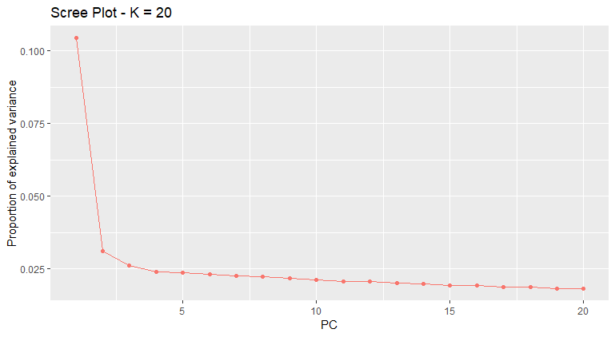

```R
#Plot Plot the likelihoods for only first 10 K
plot(x, option = "screeplot", K = 10)
```

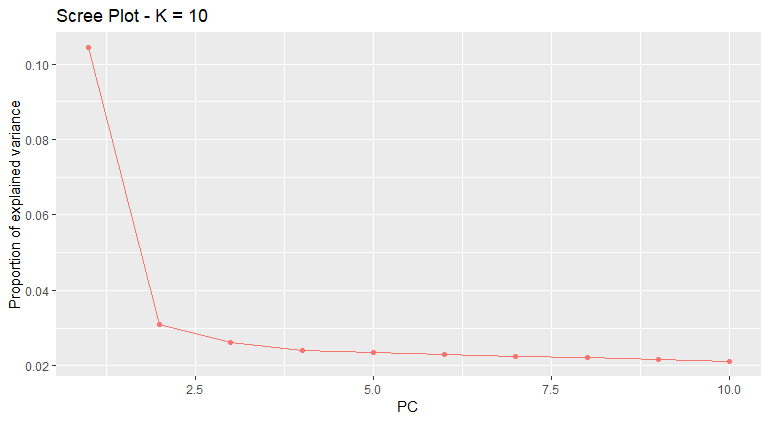

```R
#Create population designations
poplist.names <- c(rep("POPA", 20),rep("POPB", 20),rep("POPC", 20), rep("POPD",20))

#Plot the actual PCA (first two PCAs)
plot(x, option = "scores", pop = poplist.names)
```

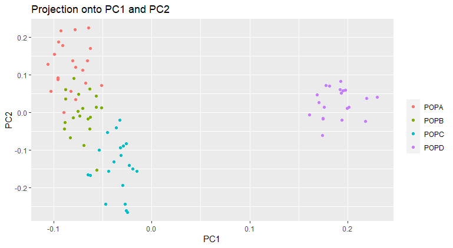

```R
#Plot PCA with PCA 2 and PCA 3
plot(x, option = "scores", i = 2, j = 3, pop = poplist.names)
```

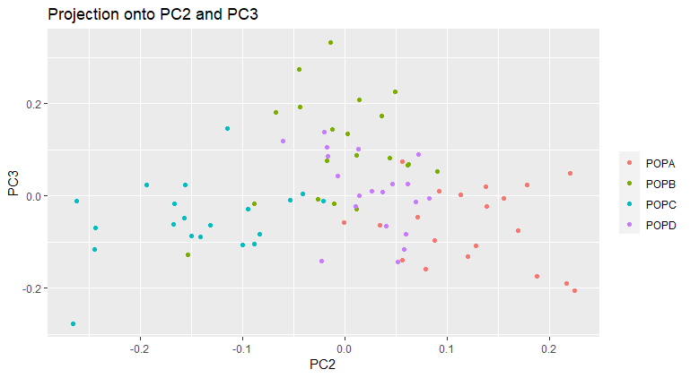

```R
#Plot PCA with PCA 3 and PCA 4
plot(x, option = "scores", i = 3, j = 4, pop = poplist.names)
```

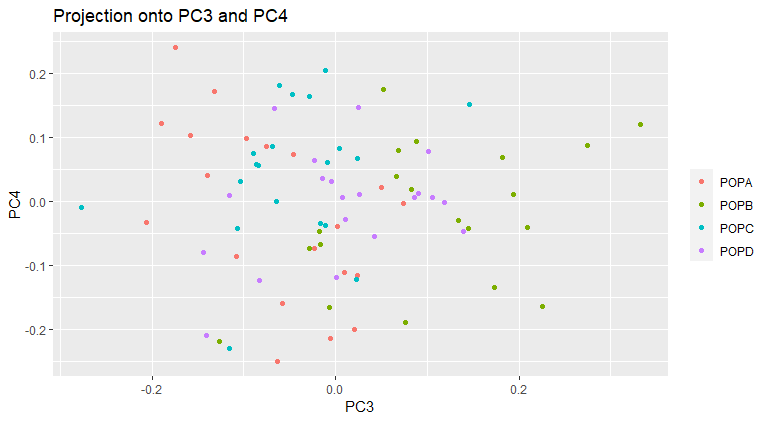

```R
#Redo PCA with only 3 K
x <- pcadapt(filename, K = 3)

summary(x)


                Length Class  Mode   
scores           240   -none- numeric
singular.values    3   -none- numeric
loadings        2295   -none- numeric
zscores         2295   -none- numeric
af               765   -none- numeric
maf              765   -none- numeric
chi2.stat        765   -none- numeric
stat             765   -none- numeric
gif                1   -none- numeric
pvalues          765   -none- numeric
pass             765   -none- numeric
```


## Make some graphs

```R
#Make Manhattan Plot
plot(x , option = "manhattan")
```

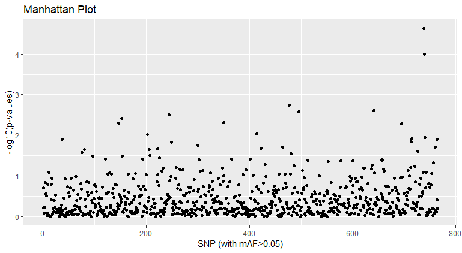

```R
#Make qqplot
plot(x, option = "qqplot", threshold = 0.1)
```

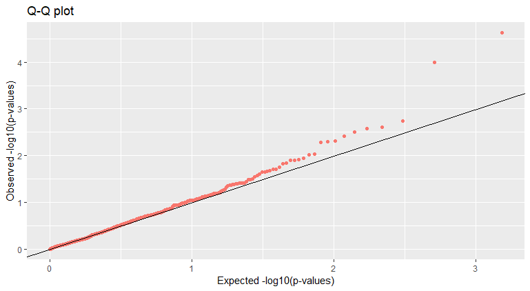

```R
# Look at P-value distribution
plot(x, option = "stat.distribution")
```

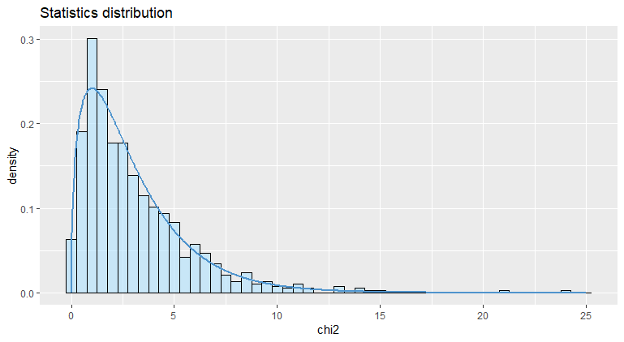

## Now lets filter for some outliers

```R
# Set FDR
library(qvalue)
qval <- qvalue(x$pvalues)$qvalues
alpha <- 0.1

# Save outliers
outliers <- which(qval < alpha)

# Testing for library effects
poplist.names <- c(rep("LIB1", 40),rep("LIB2", 40))
x <- pcadapt(input = filename, K = 20)

plot(x, option = "scores", pop = poplist.names)
```

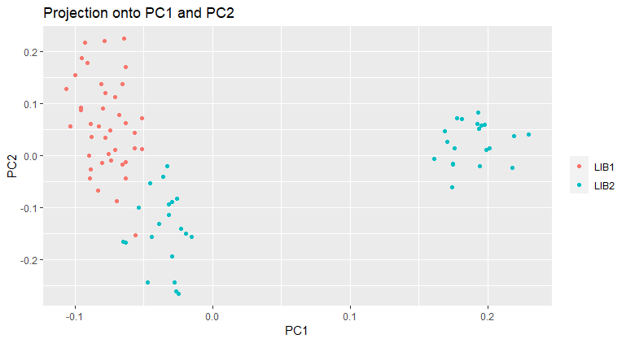


```R
plot(x, option = "scores", i = 2, j = 3, pop = poplist.names)
```

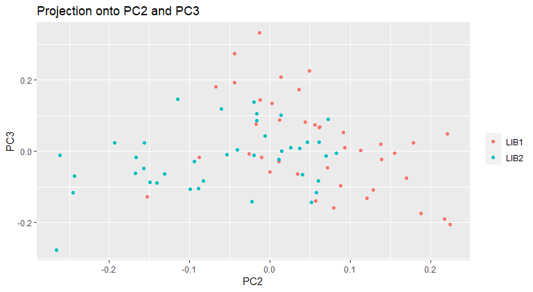

```R
x <- pcadapt(filename, K = 2)

summary(x)

                Length Class  Mode   
scores           160   -none- numeric
singular.values    2   -none- numeric
loadings        1530   -none- numeric
zscores         1530   -none- numeric
af               765   -none- numeric
maf              765   -none- numeric
chi2.stat        765   -none- numeric
stat             765   -none- numeric
gif                1   -none- numeric
pvalues          765   -none- numeric
pass             765   -none- numeric
```

## Lets creat some more of those alternative graphs to look at our data

```R
plot(x , option = "manhattan")
```

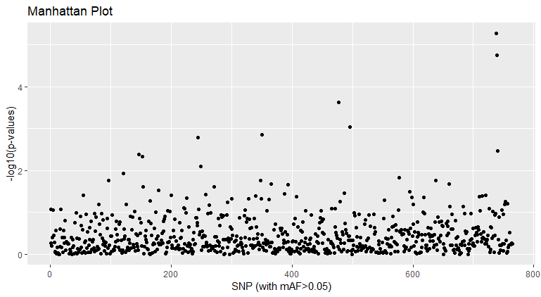

```R
plot(x, option = "qqplot", threshold = 0.1)
```

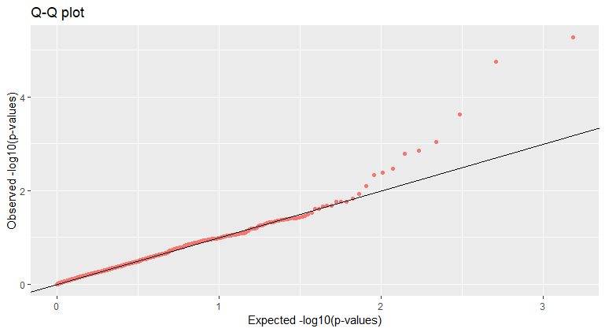

```R
plot(x, option = "stat.distribution")
```

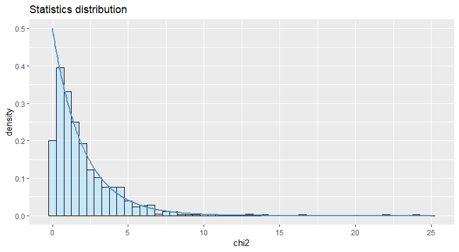

## We are going to apply OutFLANK which is a procedure to find Fst outliers based on an inferred distribution of neutral Fst

```R
library(qvalue)
qval <- qvalue(x$pvalues)$qvalues
alpha <- 0.1
outliers <- which(qval < alpha)
```

### R code for running Outflank
See documentation [here](https://github.com/whitlock/OutFLANK)

There are some funky installs for using it locally which I will drop [here](http://rstudio-pubs-static.s3.amazonaws.com/305384_9aee1c1046394fb9bd8e449453d72847.html)

```R
library(OutFLANK)  # outflank package
library(vcfR)
library(bigsnpr)   # package for LD pruning

my_vcf <- read.vcfR("SNP.TRSdp5p05FHWE2A.recode.vcf")

Scanning file to determine attributes.
File attributes:
  meta lines: 64
  header_line: 65
  variant count: 906
  column count: 89
Meta line 64 read in.
All meta lines processed.
gt matrix initialized.
Character matrix gt created.
  Character matrix gt rows: 906
  Character matrix gt cols: 89
  skip: 0
  nrows: 906
  row_num: 0
Processed variant: 906
All variants processed

geno <- extract.gt(my_vcf) # Character matrix containing the genotypes
position <- getPOS(my_vcf) # Positions in bp
chromosome <- getCHROM(my_vcf) # Chromosome information

G <- matrix(NA, nrow = nrow(geno), ncol = ncol(geno))

G[geno %in% c("0/0", "0|0")] <- 0
G[geno  %in% c("0/1", "1/0", "1|0", "0|1")] <- 1
G[geno %in% c("1/1", "1|1")] <- 2

G[is.na(G)] <- 9

head(G[,1:10])

pop <- read.table("~/week7/popmap", header=FALSE)
pop <- pop$V2


my_fst <- MakeDiploidFSTMat(t(G), locusNames = paste0(chromosome,"_", position), popNames = pop)
```

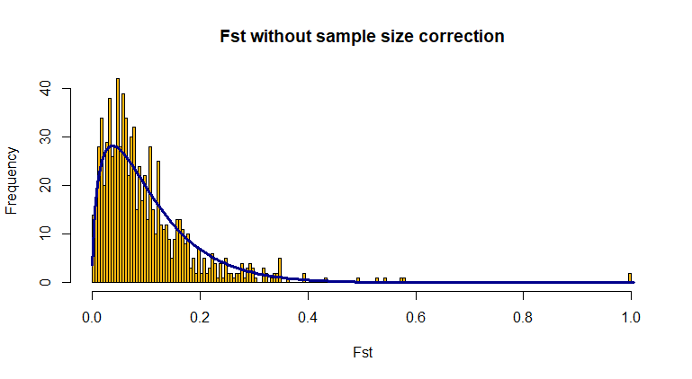

```R
my_dist <- OutFLANK(my_fst, NumberOfSamples = 4, qthreshold=0.1, RightTrimFraction=0.1, LeftTrimFraction=0.1)

OutFLANKResultsPlotter(my_dist)


                LocusName  He FST        T1
850 dDocent_Contig_984_86 0.5   1 0.3333333
851 dDocent_Contig_984_89 0.5   1 0.3333333
           T2 FSTNoCorr  T1NoCorr  T2NoCorr
850 0.3333333         1 0.3333333 0.3333333
851 0.3333333         1 0.3333333 0.3333333
    meanAlleleFreq indexOrder GoodH      qvalues
850            0.5        850 goodH 0.0007293536
851            0.5        851 goodH 0.0007293536
         pvalues pvaluesRightTail OutlierFlag
850 3.473112e-06     1.736556e-06        TRUE
851 3.473112e-06     1.736556e-06        TRUE

plot(my_dist$results$FST, col=as.numeric(as.factor(chromosome)))
```

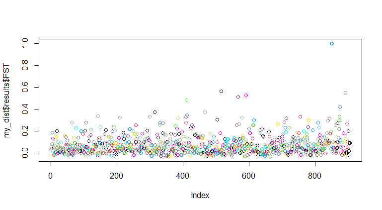

```R
my_dist$results[which(my_dist$results$OutlierFlag == TRUE),]

                LocusName  He FST        T1
850 dDocent_Contig_984_86 0.5   1 0.3333333
851 dDocent_Contig_984_89 0.5   1 0.3333333
           T2 FSTNoCorr  T1NoCorr  T2NoCorr
850 0.3333333         1 0.3333333 0.3333333
851 0.3333333         1 0.3333333 0.3333333
    meanAlleleFreq indexOrder GoodH      qvalues
850            0.5        850 goodH 0.0007293536
851            0.5        851 goodH 0.0007293536
         pvalues pvaluesRightTail OutlierFlag
850 3.473112e-06     1.736556e-06        TRUE
851 3.473112e-06     1.736556e-06        TRUE
```

## BayEnv2

[Documentation](https://bitbucket.org/tguenther/bayenv2_public/src)

First, convert vcf to BayEnv input
```
cp /home/BIO594/DATA/Week7/example/SNPBayEnv.spid .
cp /home/BIO594/DATA/Week7/example/environ .
java -jar /usr/local/bin/PGDSpider2-cli.jar -inputfile SNP.TRSdp5p05FHWE2A.recode.vcf -outputfile SNP.TRSdp5p05FHWEBayEnv.txt -spid SNPBayEnv.spid
```

```
WARN  22:05:19 - PGDSpider configuration file not found! Loading default configuration.
initialize convert process...
read input file...
read input file done.
write output file...
write output file done.
```

Run BayEnv to generate the covariance matrix

```
bayenv2 -i SNP.TRSdp5p05FHWEBayEnv.txt -p 4 -k 100000 -r 63479 > matrix.out
```

This code generates 100,000 iterations.  We only need the last one.

```
tail -5 matrix.out | head -4 > matrix
```

With the matrix we will use our environmental factor file:

```
cat environ

-0.888330138    -0.565300997    0.080757285     1.37287385
-0.565300997    -0.484543712    -0.565300997    -0.403786427
```

The environmental file are standardized environmental data with each line representing an environemtal factor with the value for each population tab delimited.  This dummy file has 2 variables for 4 populations

Next, we calculate the Bayes Factor for each SNP for each environmental variable:

```
ln -s /usr/local/bin/bayenv2 .
calc_bf.sh SNP.TRSdp5p05FHWEBayEnv.txt environ matrix 4 10000 2
```

Next, we convert the output into something suitable to input into R
```
paste <(seq 1 923) <(cut -f2,3 bf_environ.environ ) > bayenv.out
cat <(echo -e "Locus\tBF1\tBF2") bayenv.out > bayenv.final
```

Now, open R and make sure you transfer the bayenv.final to the proper working directory

```R
table_bay <- read.table("bayenv.final",header=TRUE)
plot(table_bay$BF1)

table_bay[which(table_bay$BF1 > 100),]

    Locus    BF1     BF2
436   436 531.36 0.36403
850   850 152.78 0.81156
851   851 323.17 1.35310
```

Conclusion Statement