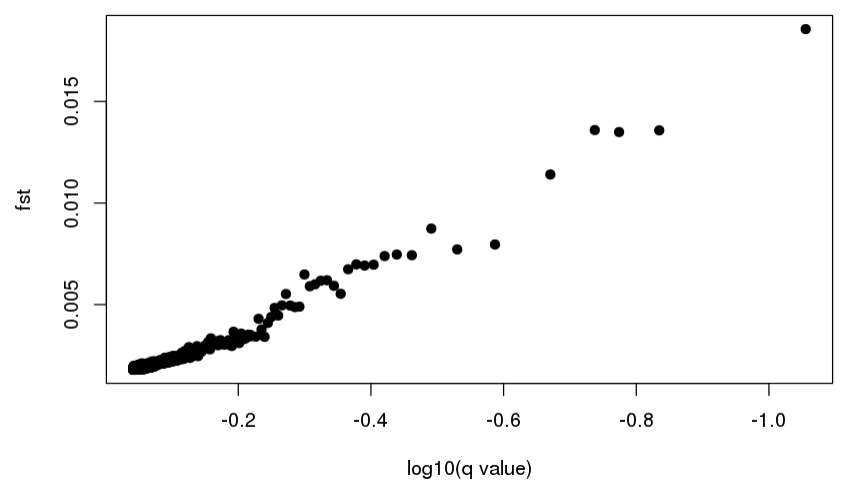
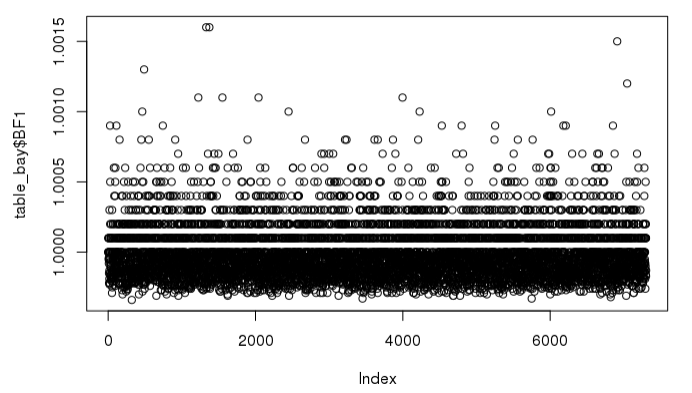
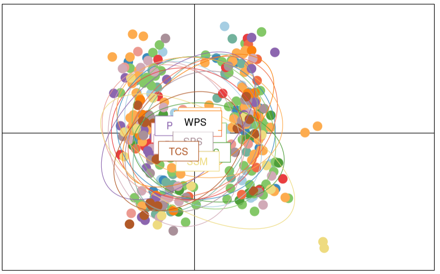

# Week 8 Activity

Goals from [class repo](https://github.com/jpuritz/BIO_594_2022/blob/main/Exercises/Week08and09/Exercise.md)

For real data
* Run BayeScan
* Run BayEnv
* Run at least one PCA and one DAPC using outlier free data set
* Perform at least two analyses from Silliman et al. 2019

> Note: Start with the popgen analysis. Do not spend time filtering and doing the other stuff we have usually done in class. Most if not all of this will be done in R

## Getting Data

```bash
mkdir wk8
cd wk8
cp -r /home/BIO594/Exercises/Week07_and_Week_08/realdata/ .

#inspecting data
less realdata/popmap # looks like 15 populations exist
```
> 15 populaions in the popmap file
> 2 environmental variables in the environ file

To be safe activating the conda environemt from wk7 "wk7ddocent" where bayscane was run previously

```bash
conda activate wk7ddocent
```

## Outlier detection in Bayscan
Output will be used in Rstudio


```bash

#converting vcf file to bayescan useable form using PGDSpider2

java -jar /usr/local/bin/PGDSpider2-cli.jar -inputfile SNP.DP3g98maf01_85INDoutFIL.NO2a.HWE.FIL.recode.vcf -outputfile SNP.DP3g98maf01_85INDoutFIL.NO2a.HWE.FIL.recode.BSout -spid BSsnp.spid

# Running bayescan -- Remember this takes a long time to run, especially with real data | disowned and ran
BayeScan2.1_linux64bits SNP.DP3g98maf01_85INDoutFIL.NO2a.HWE.FIL.recode.BSout -nbp 30 -thin 20

#It worked .B.fst.txt is in ../realdata

```
Set `realdata`as working directory in R

Plotting bayescan output in RStudio
```R
setwd ("~/wk8/realdata")
source ("plot_R.r")
plot_bayescan "SNP.DP3g98maf01_85INDoutFIL.NO2a.HWE.FIL.recode.B_fst.txt"
```
> No outliers present




## Running BayEnv

Step one: create proper output files for BayEnv in `bash`

```bash
#SNPBayEnv.spid already in working directory

java -jar /usr/local/bin/PGDSpider2-cli.jar -inputfile SNP.DP3g98maf01_85INDoutFIL.NO2a.HWE.FIL.recode.vcf -outputfile SNP.DP3g98maf01_85INDoutFIL.NO2a.HWE.FIL.Benvyout.txt -spid SNPBayEnv.spid 

#Note it said it could not find the "SNPBayEnv.spid" file and loaded a default config

#Worked .Benvyout.txt exists in directory
```
Use BayEnv to create a covariance matrix
Remember we have 15 populations

```bash
#With 15 pops and 100000 iterations this will need to be put in the background
bayenv2 -i SNP.DP3g98maf01_85INDoutFIL.NO2a.HWE.FIL.Benvyout.txt -p 15 -k 100000 -r 63479 > matrix.out &

# -p popn #
# -k iteration #
# -r randome seed set
```
Taking the last interation of 100,000 for each population

Matrix.out has 3414 rows (lines)

```bash
tail -16 matrix.out | head -15 > matrix
```
Using the envi factor file with the new matrix

```bash
cat environ
```

Calculating the Bayes Factor for each SNP for each envi variable

```bash
ln -s /usr/local/bin/bayenv2 .

# putting next command in background
calc_bf.sh SNP.DP3g98maf01_85INDoutFIL.NO2a.HWE.FIL.Benvyout.txt environ matrix 15 10000 2 &

# input order
# snp file, envfile, matrixfile, popn #, iteration #, environment #
```
> * 7303 lines in `bf_environ.environ`
> * All lines are filled

Converting Output for R

```bash
paste <(seq 1 7303) <(cut -f2,3 bf_environ.environ ) > bayenv.out

cat <(echo -e "Locus\tBF1\tBF2") bayenv.out > bayenv.final
```

Moving into R

```r
setwd ("~/wk8/realdata")
table_bay <- read.table("bayenv.final",header=TRUE)
plot(table_bay$BF1)

table_bay[which(table_bay$BF1 > 100),]
```
> No outliers found

### output



## PCA 

Run exclusively in R

> Need to get or create the `"strata"` variable. The PCA will not be constructed without it.

```r
#Set up

# loading packages
library(adegenet)
library(vcfR)

#creating objects from data files 

my_vcf <- read.vcfR("SNP.DP3g98maf01_85INDoutFIL.NO2a.HWE.FIL.recode.vcf")


my_genind <- vcfR2genind(my_vcf) #making a gene ID file from original VCF
#str (my_genind)# returns ..@strata : NULL

#region ------------------------------------------------------------
#Ask about this block of code.

#"strata" needs to be created. Right now it appears to come from nothing and is filled with my_geneID

strata<- read.table("LibraryInfo", header=TRUE) #What is strata? It is not in the directory. "LibraryInfo"?
strata_df <- data.frame(strata)#turn to data frame
strata(my_genind) <- strata_df #set strata varialbe in my_genind to the strata dataframe

setPop(my_genind) <- ~Population
#endregion-------------------------------------------------------------

#Test Population Structure
library("hierfstat")
fstat(my_genind)

matFst <- pairwise.fst(my_genind)

#PCA building

X <- tab(my_genind, freq = TRUE, NA.method = "mean")
pca1 <- dudi.pca(X, scale = FALSE, scannf = FALSE, nf = 3)
barplot(pca1$eig[1:50], main = "PCA eigenvalues", col = heat.colors(50)) #Creating barplot of eigenvectors (PCA axes?)
s.class(pca1$li, pop(my_genind))
title("PCA of realdata\naxes 1-2")
add.scatter.eig(pca1$eig[1:20], 3,1,2)

col <- funky(15)
s.class(pca1$li, pop(my_genind),xax=1,yax=2, col=col, axesell=FALSE, cstar=0, cpoint=3, grid=FALSE)# plots PCA
```
> Did not get the fst test to work overall they PCA suggests there is no population structure between any of these populations. Some structure exists more broadly because the points are clouding on either side of PC2 with very little overlap in the middle. Oddly enough all populations seem to be represented in both "clouds".

## Output




## DAPC

Run entierly in R

```r
grp <- find.clusters(my_genind, max.n.clust=40)#
table(pop(my_genind), grp$grp)# arguments must be the same length. Appears that the @ POP variable in my_genind is also NULL

table.value(table(pop(my_genind), grp$grp), col.lab=paste("inf", 1:2), row.lab=paste("ori", 1:4))


dapc1 <- dapc(my_genind, grp$grp)
scatter(dapc1,col=col,bg="white", solid=1)


contrib <- loadingplot(dapc1$var.contr, axis=1, thres=.01, lab.jitter=1)
contrib


setPop(my_genind) <- ~Library

dapc1 <- dapc(my_genind, pop(my_genind))
contrib <- loadingplot(dapc1$var.contr, axis=1, thres=.05, lab.jitter=1)
```