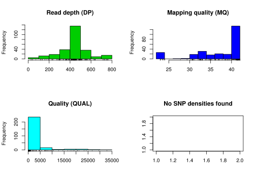
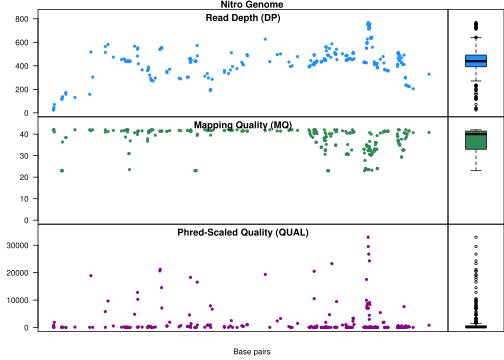
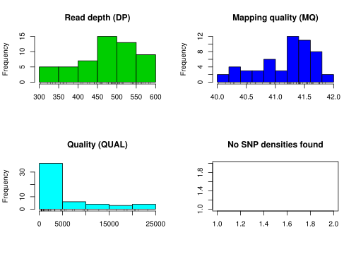
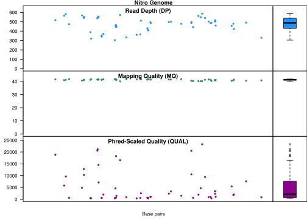
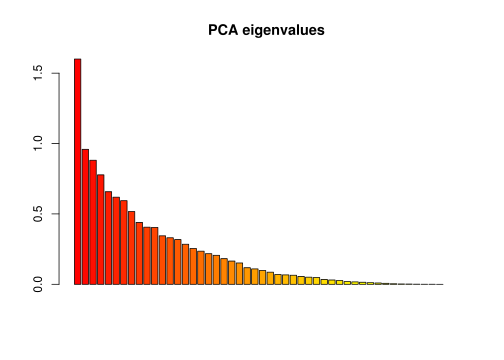
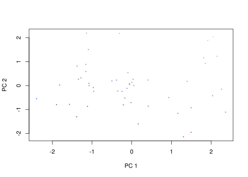

Final Project
================
DB Richardson
5/2/2022

# Nitrosopumilus strains project

## Summary

This project uses data from 68 metagenomes collected between September
2017 and March 2020. The main focus of this work is the exploration of
witihin species diversity in the Nitrosopumilus sp. of Narragansett Bay.
To achieve this goal, we performed: 1. Illumina read quality filtering
2. NGS read assembly 3. Identification of high-quality Metagenome
Assembled Geneomes (MAGs) 4. Selected a representative Nitrosopumilus
MAG from the metagenomic time series 5. Identified variants 6. Filtered
variants and clustered samples by Nitrosopumilus sp. variant composition

Most of these analyses were performed using the Andromeda and Bluewaves
high performance computing clusters. Given the size of the dataset and
the fact that much of this work has not yet been published, the data
used in steps 1-4 will not be uploaded onto the class GitHub. However,
the unfiltered VCF containing the SNPs resulting from the analyses
performed in step 5, the representative Nitrosopumilus MAG, and the
filtered VCF produced in the middle of step 6 will be uploaded onto the
site.

## Part 1: NGS read quality filtering

This slurm array job begins with combining the reads from the separate
lanes into forward and reverse read files for each sample. Next, PCR
duplicates were removed using the clumpify.sh module in the BBtools
(v.38.87) software package. The overlapping de-duplicated reads were
then merged together using bbmerge.sh, another module from the BBtools
package. Then, adapters were removed from the reads, low-quality bases
were trimmed from the reads, and the quality-trimmed reads that are
shorter 251 bp long are dropped using Trimmomatic (v. 0.39). Unmerged
reads can suffer from an abundance of erroneous homopolymer repeats. To
remove these reads, AfterQC (v. 0.9.7) was used. In preparation for
metagenomic read assembly, the quality-filtered reads were normalized to
100 - i.e. reads containing k-mers observed more than 100 times in the
sample were removed - using the bbnorm.sh script from BBtools.

``` bash
#!/bin/bash
#SBATCH -t 100:00:00
#SBATCH --nodes=1
#SBATCH --exclusive
#SBATCH --mem=120GB
#SBATCH --array=1-68%10


Raw_MGs="/data4/zpimentel/Projects/NB_Metagenomes/raw_data_NB"
READ_FILT_OUTDIRS="/data/zhanglab/dbrichardson/projects/NB/analyses/01_QC/read_filtering"
ANALYSIS_DIR_UDIR="/data/zhanglab/dbrichardson/projects/NB/analyses"
FILE=($(cat ${ANALYSIS_DIR_UDIR}/collapsed_sample.list | head -n $SLURM_ARRAY_TASK_ID | tail -1))


echo "Starting Run"
date

### Combine L1 and L2 -> Clumpify -> Merge -> QC -> Normalize (target=100 min=1)  ###

#Combining raw reads into single
cat ${Raw_MGs}/${FILE}_L00[1-2]_R1_001.fastq.gz > ${READ_FILT_OUTDIRS}/A_Combine/${FILE}_R1.fastq.gz
cat ${Raw_MGs}/${FILE}_L00[1-2]_R2_001.fastq.gz > ${READ_FILT_OUTDIRS}/A_Combine/${FILE}_R2.fastq.gz

#Loading BBMap 38.87
module load BBMap/38.87-foss-2020b
#PCR deduplication
clumpify.sh -Xmx50g in=${READ_FILT_OUTDIRS}/A_Combine/${FILE}_R1.fastq.gz in2=${READ_FILT_OUTDIRS}/A_Combine/${FILE}_R2.fastq.gz \
 out=${READ_FILT_OUTDIRS}/B_Clumpify/${FILE}_R1_clumpified.fastq.gz out2=${READ_FILT_OUTDIRS}/B_Clumpify/${FILE}_R2_clumpified.fastq.gz \
  groups=64 dedupe=t subs=0

#Merge the reads
bbmerge.sh in1=${READ_FILT_OUTDIRS}/B_Clumpify/${FILE}_R1_clumpified.fastq.gz in2=${READ_FILT_OUTDIRS}/B_Clumpify/${FILE}_R2_clumpified.fastq.gz \
   out=${READ_FILT_OUTDIRS}/C_Merge/${FILE}_merged.fastq.gz outu1=${READ_FILT_OUTDIRS}/C_Merge/${FILE}_R1.fastq.gz outu2=${READ_FILT_OUTDIRS}/C_Merge/${FILE}_
R2.fastq.gz \
#Removing module
module purge

#Loading Trimmomatic 0.39
module load Trimmomatic/0.39-Java-11

# quality trim, remove adapters, and remove the merged pairs smaller than 251bp
java -jar $EBROOTTRIMMOMATIC/trimmomatic-0.39.jar SE -threads 20 ${READ_FILT_OUTDIRS}/C_Merge/${FILE}_merged.fastq.gz ${READ_FILT_OUTDIRS}/D_Trimmomatic/merge
d/${FILE}_merged.fastq.gz MINLEN:251 LEADING:3 TRAILING:3 \
  ILLUMINACLIP:${READ_FILT_OUTDIRS}/adapters.fa:2:30:10 SLIDINGWINDOW:4:15

# quality trim the unmerged reads
java -jar $EBROOTTRIMMOMATIC/trimmomatic-0.39.jar PE -threads 20 ${READ_FILT_OUTDIRS}/C_Merge/${FILE}_R1.fastq.gz ${READ_FILT_OUTDIRS}/C_Merge/${FILE}_R2.fastq.gz \
${READ_FILT_OUTDIRS}/D_Trimmomatic/unmerged/${FILE}_R1_paired.fastq.gz \
${READ_FILT_OUTDIRS}/D_Trimmomatic/unmerged/${FILE}_R1_unpaired.fastq.gz \
${READ_FILT_OUTDIRS}/D_Trimmomatic/unmerged/${FILE}_R2_paired.fastq.gz \
${READ_FILT_OUTDIRS}/D_Trimmomatic/unmerged/${FILE}_R2_unpaired.fastq.gz \
ILLUMINACLIP:${READ_FILT_OUTDIRS}/adapters.fa:2:30:10 LEADING:3 TRAILING:3 SLIDINGWINDOW:4:15 MINLEN:90

#Removing module
module purge

#Loading AfterQC 0.9.7
module load AfterQC/0.9.7-GCCcore-10.2.0-Python-2.7.18

# AfterQC on the paired R1 and R2
after.py -1 ${READ_FILT_OUTDIRS}/D_Trimmomatic/unmerged/${FILE}_R1_paired.fastq.gz \
  -2 ${READ_FILT_OUTDIRS}/D_Trimmomatic/unmerged/${FILE}_R2_paired.fastq.gz -g ${READ_FILT_OUTDIRS}/E_AfterQC -p 20 -a 5 -s 90

#Removing module
module purge

#Loading BBMap 38.87
module load BBMap/38.87-foss-2020b
#Normalize the forward and reverse reads
bbnorm.sh in=${READ_FILT_OUTDIRS}/E_AfterQC/${FILE}_R1_paired.good.fq.gz in2=${READ_FILT_OUTDIRS}/E_AfterQC/${FILE}_R2_paired.good.fq.gz \
  out=${READ_FILT_OUTDIRS}/G_BBnorm/${FILE}_R1_001_normed.good.fastq.gz out2=${READ_FILT_OUTDIRS}/G_BBnorm/${FILE}_R2_001_normed.fastq.gz \
  target=100 min=1
#Normalize the merged reads
bbnorm.sh in=${READ_FILT_OUTDIRS}/D_Trimmomatic/merged/${FILE}_merged.fastq.gz \
  out=${READ_FILT_OUTDIRS}/G_BBnorm/${FILE}_merged.normed.fastq.gz \
  target=100 min=1
#Removing module
module purge

echo "Ending Run"
date
```

## Part 2: NGS read assembly

To study Nitrosopumilis population structure, the short NGS reads were
assembled into contigs using metaSPAdes (v. 3.15.2). This program can be
very memory intensive, so it was necessary to run these jobs in parallel
using the High Performance Computing Clusters Andromeda and Bluewaves.
When Bluewaves was used, it was necessary to move the files from the
data directory to the data4 directory. A few of the samples required up
to 500GB of RAM and so the higher memory requirement is shown in the
code below

``` bash
#!/bin/bash
#SBATCH -t 100:00:00
#SBATCH --nodes=1
#SBATCH --exclusive
#SBATCH --array=1-68%10
#SBATCH --mem=256GB
##SBATCH --mem=500GB


FILEPATH="/data/zhanglab/dbrichardson/projects/NB/analyses/01_QC/L_BBnorm"
OUTDIR="/data/zhanglab/dbrichardson/projects/NB/analyses/02_Assembly/metaSpades_assemblies"

#Some samples were run on bluewaves and were stored in this directory
DATA4_DIR="/data4/zpimentel/dbrichardson"

FILE=($(cat ${ANALYSIS_DIR_UDIR}/collapsed_sample.list | head -n $SLURM_ARRAY_TASK_ID | tail -1))


echo "Starting Run"
date

#moving samples run on bluewaves to the data4 directory
cp /data/zhanglab/dbrichardson/projects/NB/analyses/01_QC/read_filtering/G_BBnorm/${FILE}_R1_001_normed.fastq.gz ${DATA4_DIR}/. 
cp /data/zhanglab/dbrichardson/projects/NB/analyses/01_QC/read_filtering/G_BBnorm/${FILE}_R2_001_normed.fastq.gz ${DATA4_DIR}/. 
cp /data/zhanglab/dbrichardson/projects/NB/analyses/01_QC/read_filtering/G_BBnorm/${FILE}_merged.normed.fastq.gz /data4/zpimentel/dbrichardson/. 

#Loading the metaSPAdes module
module load SPAdes/3.15.2-GCC-10.2.0

cd /data/zhanglab/dbrichardson/projects/NB/analyses/02_Assembly

#using metaSPAdes
spades.py --meta --only-assembler -m 1000 -t 20 -1 ${FILEPATH}/${FILE}_R1_001_normed.good.fastq.gz -2 ${FILEPATH}/${FILE}_R2_001_normed.fastq.gz \
--merged ${FILEPATH}/${FILE}_merged.normed.fastq.gz -o ${OUTDIR}${FILE}_OUTDIR

module purge

#removing files from data4 (if applicable)
rm ${DATA4_DIR}/${FILE}_R1_001_normed.fastq.gz
rm ${DATA4_DIR}/${FILE}_R2_001_normed.fastq.gz
rm ${DATA4_DIR}/${FILE}_merged.normed.fastq.gz

echo "Ending Run"
date
```

## Part 3: Identifying MAGs

This array job builds a bowtie2 index for each contig in every
metagenome assembly using Bowtie2 (v. 2.4.1). It then calls another
script, recruit_reads_10022021.sh, to map the quality filtered reads to
the contigs.

``` bash
#!/bin/bash
#SBATCH -t 100:00:00
#SBATCH --array=1-68%2
#SBATCH --mem=120GB

ANALYSIS_ROOT="/data/zhanglab/dbrichardson/projects/NB/analyses"
FILE=($(cat ${ANALYSIS_ROOT}/collapsed_sample.list | head -n $SLURM_ARRAY_TASK_ID | tail -1))
CONTIGS_FILEPATH="/data/zhanglab/dbrichardson/projects/NB/analyses/02_Assembly/metaSpades_assemblies/${FILE}_OUTDIR/contigs.fasta"
BT2_INDICIES="/data2/dbrichardson/projects/NB/04_binning/bt2_indices/${FILE}_contigs"
DATA2_CONTIGS="/data2/dbrichardson/projects/NB/04_binning/contigs"
SCRIPTS="/data/zhanglab/dbrichardson/projects/NB/scripts/04_Taxonomy_scripts/drafts"
RR_REPORTS_DIR="/data2/dbrichardson/projects/NB/04_binning/read_recruitment_reports"

echo "Starting Run"
date


#Load bowtie2 v 2.4.1 module
module load Bowtie2/2.4.1-GCC-8.3.0

#Making a directory for the sample's bowtie2 index
mkdir ${BT2_INDICIES}

#loading python3 module
module load Python/3.7.4-GCCcore-8.3.0

#Create a bowtie2 index
bowtie2-build -f ${CONTIGS_FILEPATH} ${BT2_INDICIES}/${FILE}_contigs

#Use the read recruitment script to map reads in the metagenome back to the assembled contigs
sbatch ${SCRIPTS}/recruit_reads_10022021.sh ${FILE}

#Remove module
module purge

#This spaces out the jobs, so that it doesn't monopolize bluewaves completely.
sleep 10h

echo "Ending Run"
date
```

This array job, recruit_reads_10022021.sh, uses Bowtie2 to align the
quality filtered reads from each sample to all of the contigs produced
by metaSPAdes. Then, it uses samtools (v. 1.10) to convert the sam files
to bam files, sort the resulting bam files, and then index those bam
files.

``` bash
#!/bin/bash
#SBATCH -t 100:00:00
#SBATCH --array=1-68%15
#SBATCH --mem=120GB
#SBATCH --exclusive
FILE=${1}
CONTIGS_FILEPATH="/data/zhanglab/dbrichardson/projects/NB/analyses/02_Assembly/metaSpades_assemblies/${FILE}_OUTDIR/contigs.fasta"
ANALYSIS_ROOT="/data/zhanglab/dbrichardson/projects/NB/analyses"
R_FILTERED_READS="/data/zhanglab/dbrichardson/projects/NB/analyses/01_QC/read_filtering/E_AfterQC"
M_FILTERED_READS="/data/zhanglab/dbrichardson/projects/NB/analyses/01_QC/read_filtering/D_Trimmomatic/merged"
BT2_INDICIES="/data2/dbrichardson/projects/NB/04_binning/bt2_indices/${FILE}_contigs"
OUTDIR_0="/data2/dbrichardson/projects/NB/04_binning/read_mappings"

FILE2=($(cat ${ANALYSIS_ROOT}/collapsed_sample.list | head -n $SLURM_ARRAY_TASK_ID | tail -1))

cd /data2/dbrichardson/projects/NB/04_binning/read_recruitment_reports

echo "Beginning Read Recruitment"
date

mkdir ${OUTDIR_0}/${FILE}_read_mappings_nt_normed
OUTDIR="${OUTDIR_0}/${FILE}_read_mappings_nt_normed"

#Load bowtie2 v 2.4.1
module load Bowtie2/2.4.1-GCC-8.3.0

#Load python 3
module load Python/3.7.4-GCCcore-8.3.0

#Load SAMtools
module load SAMtools/1.10-GCC-8.3.0

#looks for reads that map to each contig in the merged, R1, and R2 files.
bowtie2 --sensitive-local --no-unal -p $SLURM_CPUS_ON_NODE -x ${BT2_INDICIES}/${FILE}_contigs \
-1 ${R_FILTERED_READS}/${FILE2}_R1_paired.good.fq.gz  \
-2 ${R_FILTERED_READS}/${FILE2}_R2_paired.good.fq.gz \
-U ${M_FILTERED_READS}/${FILE2}_merged.fastq.gz \
| samtools view -bS - | samtools sort -o ${OUTDIR}/${FILE2}_sorted.bam

#Index the BAM files
samtools index -b ${OUTDIR}/${FILE2}_sorted.bam ${OUTDIR}/${FILE2}_sorted.bai

module purge

echo "Ending Read Recruitment"
date
```

Binning the contigs, clustering the contigs together based on their
k-mer composition and abundance, using metabat2 (v. 2.12.1)

``` bash
#!/bin/bash
#SBATCH -t 100:00:00
#SBATCH --nodes=1
#SBATCH --exclusive
#SBATCH --mem=120GB
#SBATCH --array=1-68%15


FILE=($(cat /data/zhanglab/dbrichardson/projects/NB/analyses/collapsed_sample.list | head -n $SLURM_ARRAY_TASK_ID | tail -1))
CONTIGS_FILEPATH="/data/zhanglab/dbrichardson/projects/NB/analyses/02_Assembly/metaSpades_assemblies/${FILE}_OUTDIR/contigs.fasta"
BAM_FILES="/data2/dbrichardson/projects/NB/04_binning/read_mappings/${FILE}_read_mappings_nt_normed"
BINNING_RESULTS="/data/zhanglab/dbrichardson/projects/NB/analyses/04_Taxonomy/cellular_orgs/binning/mb2/${FILE}_bins"


echo "Starting Run"
date

#Load metabat2
module load MetaBAT/2.12.1-foss-2018b-Python-2.7.15

#Making a directory for the bins
mkdir ${BINNING_RESULTS}
#Moving into that directory
cd ${BINNING_RESULTS}

#building a depth file
jgi_summarize_bam_contig_depths --outputDepth ${BINNING_RESULTS}/${FILE}_contig_depth.txt ${BAM_FILES}/*_sorted.bam

#bin the contigs
metabat2 -i ${CONTIGS_FILEPATH} -a ${BINNING_RESULTS}/${FILE}_contig_depth.txt -o ${BINNING_RESULTS}/bins

module purge

echo "Ending Run"
date
```

Binning the contigs using CONCOCT (v. 1.1.0)

``` bash
#!/bin/bash
#SBATCH -t 100:00:00
#SBATCH --nodes=1
#SBATCH --exclusive
#SBATCH --mem=120GB
#SBATCH --array=1-68%15


FILE=($(cat /data/zhanglab/dbrichardson/projects/NB/analyses/collapsed_sample.list | head -n $SLURM_ARRAY_TASK_ID | tail -1))
CONTIGS_FILEPATH="/data/zhanglab/dbrichardson/projects/NB/analyses/02_Assembly/metaSpades_assemblies/${FILE}_OUTDIR/contigs.fasta"
BINNING_RESULTS="/data/zhanglab/dbrichardson/projects/NB/analyses/04_Taxonomy/cellular_orgs/binning/cct/${FILE}_bins"
BAM_FILES="/data2/dbrichardson/projects/NB/04_binning/read_mappings/${FILE}_read_mappings_nt_normed"
BAM_FILES_SUBSET="${BINNING_RESULTS}/mappings"

echo "Starting Run"
date

#Load Anaconda3 4.2.0
module load Anaconda3/4.2.0


#Activate binning environment
source activate binning

#Setting up directory for binning
mkdir ${BINNING_RESULTS}

#Setting up directory for BAM files on /Data
mkdir ${BINNING_RESULTS}/mappings

#Copying read mappings to binning directory in the /data/ directory for Andromeda
cp ${BAM_FILES}/*  /${BAM_FILES_SUBSET}

#Breaking contigs file into smaller parts
cut_up_fasta.py ${CONTIGS_FILEPATH} -c 10000 -o 0 --merge_last -b ${BINNING_RESULTS}/${FILE}_contigs_10K.bed > ${BINNING_RESULTS}/${FILE}_contigs_10K.fna

#Making a coverage depth table
concoct_coverage_table.py ${BINNING_RESULTS}/${FILE}_contigs_10K.bed ${BAM_FILES_SUBSET}/*_sorted.bam > ${BINNING_RESULTS}/${FILE}_coverage_table.tsv

#Using CONCOCT to bin the contigs
concoct -t 36 --composition_file ${BINNING_RESULTS}/${FILE}_contigs_10K.fna -l 2500 --coverage_file ${BINNING_RESULTS}/${FILE}_coverage_table.tsv -b ${BINNING
_RESULTS}

#Combining contig chunk clustering results to get the original contig clustering results
merge_cutup_clustering.py ${BINNING_RESULTS}/clustering_gt2500.csv > ${BINNING_RESULTS}/${FILE}_clustering_merged.csv

#Setting up a directory for the binned contigs
mkdir ${BINNING_RESULTS}/${FILE}_fasta_bins

#Extracting the bins as individual FASTA files
extract_fasta_bins.py ${CONTIGS_FILEPATH} ${BINNING_RESULTS}/${FILE}_clustering_merged.csv --output_path ${BINNING_RESULTS}/${FILE}_fasta_bins

#Removing read mappings from binning directory on /data/
rm ${BAM_FILES_SUBSET}/*

echo "Ending Run"
date
```

Binning the contigs using MaxBin2 (v. 2.2.7)

``` bash
#!/bin/bash
#SBATCH -t 100:00:00
#SBATCH --nodes=1
#SBATCH --exclusive
#SBATCH --mem=120GB
##SBATCH --array=2
#SBATCH --array=3-68%10


FILE=($(cat /data/zhanglab/dbrichardson/projects/NB/analyses/collapsed_sample.list | head -n $SLURM_ARRAY_TASK_ID | tail -1))
CONTIGS_FILEPATH="/data/zhanglab/dbrichardson/projects/NB/analyses/02_Assembly/metaSpades_assemblies/${FILE}_OUTDIR/contigs.fasta"
DATA2_BAM_FILES="/data2/dbrichardson/projects/NB/04_binning/read_mappings/${FILE}_read_mappings_nt_normed"
BINNING_RESULTS="/data/zhanglab/dbrichardson/projects/NB/analyses/04_Taxonomy/cellular_orgs/binning/mxb2/${FILE}_bins"
BAM_FILES="${BINNING_RESULTS}/mappings"

echo "Starting Run"
date

#Making directory for the MaxBin2 picked bins
mkdir ${BINNING_RESULTS}

#Making a directory for the mapping files on /Data
mkdir ${BAM_FILES}

#Copying mapping files to /data
cp ${DATA2_BAM_FILES}/* /${BAM_FILES}

#Load the MetaBat2 moudle to make the contig depth files
module load MetaBAT/2.12.1-foss-2018b-Python-2.7.15

#Move to results directory
cd ${BINNING_RESULTS}

#Creating a contig depth file
jgi_summarize_bam_contig_depths --noIntraDepthVariance --outputDepth ${BINNING_RESULTS}/${FILE}_contig_depth.txt ${BAM_FILES}/*_sorted.bam
#Removing the module
module purge

#Using metaWRAP pipeline guidance

#calculate total number of columns
A=($(head -n 1 ${BINNING_RESULTS}/${FILE}_contig_depth.txt))
N=${#A[*]}
  # split the contig depth file into multiple files
echo "split master contig depth file into individual files for maxbin2 input"
for i in $(seq 4 $N); do
        sample=$(head -n 1 ${BINNING_RESULTS}/${FILE}_contig_depth.txt | cut -f $i)
        echo "processing $sample depth file..."
        grep -v totalAvgDepth ${BINNING_RESULTS}/${FILE}_contig_depth.txt | cut -f 1,$i > ${BINNING_RESULTS}/${FILE}_mb2_${sample%.*}.txt
        if [[ ${BINNING_RESULTS} == /* ]]; then
                echo ${BINNING_RESULTS}/${FILE}_mb2_${sample%.*}.txt >> ${BINNING_RESULTS}/${FILE}_mb2_abund_list.txt
        else
                echo $(pwd)/${BINNING_RESULTS}/${FILE}_mb2_${sample%.*}.txt >> ${BINNING_RESULTS}/${FILE}_mb2_abund_list.txt
        fi
done

#Load maxbin2
module load MaxBin/2.2.7-gompi-2020b

#Making a directory for the bins
mkdir ${BINNING_RESULTS}/bins

#Running MaxBin2
run_MaxBin.pl -contig ${CONTIGS_FILEPATH} \
-out ${BINNING_RESULTS}/bins/${FILE}_mxb2_bins \
-thread 36 \
-markerset 40 \
-min_contig_length 2500 \
-abund_list ${BINNING_RESULTS}/${FILE}_mb2_abund_list.txt

#removing the mapping files from /data/ to save space
rm ${BAM_FILES}/*
#removing some extra files from /data/ to save space
rm ${BINNING_RESULTS}/*_sorted.txt

echo "Ending Run"
date
```

Finding high-quality MAGs using metaWRAP (v. 1.13)

Some samples needed to run with 250GB or 510GB of RAM, but this is how
the vast majority were run. All samples were analyzed using the same
metaWRAP parameters.

``` bash
#!/bin/bash
#SBATCH -t 100:00:00
#SBATCH --nodes=1
#SBATCH --exclusive
#SBATCH --mem=120GB
##SBATCH --mem=510GB
#SBATCH --array=1-68%7


FILE=($(cat /data/zhanglab/dbrichardson/projects/NB/analyses/collapsed_sample.list | head -n $SLURM_ARRAY_TASK_ID | tail -1))
OUTDIR="/data/zhanglab/dbrichardson/projects/NB/analyses/04_Taxonomy/cellular_orgs/binning/mWRAP_refined_bins"
MB2_BINS="/data/zhanglab/dbrichardson/projects/NB/analyses/04_Taxonomy/cellular_orgs/binning/mb2"
CCT_BINS="/data/zhanglab/dbrichardson/projects/NB/analyses/04_Taxonomy/cellular_orgs/binning/cct"
MXB2_BINNING_RESULTS="/data/zhanglab/dbrichardson/projects/NB/analyses/04_Taxonomy/cellular_orgs/binning/mxb2/${FILE}_bins"

echo "Starting Run"
date

#Loading the metaWRAP module
module load metaWRAP/1.3-foss-2020b-Python-2.7.18

#Using the bin refinement module to find the best bins
metawrap bin_refinement -o ${OUTDIR}/${FILE}_BIN_REFINEMENT -t 96 -A ${MB2_BINS}/${FILE}_bins/ -B ${MXB2_BINNING_RESULTS}/fasta_bins -C ${CCT_BINS}/${FILE}_bins/${FILE}_fasta_bins/ -c 50 -x 10

#remove the copies of the bins after metWRAP finished binning
rm -r ${OUTDIR}/${FILE}_BIN_REFINEMENT/${FILE}_bins
rm -r ${OUTDIR}/${FILE}_BIN_REFINEMENT/${FILE}_fasta_bins
rm -r ${OUTDIR}/${FILE}_BIN_REFINEMENT/fasta_bins

#remove the intermediate files
rm -rf ${OUTDIR}/${FILE}_BIN_REFINEMENT/work_files

echo "Ending Run"
date
```

Part 4: Selecting a representative Nitrosopumulis MAG

This creates a csv file with each MAGs score. This score incorporates
estimated genome completeness and contamination as well as genome
length.

``` python
from collections import defaultdict
import collections

#This function stores the information about genome completeness, contamination, and length annotated on each genome's name into separate lists.  
def get_genome_stats(column):
    list = []
    mag_id = column.strip().split('_')[2:4]
    completeness = float(column.strip().split('_')[5])
    contamination = float(column.strip().split('_')[7])
    length = int(column.strip().split('_')[9])
    list.extend((completeness, contamination, length, mag_id))
    return list


MAG_list_file = "/data2/dbrichardson/projects/NB/04_binning/HQ_MAGs/HQ_MAGs.list"

#Initializing the dictionary that will store genome name and genome score
genome_scores = defaultdict(list)

#Looping through the genome list, calculating the genome score, and storing the genome name and score in the genome_scores dictionary
with open(MAG_list_file) as file:
    for row in file:
        row = row.strip()
        genome1 = row
        genome1_completeness = get_genome_stats(genome1)[0]
        genome1_completeness
        genome1_contamination = get_genome_stats(genome1)[1]
        genome1_length = get_genome_stats(genome1)[2]
        genome1_score = genome1_completeness - 5*genome1_contamination + (genome1_length/100000)
        genome_scores[genome1] = genome1_score
        genome_scores
#Writing the output into a csv file
import csv
with open('/data2/dbrichardson/projects/NB/04_binning/MAG_Scores.csv', 'w') as f:
    for key in genome_scores.keys():
        f.write("%s,%s\n"%(key,genome_scores[key]))
```

Creating data tables with MAG ID, path, taxonomy, and score

``` bash
#combining the GTDB-tk taxonomic annotations for the bacteria and archaea into a single list
cat /data2/dbrichardson/projects/NB/04_binning/bacterial_taxa.list /data2/dbrichardson/projects/NB/04_binning/archaeal_taxa.list > /data2/dbrichardson/projects/NB/04_binning/all_taxa.list

#Creating separate files containing all of the bacterial genomes with the same species-level taxonomic identification
cat /data2/dbrichardson/projects/NB/04_binning/bacterial_taxa.list | while read i
do
  reformatted_taxonomies=$(echo ${i} | sed 's/ /_/g')
  title=$(echo ${reformatted_taxonomies} | sed 's/;/_/g')
  count=$(grep -c "${i}" /data2/dbrichardson/projects/NB/04_binning/HQ_MAGs_gtdbtk/classify/gtdbtk.bac120.summary.tsv)
  grep -w "${i}" /data2/dbrichardson/projects/NB/04_binning/HQ_MAGs_gtdbtk/classify/gtdbtk.bac120.summary.tsv | cut -f1,2 > /data2/dbrichardson/projects/NB/04_binning/clust_by_taxonomy/all_taxa/${title}_count_${count}.list
done


#Creating separate files containing all of the archaeal genomes with the same species-level taxonomic identification
cat /data2/dbrichardson/projects/NB/04_binning/archaeal_taxa.list | while read i
do
  reformatted_taxonomies=$(echo ${i} | sed 's/ /_/g')
  title=$(echo ${reformatted_taxonomies} | sed 's/;/_/g')
  count=$(grep -c "${i}" /data2/dbrichardson/projects/NB/04_binning/HQ_MAGs_gtdbtk/classify/gtdbtk.ar122.summary.tsv)
  grep -w "${i}" /data2/dbrichardson/projects/NB/04_binning/HQ_MAGs_gtdbtk/classify/gtdbtk.ar122.summary.tsv | cut -f1,2 > /data2/dbrichardson/projects/NB/04_binning/clust_by_taxonomy/all_taxa/${title}_count_${count}.list
done

#This script creates a table with the bin-id, taxonomy, bin-score, and path to bin fasta file

SCORES="/data2/dbrichardson/projects/NB/04_binning/clust_by_taxonomy/MAG_Scores_gtdbtk.list"
All_DIR="/data2/dbrichardson/projects/NB/04_binning/clust_by_taxonomy/all_taxa"
HQ_MAG_PATHS="/data2/dbrichardson/projects/NB/04_binning/HQ_MAGs/HQ_MAGs.list"
for i in `ls /data2/dbrichardson/projects/NB/04_binning/clust_by_taxonomy/all_taxa`
do
  echo "MAG_ID Taxonomy Score Path_to_MAG" > ${All_DIR}/${i}_scores_taxonomy.list
  taxonomy=$(echo ${i} | cut -d'.' -f1)
  cat ${All_DIR}/${i} | while read j
  do
    bin_id=$(echo ${j} | cut -d' ' -f1)
    score=$(grep -w "${bin_id}" ${SCORES} | cut -f2)
    sample=$(echo ${j} | cut -d'_' -f1,2)
    bin_num=$(echo ${j} | cut -d'_' -f3 | cut -d' ' -f1)
    MAG_PATH=$(cat ${HQ_MAG_PATHS} | grep "${sample}" | grep  "_${bin_num}.fa")
    echo ${bin_id} ${taxonomy} ${score} ${MAG_PATH} >> ${All_DIR}/${i}_scores_taxonomy.list
  done
done

#A quick sanity check
ls ${All_DIR}/*_scores_taxonomy.list | wc -l
#534

#This script selects the best MAG in each species level cluster.
#Additional ANI-based clustering might be necessary
clust_by_taxonomy_DIR="/data2/dbrichardson/projects/NB/04_binning/clust_by_taxonomy"
echo "MAG_ID Taxonomy Score Path_to_MAG" > ${clust_by_taxonomy_DIR}/sp_level_rep_MAGS.list
for i in `ls ${All_DIR}/*_scores_taxonomy.list`
do
  cat ${i} | sort -k3 -h -r | head -1 >> ${clust_by_taxonomy_DIR}/sp_level_rep_MAGS.list
done
```

This is the highest scoring Nitrosopumilus MAG

``` bash
clust_by_taxonomy_DIR="/data2/dbrichardson/projects/NB/04_binning/clust_by_taxonomy"
cat ${clust_by_taxonomy_DIR}/sp_level_rep_MAGS.list | grep "Nitrosopumilus" | sort -k3 -r -h | head -1
```

ZTP33_S7_bin.42
d\_\_Archaea_p\_\_Thermoproteota_c\_\_Nitrososphaeria_o\_\_Nitrososphaerales_f\_\_Nitrosopumilaceae_g**Nitrosopumilus_s**\_count_23
80.42
/data2/dbrichardson/projects/NB/04_binning/HQ_MAGs/ZTP33_S7_completeness_76.27_contamination_0.970_length_900089_bin.42.fa

This script creates a bowtie2 index using the representative MAG

``` bash
#!/bin/bash
#SBATCH -t 100:00:00
#SBATCH --mem=120GB
#SBATCH --exclusive

#/data/zhanglab/dbrichardson/projects/NB/scripts/04_Taxonomy_scripts/drafts/Nitro_mag_index_test.sh

REP_MAG="/data2/dbrichardson/projects/NB/04_binning/HQ_MAGs/ZTP33_S7_completeness_76.27_contamination_0.970_length_900089_bin.42.fa"
BT2_INDICIES="/data2/dbrichardson/projects/NB/05_Pop_Evo_Genomics/Nitro/bt2_indices"

echo "Starting"
date
#Loading  Python3
module load Python/3.8.6-GCCcore-10.2.0
# Loading Bowtie2
module load Bowtie2/2.4.4-GCC-10.2.0

#Building a bowtie2 index
bowtie2-build --threads ${SLURM_CPUS_ON_NODE} -f ${REP_MAG} ${BT2_INDICIES}/Nitro_MAG

echo "Ending"
date
```

## Part 5: Identify variants

This pipeline maps quality filtered reads to the representative
Nitrosopumilus genome, removed duplicates from the alignment using
MarkDuplicates and CleanSam modules from Picard tools (v. 2.18.17),
re-sorts and indexes the cleaned bam files using samtools (v. 1.15), and
uses GATK HaplotypeCaller (v.4.2.0) to find variants.

``` bash
#!/bin/bash
#SBATCH -t 100:00:00
#SBATCH --array=1-68%15
#SBATCH --mem=120GB
#SBATCH --exclusive
ANALYSIS_ROOT="/data/zhanglab/dbrichardson/projects/NB/analyses"
FILTERED_READS="/data2/dbrichardson/projects/NB/01_QC/filtered_reads"
BT2_INDICIES="/data2/dbrichardson/projects/NB/05_Pop_Evo_Genomics/Nitro/bt2_indices"
FILE=($(cat ${ANALYSIS_ROOT}/collapsed_sample.list | head -n $SLURM_ARRAY_TASK_ID | tail -1))
ALN_DIR="/data2/dbrichardson/projects/NB/05_Pop_Evo_Genomics/Nitro/read_mappings"
VAR_OUTDIR="/data2/dbrichardson/projects/NB/05_Pop_Evo_Genomics/Nitro/variants"
REP_MAG="/data2/dbrichardson/projects/NB/04_binning/HQ_MAGs/ZTP33_S7_completeness_76.27_contamination_0.970_length_900089_bin.42.fa"

#/data/zhanglab/dbrichardson/projects/NB/scripts/04_Taxonomy_scripts/drafts/nitrosopumilus_mag_read_mapping_var_finding.sh

echo "Beginning Read Recruitment"

#Loading  Python3
module load Python/3.8.6-GCCcore-10.2.0

# Loading Bowtie2
module load Bowtie2/2.4.4-GCC-10.2.0

#Using Conda module
module load Anaconda3/4.2.0

#Using the version of samtools that has the -N option (1.15)
source activate vamb

#looks for reads that map to each contig in the merged, R1, and R2 files.
bowtie2 --sensitive --no-unal -p ${SLURM_CPUS_ON_NODE} -x ${BT2_INDICIES}/Nitro_MAG \
-1 ${FILTERED_READS}/${FILE}_R1.fq.gz  \
-2 ${FILTERED_READS}/${FILE}_R2.fq.gz \
-U ${FILTERED_READS}/${FILE}_merged.fq.gz \
--rg-id ${FILE} \
--rg SM:${FILE} \
--rg LB:${SLURM_ARRAY_TASK_ID} \
--rg PU:${FILE}_${SLURM_ARRAY_TASK_ID} \
--rg PL:ILLUMINA \
| samtools view -bS - | samtools sort -o ${ALN_DIR}/${FILE}_sorted.bam

#Index the BAM files
samtools index -b ${ALN_DIR}/${FILE}_sorted.bam ${ALN_DIR}/${FILE}_sorted.bai

module purge

#loading picard
module load picard/2.18.17-Java-1.8

# marking the duplicate reads in the alignment. There shouldn't be any, but I'm doing this to be consistent with Andreu-Sanchez et al. 2021
java -jar $EBROOTPICARD/picard.jar MarkDuplicates \
      I=${ALN_DIR}/${FILE}_sorted.bam \
      O=${ALN_DIR}/${FILE}_sorted_marked_duplicates.bam \
      M=${ALN_DIR}/${FILE}_marked_dup_metrics.txt

#Using CleanSam to clean the alignment file
java -jar $EBROOTPICARD/picard.jar CleanSam \
      I=${ALN_DIR}/${FILE}_sorted_marked_duplicates.bam \
      O=${ALN_DIR}/${FILE}_sorted_cleaned.bam

module purge

#Loading  Python3
module load Python/3.8.6-GCCcore-10.2.0

# Loading Bowtie2
module load Bowtie2/2.4.4-GCC-10.2.0

#Using Conda module
module load Anaconda3/4.2.0

#Using the version of samtools that has the -N option (1.15)
source activate vamb

#Re-sorting the cleaned BAM files
samtools sort -o ${ALN_DIR}/${FILE}_sorted2_cleaned.bam ${ALN_DIR}/${FILE}_sorted_cleaned.bam

#Index the BAM files
samtools index -b ${ALN_DIR}/${FILE}_sorted2_cleaned.bam ${ALN_DIR}/${FILE}_sorted2_cleaned.bai

module purge

#this will load the GATK module for variant calling
module load GATK/4.2.0.0-GCCcore-10.2.0-Java-11

#Using GATK to find variants
gatk --java-options "-Xmx120g" HaplotypeCaller  \
   -R ${REP_MAG} \
   -I ${ALN_DIR}/${FILE}_sorted2_cleaned.bam \
   -O ${VAR_OUTDIR}/${FILE}.g.vcf.gz \
   -ploidy 1 \
   -ERC GVCF

#Using GATK to call genotypes
gatk --java-options "-Xmx120g" GenotypeGVCFs \
   -R ${REP_MAG} \
   -V ${VAR_OUTDIR}/${FILE}.g.vcf.gz \
   -O ${VAR_OUTDIR}/${FILE}_genotyped.g.vcf.gz
```

Combining all of the gVCF files from HaplotypeCaller

``` bash
#!/bin/bash
#SBATCH -t 100:00:00
#SBATCH --mem=120GB
#SBATCH --exclusive

#/data/zhanglab/dbrichardson/projects/NB/scripts/05_Pop_Evo_Genomics_scripts/drafts/nitrosopumilus_variant_consolidation.sh


DATA_DIR="/data2/dbrichardson/projects/NB/05_Pop_Evo_Genomics/Nitro"
REP_MAG="/data2/dbrichardson/projects/NB/04_binning/HQ_MAGs/ZTP33_S7_completeness_76.27_contamination_0.970_length_900089_bin.42.fa"

echo "Starting Consolidation"
date

#this will load the GATK module for variant calling
module load GATK/4.2.0.0-GCCcore-10.2.0-Java-11

#This combines the 1st set of 17 GVCF files.
gatk CombineGVCFs \
   -R ${REP_MAG} \
   --variant ${DATA_DIR}/variants/ZTP15_S1.g.vcf.gz \
   --variant ${DATA_DIR}/variants/ZTP16_S2.g.vcf.gz \
   --variant ${DATA_DIR}/variants/ZTP17_S3.g.vcf.gz \
   --variant ${DATA_DIR}/variants/ZTP18_S4.g.vcf.gz \
   --variant ${DATA_DIR}/variants/ZTP19_S5.g.vcf.gz \
   --variant ${DATA_DIR}/variants/ZTP20_S6.g.vcf.gz \
   --variant ${DATA_DIR}/variants/ZTP21_S7.g.vcf.gz \
   --variant ${DATA_DIR}/variants/ZTP22_S8.g.vcf.gz \
   --variant ${DATA_DIR}/variants/ZTP23_S9.g.vcf.gz \
   --variant ${DATA_DIR}/variants/ZTP24_S10.g.vcf.gz \
   --variant ${DATA_DIR}/variants/ZTP25_S11.g.vcf.gz \
   --variant ${DATA_DIR}/variants/ZTP26_S12.g.vcf.gz \
   --variant ${DATA_DIR}/variants/ZTP27_S1.g.vcf.gz \
   --variant ${DATA_DIR}/variants/ZTP28_S2.g.vcf.gz \
   --variant ${DATA_DIR}/variants/ZTP29_S3.g.vcf.gz \
   --variant ${DATA_DIR}/variants/ZTP30_S4.g.vcf.gz \
   --variant ${DATA_DIR}/variants/ZTP31_S5.g.vcf.gz \
   -O ${DATA_DIR}/NB_Nitro_1.g.vcf.gz

#This combines the 2nd set of 17 GVCF files.
gatk CombineGVCFs \
   -R ${REP_MAG} \
   --variant ${DATA_DIR}/variants/ZTP32_S6.g.vcf.gz \
   --variant ${DATA_DIR}/variants/ZTP33_S7.g.vcf.gz \
   --variant ${DATA_DIR}/variants/ZTP34_S8.g.vcf.gz \
   --variant ${DATA_DIR}/variants/ZTP35_S9.g.vcf.gz \
   --variant ${DATA_DIR}/variants/ZTP36_S10.g.vcf.gz \
   --variant ${DATA_DIR}/variants/ZTP37_S11.g.vcf.gz \
   --variant ${DATA_DIR}/variants/ZTP38_S12.g.vcf.gz \
   --variant ${DATA_DIR}/variants/ZTP39_S13.g.vcf.gz \
   --variant ${DATA_DIR}/variants/ZTP40_S14.g.vcf.gz \
   --variant ${DATA_DIR}/variants/ZTP41_S1.g.vcf.gz \
   --variant ${DATA_DIR}/variants/ZTP42_S2.g.vcf.gz \
   --variant ${DATA_DIR}/variants/ZTP43_S3.g.vcf.gz \
   --variant ${DATA_DIR}/variants/ZTP44_S4.g.vcf.gz \
   --variant ${DATA_DIR}/variants/ZTP45_S5.g.vcf.gz \
   --variant ${DATA_DIR}/variants/ZTP46_S6.g.vcf.gz \
   --variant ${DATA_DIR}/variants/ZTP47_S7.g.vcf.gz \
   --variant ${DATA_DIR}/variants/ZTP48_S8.g.vcf.gz \
   -O ${DATA_DIR}/NB_Nitro_2.g.vcf.gz

#This combines the 3rd set of 17 GVCF files.
gatk CombineGVCFs \
      -R ${REP_MAG} \
      --variant ${DATA_DIR}/variants/ZTP49_S9.g.vcf.gz \
      --variant ${DATA_DIR}/variants/ZTP50_S10.g.vcf.gz \
      --variant ${DATA_DIR}/variants/ZTP51_S11.g.vcf.gz \
      --variant ${DATA_DIR}/variants/ZTP52_S12.g.vcf.gz \
      --variant ${DATA_DIR}/variants/ZTP53_S13.g.vcf.gz \
      --variant ${DATA_DIR}/variants/ZTP54_S14.g.vcf.gz \
      --variant ${DATA_DIR}/variants/ZTP55_S1.g.vcf.gz \
      --variant ${DATA_DIR}/variants/ZTP56_S2.g.vcf.gz \
      --variant ${DATA_DIR}/variants/ZTP57_S3.g.vcf.gz \
      --variant ${DATA_DIR}/variants/ZTP58_S4.g.vcf.gz \
      --variant ${DATA_DIR}/variants/ZTP59_S5.g.vcf.gz \
      --variant ${DATA_DIR}/variants/ZTP60_S6.g.vcf.gz \
      --variant ${DATA_DIR}/variants/ZTP61_S7.g.vcf.gz \
      --variant ${DATA_DIR}/variants/ZTP62_S8.g.vcf.gz \
      --variant ${DATA_DIR}/variants/ZTP63_S9.g.vcf.gz \
      --variant ${DATA_DIR}/variants/ZTP64_S10.g.vcf.gz \
      --variant ${DATA_DIR}/variants/ZTP65_S11.g.vcf.gz \
       -O ${DATA_DIR}/NB_Nitro_3.g.vcf.gz

#This combines the 4th set of 17 GVCF files.
gatk CombineGVCFs \
      -R ${REP_MAG} \
      --variant ${DATA_DIR}/variants/ZTP66_S12.g.vcf.gz \
      --variant ${DATA_DIR}/variants/ZTP67_S13.g.vcf.gz \
      --variant ${DATA_DIR}/variants/ZTP68_S14.g.vcf.gz \
      --variant ${DATA_DIR}/variants/ZTP69_S1.g.vcf.gz \
      --variant ${DATA_DIR}/variants/ZTP70_S2.g.vcf.gz \
      --variant ${DATA_DIR}/variants/ZTP71_S3.g.vcf.gz \
      --variant ${DATA_DIR}/variants/ZTP72_S4.g.vcf.gz \
      --variant ${DATA_DIR}/variants/ZTP73_S5.g.vcf.gz \
      --variant ${DATA_DIR}/variants/ZTP74_S6.g.vcf.gz \
      --variant ${DATA_DIR}/variants/ZTP75_S7.g.vcf.gz \
      --variant ${DATA_DIR}/variants/ZTP76_S8.g.vcf.gz \
      --variant ${DATA_DIR}/variants/ZTP77_S9.g.vcf.gz \
      --variant ${DATA_DIR}/variants/ZTP78_S10.g.vcf.gz \
      --variant ${DATA_DIR}/variants/ZTP79_S11.g.vcf.gz \
      --variant ${DATA_DIR}/variants/ZTP80_S12.g.vcf.gz \
      --variant ${DATA_DIR}/variants/ZTP81_S13.g.vcf.gz \
      --variant ${DATA_DIR}/variants/ZTP82_S14.g.vcf.gz \
      -O ${DATA_DIR}/NB_Nitro_4.g.vcf.gz

#This combines all 4 sets into a single GVCF
gatk CombineGVCFs \
      -R ${REP_MAG} \
      --variant ${DATA_DIR}/NB_Nitro_1.g.vcf.gz \
      --variant ${DATA_DIR}/NB_Nitro_2.g.vcf.gz \
      --variant ${DATA_DIR}/NB_Nitro_3.g.vcf.gz \
      --variant ${DATA_DIR}/NB_Nitro_4.g.vcf.gz \
      -O ${DATA_DIR}/NB_Nitrosopumilus_all.g.vcf.gz
#Marking the completion time
echo "Ending Consolidation"
date
```

Performing joint genotyping using the GenotypeGVCFs module from GATK.
Previous authors have found that this could reduce the precision of the
variant calling, so additional variant filtering will be performed
later.

``` bash
#This genotypes the all_sample gVCF. Although, it's not recommended it might improve our analyses
gatk --java-options "-Xmx4g" GenotypeGVCFs \
   -R ${REP_MAG} \
   -V NB_Nitrosopumilus_all.g.vcf.gz \
   -O NB_Nitrosopumilus_all_jc.g.vcf.gz
```

Selecting the SNPs

``` bash
DATA_DIR="/data2/dbrichardson/projects/NB/05_Pop_Evo_Genomics/Nitro"

#This creates a SNPs variant file
gatk SelectVariants \
    -V ${DATA_DIR}/NB_Nitrosopumilus_all_jc.g.vcf.gz \
    -select-type SNP \
    -O ${DATA_DIR}/NB_Nitrosopumilus_all_jc.snps.vcf.gz
```

## Part 6: Variant filtering and clustering samples by variant composition.

This allowed us to look at variant depth, mapping quality, and other
statistics that allowed us filter the called variants.

``` r
library(vcfR)
```

    ## 
    ##    *****       ***   vcfR   ***       *****
    ##    This is vcfR 1.12.0 
    ##      browseVignettes('vcfR') # Documentation
    ##      citation('vcfR') # Citation
    ##    *****       *****      *****       *****

``` r
library(ape)

#reading in the VCF
load("./Rdata/my_vcf.Rdata")
#Reading in the representative MAG
load("./Rdata/dna.Rdata")

chrom <- create.chromR(name="Nitro Genome", vcf=my_vcf, seq=dna)
```

    ## vcfR object includes more than one chromosome (CHROM).

    ## ZTP33_S7_bin_42_NODE_1753_length_22547_cov_4_461453, ZTP33_S7_bin_42_NODE_3255_length_15614_cov_7_606851, ZTP33_S7_bin_42_NODE_3581_length_14623_cov_5_705244, ZTP33_S7_bin_42_NODE_3623_length_14504_cov_4_925185, ZTP33_S7_bin_42_NODE_3638_length_14448_cov_4_690613, ZTP33_S7_bin_42_NODE_4146_length_13256_cov_4_202485, ZTP33_S7_bin_42_NODE_4381_length_12792_cov_5_428829, ZTP33_S7_bin_42_NODE_4816_length_11967_cov_3_939137, ZTP33_S7_bin_42_NODE_4883_length_11872_cov_5_449099, ZTP33_S7_bin_42_NODE_5039_length_11654_cov_5_035434, ZTP33_S7_bin_42_NODE_5194_length_11425_cov_6_153650, ZTP33_S7_bin_42_NODE_5446_length_11004_cov_7_000183, ZTP33_S7_bin_42_NODE_5659_length_10717_cov_5_941850, ZTP33_S7_bin_42_NODE_5854_length_10496_cov_5_515468, ZTP33_S7_bin_42_NODE_5868_length_10470_cov_5_922228, ZTP33_S7_bin_42_NODE_6308_length_9960_cov_4_313579, ZTP33_S7_bin_42_NODE_6366_length_9905_cov_4_198680, ZTP33_S7_bin_42_NODE_6623_length_9623_cov_5_451191, ZTP33_S7_bin_42_NODE_6827_length_9398_cov_5_962646, ZTP33_S7_bin_42_NODE_6883_length_9347_cov_4_940809, ZTP33_S7_bin_42_NODE_6903_length_9335_cov_6_010776, ZTP33_S7_bin_42_NODE_7364_length_8947_cov_5_308367, ZTP33_S7_bin_42_NODE_7450_length_8864_cov_6_323987, ZTP33_S7_bin_42_NODE_7803_length_8588_cov_6_667995, ZTP33_S7_bin_42_NODE_7817_length_8579_cov_11_516776, ZTP33_S7_bin_42_NODE_7948_length_8479_cov_4_721629, ZTP33_S7_bin_42_NODE_8279_length_8225_cov_4_264994, ZTP33_S7_bin_42_NODE_8677_length_7941_cov_6_404261, ZTP33_S7_bin_42_NODE_8707_length_7923_cov_3_516904, ZTP33_S7_bin_42_NODE_8754_length_7892_cov_4_525201, ZTP33_S7_bin_42_NODE_9137_length_7660_cov_6_342012, ZTP33_S7_bin_42_NODE_9654_length_7375_cov_5_820355, ZTP33_S7_bin_42_NODE_9707_length_7347_cov_6_744377, ZTP33_S7_bin_42_NODE_9708_length_7347_cov_4_908667, ZTP33_S7_bin_42_NODE_9869_length_7272_cov_3_673964, ZTP33_S7_bin_42_NODE_10031_length_7188_cov_5_514370, ZTP33_S7_bin_42_NODE_10138_length_7136_cov_4_165937, ZTP33_S7_bin_42_NODE_10297_length_7063_cov_6_062500, ZTP33_S7_bin_42_NODE_10726_length_6878_cov_5_198446, ZTP33_S7_bin_42_NODE_10773_length_6855_cov_8_253088, ZTP33_S7_bin_42_NODE_10967_length_6777_cov_8_376822, ZTP33_S7_bin_42_NODE_10974_length_6774_cov_6_198690, ZTP33_S7_bin_42_NODE_11185_length_6687_cov_4_313782, ZTP33_S7_bin_42_NODE_11847_length_6435_cov_7_668966, ZTP33_S7_bin_42_NODE_12023_length_6371_cov_5_514883, ZTP33_S7_bin_42_NODE_12090_length_6342_cov_4_096867, ZTP33_S7_bin_42_NODE_12237_length_6292_cov_6_321148, ZTP33_S7_bin_42_NODE_12247_length_6289_cov_4_774142, ZTP33_S7_bin_42_NODE_12588_length_6173_cov_5_461589, ZTP33_S7_bin_42_NODE_12596_length_6171_cov_7_599902, ZTP33_S7_bin_42_NODE_13182_length_5985_cov_7_420236, ZTP33_S7_bin_42_NODE_13375_length_5939_cov_4_302685, ZTP33_S7_bin_42_NODE_13734_length_5835_cov_6_508824, ZTP33_S7_bin_42_NODE_13800_length_5816_cov_4_801076, ZTP33_S7_bin_42_NODE_13815_length_5812_cov_7_383012, ZTP33_S7_bin_42_NODE_13874_length_5798_cov_7_507574, ZTP33_S7_bin_42_NODE_14193_length_5715_cov_6_622261, ZTP33_S7_bin_42_NODE_14272_length_5698_cov_4_744817, ZTP33_S7_bin_42_NODE_14369_length_5677_cov_4_206154, ZTP33_S7_bin_42_NODE_14384_length_5673_cov_4_619616, ZTP33_S7_bin_42_NODE_14437_length_5656_cov_7_289413, ZTP33_S7_bin_42_NODE_15103_length_5496_cov_7_124977, ZTP33_S7_bin_42_NODE_15256_length_5460_cov_3_723034, ZTP33_S7_bin_42_NODE_15383_length_5430_cov_6_988837, ZTP33_S7_bin_42_NODE_15473_length_5412_cov_5_607056, ZTP33_S7_bin_42_NODE_15932_length_5302_cov_6_923575, ZTP33_S7_bin_42_NODE_16001_length_5282_cov_6_687392, ZTP33_S7_bin_42_NODE_16076_length_5269_cov_6_633295, ZTP33_S7_bin_42_NODE_16845_length_5120_cov_7_834946, ZTP33_S7_bin_42_NODE_17952_length_4907_cov_5_799052, ZTP33_S7_bin_42_NODE_18329_length_4842_cov_5_941090, ZTP33_S7_bin_42_NODE_18679_length_4793_cov_6_777543, ZTP33_S7_bin_42_NODE_18971_length_4750_cov_5_533759, ZTP33_S7_bin_42_NODE_19024_length_4742_cov_5_566247, ZTP33_S7_bin_42_NODE_19144_length_4724_cov_3_646177, ZTP33_S7_bin_42_NODE_19527_length_4671_cov_4_801776, ZTP33_S7_bin_42_NODE_19661_length_4650_cov_2_611317, ZTP33_S7_bin_42_NODE_20022_length_4600_cov_5_782398, ZTP33_S7_bin_42_NODE_20193_length_4576_cov_6_333112, ZTP33_S7_bin_42_NODE_20265_length_4569_cov_4_811254, ZTP33_S7_bin_42_NODE_20432_length_4545_cov_7_189755, ZTP33_S7_bin_42_NODE_20531_length_4531_cov_5_882261, ZTP33_S7_bin_42_NODE_21341_length_4428_cov_4_456895, ZTP33_S7_bin_42_NODE_21626_length_4394_cov_5_750864, ZTP33_S7_bin_42_NODE_21947_length_4360_cov_2_498722, ZTP33_S7_bin_42_NODE_21954_length_4359_cov_4_682621, ZTP33_S7_bin_42_NODE_22002_length_4354_cov_5_684578, ZTP33_S7_bin_42_NODE_22072_length_4347_cov_4_666589, ZTP33_S7_bin_42_NODE_22126_length_4340_cov_7_370128, ZTP33_S7_bin_42_NODE_22590_length_4287_cov_3_703922, ZTP33_S7_bin_42_NODE_22598_length_4286_cov_4_568424, ZTP33_S7_bin_42_NODE_22735_length_4271_cov_4_688567, ZTP33_S7_bin_42_NODE_22927_length_4248_cov_6_609349, ZTP33_S7_bin_42_NODE_23033_length_4236_cov_4_709639, ZTP33_S7_bin_42_NODE_23292_length_4205_cov_3_911807, ZTP33_S7_bin_42_NODE_23901_length_4148_cov_3_853653, ZTP33_S7_bin_42_NODE_24026_length_4135_cov_4_714216, ZTP33_S7_bin_42_NODE_24811_length_4061_cov_5_222666, ZTP33_S7_bin_42_NODE_25144_length_4032_cov_4_049283, ZTP33_S7_bin_42_NODE_25618_length_3989_cov_11_252415, ZTP33_S7_bin_42_NODE_25791_length_3974_cov_3_215106, ZTP33_S7_bin_42_NODE_26158_length_3940_cov_4_120206, ZTP33_S7_bin_42_NODE_26446_length_3915_cov_5_721762, ZTP33_S7_bin_42_NODE_27888_length_3796_cov_5_959102, ZTP33_S7_bin_42_NODE_28122_length_3781_cov_3_004026, ZTP33_S7_bin_42_NODE_28798_length_3733_cov_3_484502, ZTP33_S7_bin_42_NODE_28939_length_3723_cov_8_239368, ZTP33_S7_bin_42_NODE_29170_length_3706_cov_4_284306, ZTP33_S7_bin_42_NODE_29509_length_3683_cov_3_453418, ZTP33_S7_bin_42_NODE_29864_length_3657_cov_4_459745, ZTP33_S7_bin_42_NODE_30387_length_3619_cov_4_755331, ZTP33_S7_bin_42_NODE_31166_length_3570_cov_6_370697, ZTP33_S7_bin_42_NODE_31624_length_3541_cov_4_426850, ZTP33_S7_bin_42_NODE_32250_length_3503_cov_4_428944, ZTP33_S7_bin_42_NODE_32481_length_3490_cov_4_018632, ZTP33_S7_bin_42_NODE_32488_length_3490_cov_3_094032, ZTP33_S7_bin_42_NODE_33387_length_3439_cov_3_149232, ZTP33_S7_bin_42_NODE_34253_length_3390_cov_9_856372, ZTP33_S7_bin_42_NODE_34255_length_3390_cov_6_734333, ZTP33_S7_bin_42_NODE_34376_length_3383_cov_3_983474, ZTP33_S7_bin_42_NODE_34591_length_3372_cov_3_271330, ZTP33_S7_bin_42_NODE_34663_length_3368_cov_7_774826, ZTP33_S7_bin_42_NODE_34684_length_3367_cov_3_703200, ZTP33_S7_bin_42_NODE_35637_length_3318_cov_5_952498, ZTP33_S7_bin_42_NODE_35661_length_3317_cov_5_949418, ZTP33_S7_bin_42_NODE_35754_length_3313_cov_11_150092, ZTP33_S7_bin_42_NODE_36681_length_3266_cov_4_744316, ZTP33_S7_bin_42_NODE_37097_length_3246_cov_6_589157, ZTP33_S7_bin_42_NODE_37460_length_3230_cov_4_515276, ZTP33_S7_bin_42_NODE_37620_length_3222_cov_5_546890, ZTP33_S7_bin_42_NODE_38204_length_3194_cov_5_794202, ZTP33_S7_bin_42_NODE_38626_length_3175_cov_6_544551, ZTP33_S7_bin_42_NODE_38722_length_3171_cov_4_102696, ZTP33_S7_bin_42_NODE_38890_length_3164_cov_4_015761, ZTP33_S7_bin_42_NODE_39141_length_3153_cov_7_022272, ZTP33_S7_bin_42_NODE_39565_length_3135_cov_7_291883, ZTP33_S7_bin_42_NODE_39852_length_3122_cov_5_843495, ZTP33_S7_bin_42_NODE_40710_length_3086_cov_4_175520, ZTP33_S7_bin_42_NODE_41000_length_3074_cov_4_838688, ZTP33_S7_bin_42_NODE_42238_length_3025_cov_6_376431, ZTP33_S7_bin_42_NODE_42601_length_3012_cov_9_451133, ZTP33_S7_bin_42_NODE_42853_length_3002_cov_6_766203, ZTP33_S7_bin_42_NODE_44340_length_2948_cov_5_438645, ZTP33_S7_bin_42_NODE_44374_length_2947_cov_9_667012, ZTP33_S7_bin_42_NODE_44893_length_2928_cov_4_149669, ZTP33_S7_bin_42_NODE_46623_length_2869_cov_6_920043, ZTP33_S7_bin_42_NODE_47422_length_2842_cov_4_418730, ZTP33_S7_bin_42_NODE_48059_length_2823_cov_3_104408, ZTP33_S7_bin_42_NODE_49784_length_2769_cov_5_537214, ZTP33_S7_bin_42_NODE_49864_length_2767_cov_5_942478, ZTP33_S7_bin_42_NODE_51667_length_2717_cov_7_902705, ZTP33_S7_bin_42_NODE_52119_length_2706_cov_2_017352, ZTP33_S7_bin_42_NODE_52696_length_2688_cov_5_872769, ZTP33_S7_bin_42_NODE_52713_length_2688_cov_2_467907, ZTP33_S7_bin_42_NODE_55236_length_2620_cov_4_245614, ZTP33_S7_bin_42_NODE_57417_length_2567_cov_4_769904, ZTP33_S7_bin_42_NODE_59220_length_2525_cov_5_527126, ZTP33_S7_bin_42_NODE_59271_length_2524_cov_5_399757, ZTP33_S7_bin_42_NODE_59276_length_2524_cov_3_223167

    ## Subsetting to the first chromosome

    ## DNAbin object includes more than one chromosome.

    ## ZTP33_S7_bin_42_NODE_1753_length_22547_cov_4_461453, ZTP33_S7_bin_42_NODE_3255_length_15614_cov_7_606851, ZTP33_S7_bin_42_NODE_3581_length_14623_cov_5_705244, ZTP33_S7_bin_42_NODE_3623_length_14504_cov_4_925185, ZTP33_S7_bin_42_NODE_3638_length_14448_cov_4_690613, ZTP33_S7_bin_42_NODE_4146_length_13256_cov_4_202485, ZTP33_S7_bin_42_NODE_4381_length_12792_cov_5_428829, ZTP33_S7_bin_42_NODE_4816_length_11967_cov_3_939137, ZTP33_S7_bin_42_NODE_4883_length_11872_cov_5_449099, ZTP33_S7_bin_42_NODE_5039_length_11654_cov_5_035434, ZTP33_S7_bin_42_NODE_5194_length_11425_cov_6_153650, ZTP33_S7_bin_42_NODE_5446_length_11004_cov_7_000183, ZTP33_S7_bin_42_NODE_5659_length_10717_cov_5_941850, ZTP33_S7_bin_42_NODE_5854_length_10496_cov_5_515468, ZTP33_S7_bin_42_NODE_5868_length_10470_cov_5_922228, ZTP33_S7_bin_42_NODE_6308_length_9960_cov_4_313579, ZTP33_S7_bin_42_NODE_6366_length_9905_cov_4_198680, ZTP33_S7_bin_42_NODE_6623_length_9623_cov_5_451191, ZTP33_S7_bin_42_NODE_6827_length_9398_cov_5_962646, ZTP33_S7_bin_42_NODE_6883_length_9347_cov_4_940809, ZTP33_S7_bin_42_NODE_6903_length_9335_cov_6_010776, ZTP33_S7_bin_42_NODE_7364_length_8947_cov_5_308367, ZTP33_S7_bin_42_NODE_7450_length_8864_cov_6_323987, ZTP33_S7_bin_42_NODE_7803_length_8588_cov_6_667995, ZTP33_S7_bin_42_NODE_7817_length_8579_cov_11_516776, ZTP33_S7_bin_42_NODE_7948_length_8479_cov_4_721629, ZTP33_S7_bin_42_NODE_8279_length_8225_cov_4_264994, ZTP33_S7_bin_42_NODE_8677_length_7941_cov_6_404261, ZTP33_S7_bin_42_NODE_8707_length_7923_cov_3_516904, ZTP33_S7_bin_42_NODE_8754_length_7892_cov_4_525201, ZTP33_S7_bin_42_NODE_9137_length_7660_cov_6_342012, ZTP33_S7_bin_42_NODE_9654_length_7375_cov_5_820355, ZTP33_S7_bin_42_NODE_9707_length_7347_cov_6_744377, ZTP33_S7_bin_42_NODE_9708_length_7347_cov_4_908667, ZTP33_S7_bin_42_NODE_9869_length_7272_cov_3_673964, ZTP33_S7_bin_42_NODE_10031_length_7188_cov_5_514370, ZTP33_S7_bin_42_NODE_10138_length_7136_cov_4_165937, ZTP33_S7_bin_42_NODE_10297_length_7063_cov_6_062500, ZTP33_S7_bin_42_NODE_10726_length_6878_cov_5_198446, ZTP33_S7_bin_42_NODE_10773_length_6855_cov_8_253088, ZTP33_S7_bin_42_NODE_10967_length_6777_cov_8_376822, ZTP33_S7_bin_42_NODE_10974_length_6774_cov_6_198690, ZTP33_S7_bin_42_NODE_11185_length_6687_cov_4_313782, ZTP33_S7_bin_42_NODE_11847_length_6435_cov_7_668966, ZTP33_S7_bin_42_NODE_12023_length_6371_cov_5_514883, ZTP33_S7_bin_42_NODE_12090_length_6342_cov_4_096867, ZTP33_S7_bin_42_NODE_12237_length_6292_cov_6_321148, ZTP33_S7_bin_42_NODE_12247_length_6289_cov_4_774142, ZTP33_S7_bin_42_NODE_12588_length_6173_cov_5_461589, ZTP33_S7_bin_42_NODE_12596_length_6171_cov_7_599902, ZTP33_S7_bin_42_NODE_13182_length_5985_cov_7_420236, ZTP33_S7_bin_42_NODE_13375_length_5939_cov_4_302685, ZTP33_S7_bin_42_NODE_13734_length_5835_cov_6_508824, ZTP33_S7_bin_42_NODE_13800_length_5816_cov_4_801076, ZTP33_S7_bin_42_NODE_13815_length_5812_cov_7_383012, ZTP33_S7_bin_42_NODE_13874_length_5798_cov_7_507574, ZTP33_S7_bin_42_NODE_14193_length_5715_cov_6_622261, ZTP33_S7_bin_42_NODE_14272_length_5698_cov_4_744817, ZTP33_S7_bin_42_NODE_14369_length_5677_cov_4_206154, ZTP33_S7_bin_42_NODE_14384_length_5673_cov_4_619616, ZTP33_S7_bin_42_NODE_14437_length_5656_cov_7_289413, ZTP33_S7_bin_42_NODE_15103_length_5496_cov_7_124977, ZTP33_S7_bin_42_NODE_15256_length_5460_cov_3_723034, ZTP33_S7_bin_42_NODE_15383_length_5430_cov_6_988837, ZTP33_S7_bin_42_NODE_15473_length_5412_cov_5_607056, ZTP33_S7_bin_42_NODE_15932_length_5302_cov_6_923575, ZTP33_S7_bin_42_NODE_16001_length_5282_cov_6_687392, ZTP33_S7_bin_42_NODE_16076_length_5269_cov_6_633295, ZTP33_S7_bin_42_NODE_16845_length_5120_cov_7_834946, ZTP33_S7_bin_42_NODE_17952_length_4907_cov_5_799052, ZTP33_S7_bin_42_NODE_18329_length_4842_cov_5_941090, ZTP33_S7_bin_42_NODE_18679_length_4793_cov_6_777543, ZTP33_S7_bin_42_NODE_18971_length_4750_cov_5_533759, ZTP33_S7_bin_42_NODE_19024_length_4742_cov_5_566247, ZTP33_S7_bin_42_NODE_19144_length_4724_cov_3_646177, ZTP33_S7_bin_42_NODE_19527_length_4671_cov_4_801776, ZTP33_S7_bin_42_NODE_19661_length_4650_cov_2_611317, ZTP33_S7_bin_42_NODE_20022_length_4600_cov_5_782398, ZTP33_S7_bin_42_NODE_20193_length_4576_cov_6_333112, ZTP33_S7_bin_42_NODE_20265_length_4569_cov_4_811254, ZTP33_S7_bin_42_NODE_20432_length_4545_cov_7_189755, ZTP33_S7_bin_42_NODE_20531_length_4531_cov_5_882261, ZTP33_S7_bin_42_NODE_21341_length_4428_cov_4_456895, ZTP33_S7_bin_42_NODE_21626_length_4394_cov_5_750864, ZTP33_S7_bin_42_NODE_21947_length_4360_cov_2_498722, ZTP33_S7_bin_42_NODE_21954_length_4359_cov_4_682621, ZTP33_S7_bin_42_NODE_22002_length_4354_cov_5_684578, ZTP33_S7_bin_42_NODE_22072_length_4347_cov_4_666589, ZTP33_S7_bin_42_NODE_22126_length_4340_cov_7_370128, ZTP33_S7_bin_42_NODE_22590_length_4287_cov_3_703922, ZTP33_S7_bin_42_NODE_22598_length_4286_cov_4_568424, ZTP33_S7_bin_42_NODE_22735_length_4271_cov_4_688567, ZTP33_S7_bin_42_NODE_22927_length_4248_cov_6_609349, ZTP33_S7_bin_42_NODE_23033_length_4236_cov_4_709639, ZTP33_S7_bin_42_NODE_23292_length_4205_cov_3_911807, ZTP33_S7_bin_42_NODE_23901_length_4148_cov_3_853653, ZTP33_S7_bin_42_NODE_24026_length_4135_cov_4_714216, ZTP33_S7_bin_42_NODE_24811_length_4061_cov_5_222666, ZTP33_S7_bin_42_NODE_25144_length_4032_cov_4_049283, ZTP33_S7_bin_42_NODE_25618_length_3989_cov_11_252415, ZTP33_S7_bin_42_NODE_25791_length_3974_cov_3_215106, ZTP33_S7_bin_42_NODE_26158_length_3940_cov_4_120206, ZTP33_S7_bin_42_NODE_26446_length_3915_cov_5_721762, ZTP33_S7_bin_42_NODE_27888_length_3796_cov_5_959102, ZTP33_S7_bin_42_NODE_28122_length_3781_cov_3_004026, ZTP33_S7_bin_42_NODE_28798_length_3733_cov_3_484502, ZTP33_S7_bin_42_NODE_28939_length_3723_cov_8_239368, ZTP33_S7_bin_42_NODE_29170_length_3706_cov_4_284306, ZTP33_S7_bin_42_NODE_29509_length_3683_cov_3_453418, ZTP33_S7_bin_42_NODE_29864_length_3657_cov_4_459745, ZTP33_S7_bin_42_NODE_30387_length_3619_cov_4_755331, ZTP33_S7_bin_42_NODE_31166_length_3570_cov_6_370697, ZTP33_S7_bin_42_NODE_31624_length_3541_cov_4_426850, ZTP33_S7_bin_42_NODE_32250_length_3503_cov_4_428944, ZTP33_S7_bin_42_NODE_32481_length_3490_cov_4_018632, ZTP33_S7_bin_42_NODE_32488_length_3490_cov_3_094032, ZTP33_S7_bin_42_NODE_33387_length_3439_cov_3_149232, ZTP33_S7_bin_42_NODE_34253_length_3390_cov_9_856372, ZTP33_S7_bin_42_NODE_34255_length_3390_cov_6_734333, ZTP33_S7_bin_42_NODE_34376_length_3383_cov_3_983474, ZTP33_S7_bin_42_NODE_34591_length_3372_cov_3_271330, ZTP33_S7_bin_42_NODE_34663_length_3368_cov_7_774826, ZTP33_S7_bin_42_NODE_34684_length_3367_cov_3_703200, ZTP33_S7_bin_42_NODE_35637_length_3318_cov_5_952498, ZTP33_S7_bin_42_NODE_35661_length_3317_cov_5_949418, ZTP33_S7_bin_42_NODE_35754_length_3313_cov_11_150092, ZTP33_S7_bin_42_NODE_36681_length_3266_cov_4_744316, ZTP33_S7_bin_42_NODE_37097_length_3246_cov_6_589157, ZTP33_S7_bin_42_NODE_37460_length_3230_cov_4_515276, ZTP33_S7_bin_42_NODE_37620_length_3222_cov_5_546890, ZTP33_S7_bin_42_NODE_38204_length_3194_cov_5_794202, ZTP33_S7_bin_42_NODE_38626_length_3175_cov_6_544551, ZTP33_S7_bin_42_NODE_38722_length_3171_cov_4_102696, ZTP33_S7_bin_42_NODE_38890_length_3164_cov_4_015761, ZTP33_S7_bin_42_NODE_39141_length_3153_cov_7_022272, ZTP33_S7_bin_42_NODE_39565_length_3135_cov_7_291883, ZTP33_S7_bin_42_NODE_39852_length_3122_cov_5_843495, ZTP33_S7_bin_42_NODE_40710_length_3086_cov_4_175520, ZTP33_S7_bin_42_NODE_41000_length_3074_cov_4_838688, ZTP33_S7_bin_42_NODE_42238_length_3025_cov_6_376431, ZTP33_S7_bin_42_NODE_42601_length_3012_cov_9_451133, ZTP33_S7_bin_42_NODE_42853_length_3002_cov_6_766203, ZTP33_S7_bin_42_NODE_44340_length_2948_cov_5_438645, ZTP33_S7_bin_42_NODE_44374_length_2947_cov_9_667012, ZTP33_S7_bin_42_NODE_44893_length_2928_cov_4_149669, ZTP33_S7_bin_42_NODE_46623_length_2869_cov_6_920043, ZTP33_S7_bin_42_NODE_47422_length_2842_cov_4_418730, ZTP33_S7_bin_42_NODE_48059_length_2823_cov_3_104408, ZTP33_S7_bin_42_NODE_49784_length_2769_cov_5_537214, ZTP33_S7_bin_42_NODE_49864_length_2767_cov_5_942478, ZTP33_S7_bin_42_NODE_51667_length_2717_cov_7_902705, ZTP33_S7_bin_42_NODE_52119_length_2706_cov_2_017352, ZTP33_S7_bin_42_NODE_52696_length_2688_cov_5_872769, ZTP33_S7_bin_42_NODE_52713_length_2688_cov_2_467907, ZTP33_S7_bin_42_NODE_55236_length_2620_cov_4_245614, ZTP33_S7_bin_42_NODE_57417_length_2567_cov_4_769904, ZTP33_S7_bin_42_NODE_59220_length_2525_cov_5_527126, ZTP33_S7_bin_42_NODE_59271_length_2524_cov_5_399757, ZTP33_S7_bin_42_NODE_59276_length_2524_cov_3_223167

    ## Subsetting to the first chromosome

    ## Names in vcf:

    ##   ZTP33_S7_bin_42_NODE_1753_length_22547_cov_4_461453

    ## Names of sequences:

    ##   ZTP33_S7_bin_42_NODE_1753_length_22547_cov_4_461453

    ## Initializing var.info slot.

    ## var.info slot initialized.

``` r
plot(chrom)
```

<!-- -->

``` r
chromoqc(chrom)
```

<!-- -->

Filtering the variants based on the GATK recommendations, the depth
distribution from the ChromR plots, and some recommendations from Olm et
al., 2021.

``` bash
#This hard filters SNP variant file
gatk VariantFiltration \
    -V ${DATA_DIR}/NB_Nitrosopumilus_all_jc.snps.vcf.gz \
    -filter "QD < 2.0" --filter-name "QD2" \
    -filter "QUAL < 30.0" --filter-name "QUAL30" \
    -filter "SOR > 3.0" --filter-name "SOR3" \
    -filter "FS > 60.0" --filter-name "FS60" \
    -filter "MQ < 40.0" --filter-name "MQ40" \
    -filter "DP < 300" --filter-name "MinDP" \
    -filter "DP > 600" --filter-name "MaxDP" \
    -filter "MQRankSum < -12.5" --filter-name "MQRankSum-12.5" \
    -filter "ReadPosRankSum < -8.0" --filter-name "ReadPosRankSum-8" \
    -G-filter "GQ < 20" -G-filter-name "GQ20" \
    -filter "AC < 5" --filter-name "AC5" \
    -filter "AF < 0.05" --filter-name "AF5pct" \
    -O ${DATA_DIR}/NB_Nitrosopumilus_all_jc.snps_filtered.vcf.gz

#Pruning out all unwanted variants
gatk SelectVariants \
    -V NB_Nitrosopumilus_all_jc.snps_filtered.vcf.gz \
    --exclude-filtered \
    -O NB_Nitrosopumilus_all_jc.snps_hq_filtered.vcf.gz
```

Uploading filtered VCF into R and inspecting it. Rdata is included in
the GitHub

``` r
#reading in the filtered VCF file.
load("./Rdata/my_vcf2.Rdata")

#Creating a chromR object that concatenates all of the contigs into a single chromosome 
chrom2 <- create.chromR(name="Nitro Genome", vcf=my_vcf2, seq=dna)
```

    ## vcfR object includes more than one chromosome (CHROM).

    ## ZTP33_S7_bin_42_NODE_1753_length_22547_cov_4_461453, ZTP33_S7_bin_42_NODE_3255_length_15614_cov_7_606851, ZTP33_S7_bin_42_NODE_3581_length_14623_cov_5_705244, ZTP33_S7_bin_42_NODE_3623_length_14504_cov_4_925185, ZTP33_S7_bin_42_NODE_3638_length_14448_cov_4_690613, ZTP33_S7_bin_42_NODE_4146_length_13256_cov_4_202485, ZTP33_S7_bin_42_NODE_4381_length_12792_cov_5_428829, ZTP33_S7_bin_42_NODE_4816_length_11967_cov_3_939137, ZTP33_S7_bin_42_NODE_4883_length_11872_cov_5_449099, ZTP33_S7_bin_42_NODE_5039_length_11654_cov_5_035434, ZTP33_S7_bin_42_NODE_5194_length_11425_cov_6_153650, ZTP33_S7_bin_42_NODE_5446_length_11004_cov_7_000183, ZTP33_S7_bin_42_NODE_5659_length_10717_cov_5_941850, ZTP33_S7_bin_42_NODE_5854_length_10496_cov_5_515468, ZTP33_S7_bin_42_NODE_5868_length_10470_cov_5_922228, ZTP33_S7_bin_42_NODE_6308_length_9960_cov_4_313579, ZTP33_S7_bin_42_NODE_6366_length_9905_cov_4_198680, ZTP33_S7_bin_42_NODE_6623_length_9623_cov_5_451191, ZTP33_S7_bin_42_NODE_6827_length_9398_cov_5_962646, ZTP33_S7_bin_42_NODE_6883_length_9347_cov_4_940809, ZTP33_S7_bin_42_NODE_6903_length_9335_cov_6_010776, ZTP33_S7_bin_42_NODE_7364_length_8947_cov_5_308367, ZTP33_S7_bin_42_NODE_7450_length_8864_cov_6_323987, ZTP33_S7_bin_42_NODE_7803_length_8588_cov_6_667995, ZTP33_S7_bin_42_NODE_7817_length_8579_cov_11_516776, ZTP33_S7_bin_42_NODE_7948_length_8479_cov_4_721629, ZTP33_S7_bin_42_NODE_8279_length_8225_cov_4_264994, ZTP33_S7_bin_42_NODE_8677_length_7941_cov_6_404261, ZTP33_S7_bin_42_NODE_8707_length_7923_cov_3_516904, ZTP33_S7_bin_42_NODE_8754_length_7892_cov_4_525201, ZTP33_S7_bin_42_NODE_9137_length_7660_cov_6_342012, ZTP33_S7_bin_42_NODE_9654_length_7375_cov_5_820355, ZTP33_S7_bin_42_NODE_9707_length_7347_cov_6_744377, ZTP33_S7_bin_42_NODE_9708_length_7347_cov_4_908667, ZTP33_S7_bin_42_NODE_9869_length_7272_cov_3_673964, ZTP33_S7_bin_42_NODE_10031_length_7188_cov_5_514370, ZTP33_S7_bin_42_NODE_10138_length_7136_cov_4_165937, ZTP33_S7_bin_42_NODE_10297_length_7063_cov_6_062500, ZTP33_S7_bin_42_NODE_10726_length_6878_cov_5_198446, ZTP33_S7_bin_42_NODE_10773_length_6855_cov_8_253088, ZTP33_S7_bin_42_NODE_10967_length_6777_cov_8_376822, ZTP33_S7_bin_42_NODE_10974_length_6774_cov_6_198690, ZTP33_S7_bin_42_NODE_11185_length_6687_cov_4_313782, ZTP33_S7_bin_42_NODE_11847_length_6435_cov_7_668966, ZTP33_S7_bin_42_NODE_12023_length_6371_cov_5_514883, ZTP33_S7_bin_42_NODE_12090_length_6342_cov_4_096867, ZTP33_S7_bin_42_NODE_12237_length_6292_cov_6_321148, ZTP33_S7_bin_42_NODE_12247_length_6289_cov_4_774142, ZTP33_S7_bin_42_NODE_12588_length_6173_cov_5_461589, ZTP33_S7_bin_42_NODE_12596_length_6171_cov_7_599902, ZTP33_S7_bin_42_NODE_13182_length_5985_cov_7_420236, ZTP33_S7_bin_42_NODE_13375_length_5939_cov_4_302685, ZTP33_S7_bin_42_NODE_13734_length_5835_cov_6_508824, ZTP33_S7_bin_42_NODE_13800_length_5816_cov_4_801076, ZTP33_S7_bin_42_NODE_13815_length_5812_cov_7_383012, ZTP33_S7_bin_42_NODE_13874_length_5798_cov_7_507574, ZTP33_S7_bin_42_NODE_14193_length_5715_cov_6_622261, ZTP33_S7_bin_42_NODE_14272_length_5698_cov_4_744817, ZTP33_S7_bin_42_NODE_14369_length_5677_cov_4_206154, ZTP33_S7_bin_42_NODE_14384_length_5673_cov_4_619616, ZTP33_S7_bin_42_NODE_14437_length_5656_cov_7_289413, ZTP33_S7_bin_42_NODE_15103_length_5496_cov_7_124977, ZTP33_S7_bin_42_NODE_15256_length_5460_cov_3_723034, ZTP33_S7_bin_42_NODE_15383_length_5430_cov_6_988837, ZTP33_S7_bin_42_NODE_15473_length_5412_cov_5_607056, ZTP33_S7_bin_42_NODE_15932_length_5302_cov_6_923575, ZTP33_S7_bin_42_NODE_16001_length_5282_cov_6_687392, ZTP33_S7_bin_42_NODE_16076_length_5269_cov_6_633295, ZTP33_S7_bin_42_NODE_16845_length_5120_cov_7_834946, ZTP33_S7_bin_42_NODE_17952_length_4907_cov_5_799052, ZTP33_S7_bin_42_NODE_18679_length_4793_cov_6_777543, ZTP33_S7_bin_42_NODE_18971_length_4750_cov_5_533759, ZTP33_S7_bin_42_NODE_19024_length_4742_cov_5_566247, ZTP33_S7_bin_42_NODE_19144_length_4724_cov_3_646177, ZTP33_S7_bin_42_NODE_19527_length_4671_cov_4_801776, ZTP33_S7_bin_42_NODE_19661_length_4650_cov_2_611317, ZTP33_S7_bin_42_NODE_20022_length_4600_cov_5_782398, ZTP33_S7_bin_42_NODE_20193_length_4576_cov_6_333112, ZTP33_S7_bin_42_NODE_20265_length_4569_cov_4_811254, ZTP33_S7_bin_42_NODE_20432_length_4545_cov_7_189755, ZTP33_S7_bin_42_NODE_20531_length_4531_cov_5_882261, ZTP33_S7_bin_42_NODE_21341_length_4428_cov_4_456895, ZTP33_S7_bin_42_NODE_21626_length_4394_cov_5_750864, ZTP33_S7_bin_42_NODE_21947_length_4360_cov_2_498722, ZTP33_S7_bin_42_NODE_21954_length_4359_cov_4_682621, ZTP33_S7_bin_42_NODE_22002_length_4354_cov_5_684578, ZTP33_S7_bin_42_NODE_22072_length_4347_cov_4_666589, ZTP33_S7_bin_42_NODE_22126_length_4340_cov_7_370128, ZTP33_S7_bin_42_NODE_22590_length_4287_cov_3_703922, ZTP33_S7_bin_42_NODE_22598_length_4286_cov_4_568424, ZTP33_S7_bin_42_NODE_22735_length_4271_cov_4_688567, ZTP33_S7_bin_42_NODE_22927_length_4248_cov_6_609349, ZTP33_S7_bin_42_NODE_23033_length_4236_cov_4_709639, ZTP33_S7_bin_42_NODE_23292_length_4205_cov_3_911807, ZTP33_S7_bin_42_NODE_23901_length_4148_cov_3_853653, ZTP33_S7_bin_42_NODE_24026_length_4135_cov_4_714216, ZTP33_S7_bin_42_NODE_24811_length_4061_cov_5_222666, ZTP33_S7_bin_42_NODE_25144_length_4032_cov_4_049283, ZTP33_S7_bin_42_NODE_25791_length_3974_cov_3_215106, ZTP33_S7_bin_42_NODE_26158_length_3940_cov_4_120206, ZTP33_S7_bin_42_NODE_26446_length_3915_cov_5_721762, ZTP33_S7_bin_42_NODE_27888_length_3796_cov_5_959102, ZTP33_S7_bin_42_NODE_28122_length_3781_cov_3_004026, ZTP33_S7_bin_42_NODE_28798_length_3733_cov_3_484502, ZTP33_S7_bin_42_NODE_28939_length_3723_cov_8_239368, ZTP33_S7_bin_42_NODE_29170_length_3706_cov_4_284306, ZTP33_S7_bin_42_NODE_29509_length_3683_cov_3_453418, ZTP33_S7_bin_42_NODE_29864_length_3657_cov_4_459745, ZTP33_S7_bin_42_NODE_30387_length_3619_cov_4_755331, ZTP33_S7_bin_42_NODE_31166_length_3570_cov_6_370697, ZTP33_S7_bin_42_NODE_31624_length_3541_cov_4_426850, ZTP33_S7_bin_42_NODE_32250_length_3503_cov_4_428944, ZTP33_S7_bin_42_NODE_32488_length_3490_cov_3_094032, ZTP33_S7_bin_42_NODE_33387_length_3439_cov_3_149232, ZTP33_S7_bin_42_NODE_34253_length_3390_cov_9_856372, ZTP33_S7_bin_42_NODE_34255_length_3390_cov_6_734333, ZTP33_S7_bin_42_NODE_34376_length_3383_cov_3_983474, ZTP33_S7_bin_42_NODE_34591_length_3372_cov_3_271330, ZTP33_S7_bin_42_NODE_34663_length_3368_cov_7_774826, ZTP33_S7_bin_42_NODE_34684_length_3367_cov_3_703200, ZTP33_S7_bin_42_NODE_35637_length_3318_cov_5_952498, ZTP33_S7_bin_42_NODE_35661_length_3317_cov_5_949418, ZTP33_S7_bin_42_NODE_35754_length_3313_cov_11_150092, ZTP33_S7_bin_42_NODE_36681_length_3266_cov_4_744316, ZTP33_S7_bin_42_NODE_37097_length_3246_cov_6_589157, ZTP33_S7_bin_42_NODE_37460_length_3230_cov_4_515276, ZTP33_S7_bin_42_NODE_37620_length_3222_cov_5_546890, ZTP33_S7_bin_42_NODE_38204_length_3194_cov_5_794202, ZTP33_S7_bin_42_NODE_38626_length_3175_cov_6_544551, ZTP33_S7_bin_42_NODE_38722_length_3171_cov_4_102696, ZTP33_S7_bin_42_NODE_39141_length_3153_cov_7_022272, ZTP33_S7_bin_42_NODE_39565_length_3135_cov_7_291883, ZTP33_S7_bin_42_NODE_39852_length_3122_cov_5_843495, ZTP33_S7_bin_42_NODE_40710_length_3086_cov_4_175520, ZTP33_S7_bin_42_NODE_41000_length_3074_cov_4_838688, ZTP33_S7_bin_42_NODE_42238_length_3025_cov_6_376431, ZTP33_S7_bin_42_NODE_42853_length_3002_cov_6_766203, ZTP33_S7_bin_42_NODE_44340_length_2948_cov_5_438645, ZTP33_S7_bin_42_NODE_44374_length_2947_cov_9_667012, ZTP33_S7_bin_42_NODE_44893_length_2928_cov_4_149669, ZTP33_S7_bin_42_NODE_46623_length_2869_cov_6_920043, ZTP33_S7_bin_42_NODE_47422_length_2842_cov_4_418730, ZTP33_S7_bin_42_NODE_48059_length_2823_cov_3_104408, ZTP33_S7_bin_42_NODE_49784_length_2769_cov_5_537214, ZTP33_S7_bin_42_NODE_49864_length_2767_cov_5_942478, ZTP33_S7_bin_42_NODE_51667_length_2717_cov_7_902705, ZTP33_S7_bin_42_NODE_52119_length_2706_cov_2_017352, ZTP33_S7_bin_42_NODE_52696_length_2688_cov_5_872769, ZTP33_S7_bin_42_NODE_52713_length_2688_cov_2_467907, ZTP33_S7_bin_42_NODE_55236_length_2620_cov_4_245614, ZTP33_S7_bin_42_NODE_57417_length_2567_cov_4_769904, ZTP33_S7_bin_42_NODE_59220_length_2525_cov_5_527126, ZTP33_S7_bin_42_NODE_59271_length_2524_cov_5_399757, ZTP33_S7_bin_42_NODE_59276_length_2524_cov_3_223167

    ## Subsetting to the first chromosome

    ## DNAbin object includes more than one chromosome.

    ## ZTP33_S7_bin_42_NODE_1753_length_22547_cov_4_461453, ZTP33_S7_bin_42_NODE_3255_length_15614_cov_7_606851, ZTP33_S7_bin_42_NODE_3581_length_14623_cov_5_705244, ZTP33_S7_bin_42_NODE_3623_length_14504_cov_4_925185, ZTP33_S7_bin_42_NODE_3638_length_14448_cov_4_690613, ZTP33_S7_bin_42_NODE_4146_length_13256_cov_4_202485, ZTP33_S7_bin_42_NODE_4381_length_12792_cov_5_428829, ZTP33_S7_bin_42_NODE_4816_length_11967_cov_3_939137, ZTP33_S7_bin_42_NODE_4883_length_11872_cov_5_449099, ZTP33_S7_bin_42_NODE_5039_length_11654_cov_5_035434, ZTP33_S7_bin_42_NODE_5194_length_11425_cov_6_153650, ZTP33_S7_bin_42_NODE_5446_length_11004_cov_7_000183, ZTP33_S7_bin_42_NODE_5659_length_10717_cov_5_941850, ZTP33_S7_bin_42_NODE_5854_length_10496_cov_5_515468, ZTP33_S7_bin_42_NODE_5868_length_10470_cov_5_922228, ZTP33_S7_bin_42_NODE_6308_length_9960_cov_4_313579, ZTP33_S7_bin_42_NODE_6366_length_9905_cov_4_198680, ZTP33_S7_bin_42_NODE_6623_length_9623_cov_5_451191, ZTP33_S7_bin_42_NODE_6827_length_9398_cov_5_962646, ZTP33_S7_bin_42_NODE_6883_length_9347_cov_4_940809, ZTP33_S7_bin_42_NODE_6903_length_9335_cov_6_010776, ZTP33_S7_bin_42_NODE_7364_length_8947_cov_5_308367, ZTP33_S7_bin_42_NODE_7450_length_8864_cov_6_323987, ZTP33_S7_bin_42_NODE_7803_length_8588_cov_6_667995, ZTP33_S7_bin_42_NODE_7817_length_8579_cov_11_516776, ZTP33_S7_bin_42_NODE_7948_length_8479_cov_4_721629, ZTP33_S7_bin_42_NODE_8279_length_8225_cov_4_264994, ZTP33_S7_bin_42_NODE_8677_length_7941_cov_6_404261, ZTP33_S7_bin_42_NODE_8707_length_7923_cov_3_516904, ZTP33_S7_bin_42_NODE_8754_length_7892_cov_4_525201, ZTP33_S7_bin_42_NODE_9137_length_7660_cov_6_342012, ZTP33_S7_bin_42_NODE_9654_length_7375_cov_5_820355, ZTP33_S7_bin_42_NODE_9707_length_7347_cov_6_744377, ZTP33_S7_bin_42_NODE_9708_length_7347_cov_4_908667, ZTP33_S7_bin_42_NODE_9869_length_7272_cov_3_673964, ZTP33_S7_bin_42_NODE_10031_length_7188_cov_5_514370, ZTP33_S7_bin_42_NODE_10138_length_7136_cov_4_165937, ZTP33_S7_bin_42_NODE_10297_length_7063_cov_6_062500, ZTP33_S7_bin_42_NODE_10726_length_6878_cov_5_198446, ZTP33_S7_bin_42_NODE_10773_length_6855_cov_8_253088, ZTP33_S7_bin_42_NODE_10967_length_6777_cov_8_376822, ZTP33_S7_bin_42_NODE_10974_length_6774_cov_6_198690, ZTP33_S7_bin_42_NODE_11185_length_6687_cov_4_313782, ZTP33_S7_bin_42_NODE_11847_length_6435_cov_7_668966, ZTP33_S7_bin_42_NODE_12023_length_6371_cov_5_514883, ZTP33_S7_bin_42_NODE_12090_length_6342_cov_4_096867, ZTP33_S7_bin_42_NODE_12237_length_6292_cov_6_321148, ZTP33_S7_bin_42_NODE_12247_length_6289_cov_4_774142, ZTP33_S7_bin_42_NODE_12588_length_6173_cov_5_461589, ZTP33_S7_bin_42_NODE_12596_length_6171_cov_7_599902, ZTP33_S7_bin_42_NODE_13182_length_5985_cov_7_420236, ZTP33_S7_bin_42_NODE_13375_length_5939_cov_4_302685, ZTP33_S7_bin_42_NODE_13734_length_5835_cov_6_508824, ZTP33_S7_bin_42_NODE_13800_length_5816_cov_4_801076, ZTP33_S7_bin_42_NODE_13815_length_5812_cov_7_383012, ZTP33_S7_bin_42_NODE_13874_length_5798_cov_7_507574, ZTP33_S7_bin_42_NODE_14193_length_5715_cov_6_622261, ZTP33_S7_bin_42_NODE_14272_length_5698_cov_4_744817, ZTP33_S7_bin_42_NODE_14369_length_5677_cov_4_206154, ZTP33_S7_bin_42_NODE_14384_length_5673_cov_4_619616, ZTP33_S7_bin_42_NODE_14437_length_5656_cov_7_289413, ZTP33_S7_bin_42_NODE_15103_length_5496_cov_7_124977, ZTP33_S7_bin_42_NODE_15256_length_5460_cov_3_723034, ZTP33_S7_bin_42_NODE_15383_length_5430_cov_6_988837, ZTP33_S7_bin_42_NODE_15473_length_5412_cov_5_607056, ZTP33_S7_bin_42_NODE_15932_length_5302_cov_6_923575, ZTP33_S7_bin_42_NODE_16001_length_5282_cov_6_687392, ZTP33_S7_bin_42_NODE_16076_length_5269_cov_6_633295, ZTP33_S7_bin_42_NODE_16845_length_5120_cov_7_834946, ZTP33_S7_bin_42_NODE_17952_length_4907_cov_5_799052, ZTP33_S7_bin_42_NODE_18329_length_4842_cov_5_941090, ZTP33_S7_bin_42_NODE_18679_length_4793_cov_6_777543, ZTP33_S7_bin_42_NODE_18971_length_4750_cov_5_533759, ZTP33_S7_bin_42_NODE_19024_length_4742_cov_5_566247, ZTP33_S7_bin_42_NODE_19144_length_4724_cov_3_646177, ZTP33_S7_bin_42_NODE_19527_length_4671_cov_4_801776, ZTP33_S7_bin_42_NODE_19661_length_4650_cov_2_611317, ZTP33_S7_bin_42_NODE_20022_length_4600_cov_5_782398, ZTP33_S7_bin_42_NODE_20193_length_4576_cov_6_333112, ZTP33_S7_bin_42_NODE_20265_length_4569_cov_4_811254, ZTP33_S7_bin_42_NODE_20432_length_4545_cov_7_189755, ZTP33_S7_bin_42_NODE_20531_length_4531_cov_5_882261, ZTP33_S7_bin_42_NODE_21341_length_4428_cov_4_456895, ZTP33_S7_bin_42_NODE_21626_length_4394_cov_5_750864, ZTP33_S7_bin_42_NODE_21947_length_4360_cov_2_498722, ZTP33_S7_bin_42_NODE_21954_length_4359_cov_4_682621, ZTP33_S7_bin_42_NODE_22002_length_4354_cov_5_684578, ZTP33_S7_bin_42_NODE_22072_length_4347_cov_4_666589, ZTP33_S7_bin_42_NODE_22126_length_4340_cov_7_370128, ZTP33_S7_bin_42_NODE_22590_length_4287_cov_3_703922, ZTP33_S7_bin_42_NODE_22598_length_4286_cov_4_568424, ZTP33_S7_bin_42_NODE_22735_length_4271_cov_4_688567, ZTP33_S7_bin_42_NODE_22927_length_4248_cov_6_609349, ZTP33_S7_bin_42_NODE_23033_length_4236_cov_4_709639, ZTP33_S7_bin_42_NODE_23292_length_4205_cov_3_911807, ZTP33_S7_bin_42_NODE_23901_length_4148_cov_3_853653, ZTP33_S7_bin_42_NODE_24026_length_4135_cov_4_714216, ZTP33_S7_bin_42_NODE_24811_length_4061_cov_5_222666, ZTP33_S7_bin_42_NODE_25144_length_4032_cov_4_049283, ZTP33_S7_bin_42_NODE_25618_length_3989_cov_11_252415, ZTP33_S7_bin_42_NODE_25791_length_3974_cov_3_215106, ZTP33_S7_bin_42_NODE_26158_length_3940_cov_4_120206, ZTP33_S7_bin_42_NODE_26446_length_3915_cov_5_721762, ZTP33_S7_bin_42_NODE_27888_length_3796_cov_5_959102, ZTP33_S7_bin_42_NODE_28122_length_3781_cov_3_004026, ZTP33_S7_bin_42_NODE_28798_length_3733_cov_3_484502, ZTP33_S7_bin_42_NODE_28939_length_3723_cov_8_239368, ZTP33_S7_bin_42_NODE_29170_length_3706_cov_4_284306, ZTP33_S7_bin_42_NODE_29509_length_3683_cov_3_453418, ZTP33_S7_bin_42_NODE_29864_length_3657_cov_4_459745, ZTP33_S7_bin_42_NODE_30387_length_3619_cov_4_755331, ZTP33_S7_bin_42_NODE_31166_length_3570_cov_6_370697, ZTP33_S7_bin_42_NODE_31624_length_3541_cov_4_426850, ZTP33_S7_bin_42_NODE_32250_length_3503_cov_4_428944, ZTP33_S7_bin_42_NODE_32481_length_3490_cov_4_018632, ZTP33_S7_bin_42_NODE_32488_length_3490_cov_3_094032, ZTP33_S7_bin_42_NODE_33387_length_3439_cov_3_149232, ZTP33_S7_bin_42_NODE_34253_length_3390_cov_9_856372, ZTP33_S7_bin_42_NODE_34255_length_3390_cov_6_734333, ZTP33_S7_bin_42_NODE_34376_length_3383_cov_3_983474, ZTP33_S7_bin_42_NODE_34591_length_3372_cov_3_271330, ZTP33_S7_bin_42_NODE_34663_length_3368_cov_7_774826, ZTP33_S7_bin_42_NODE_34684_length_3367_cov_3_703200, ZTP33_S7_bin_42_NODE_35637_length_3318_cov_5_952498, ZTP33_S7_bin_42_NODE_35661_length_3317_cov_5_949418, ZTP33_S7_bin_42_NODE_35754_length_3313_cov_11_150092, ZTP33_S7_bin_42_NODE_36681_length_3266_cov_4_744316, ZTP33_S7_bin_42_NODE_37097_length_3246_cov_6_589157, ZTP33_S7_bin_42_NODE_37460_length_3230_cov_4_515276, ZTP33_S7_bin_42_NODE_37620_length_3222_cov_5_546890, ZTP33_S7_bin_42_NODE_38204_length_3194_cov_5_794202, ZTP33_S7_bin_42_NODE_38626_length_3175_cov_6_544551, ZTP33_S7_bin_42_NODE_38722_length_3171_cov_4_102696, ZTP33_S7_bin_42_NODE_38890_length_3164_cov_4_015761, ZTP33_S7_bin_42_NODE_39141_length_3153_cov_7_022272, ZTP33_S7_bin_42_NODE_39565_length_3135_cov_7_291883, ZTP33_S7_bin_42_NODE_39852_length_3122_cov_5_843495, ZTP33_S7_bin_42_NODE_40710_length_3086_cov_4_175520, ZTP33_S7_bin_42_NODE_41000_length_3074_cov_4_838688, ZTP33_S7_bin_42_NODE_42238_length_3025_cov_6_376431, ZTP33_S7_bin_42_NODE_42601_length_3012_cov_9_451133, ZTP33_S7_bin_42_NODE_42853_length_3002_cov_6_766203, ZTP33_S7_bin_42_NODE_44340_length_2948_cov_5_438645, ZTP33_S7_bin_42_NODE_44374_length_2947_cov_9_667012, ZTP33_S7_bin_42_NODE_44893_length_2928_cov_4_149669, ZTP33_S7_bin_42_NODE_46623_length_2869_cov_6_920043, ZTP33_S7_bin_42_NODE_47422_length_2842_cov_4_418730, ZTP33_S7_bin_42_NODE_48059_length_2823_cov_3_104408, ZTP33_S7_bin_42_NODE_49784_length_2769_cov_5_537214, ZTP33_S7_bin_42_NODE_49864_length_2767_cov_5_942478, ZTP33_S7_bin_42_NODE_51667_length_2717_cov_7_902705, ZTP33_S7_bin_42_NODE_52119_length_2706_cov_2_017352, ZTP33_S7_bin_42_NODE_52696_length_2688_cov_5_872769, ZTP33_S7_bin_42_NODE_52713_length_2688_cov_2_467907, ZTP33_S7_bin_42_NODE_55236_length_2620_cov_4_245614, ZTP33_S7_bin_42_NODE_57417_length_2567_cov_4_769904, ZTP33_S7_bin_42_NODE_59220_length_2525_cov_5_527126, ZTP33_S7_bin_42_NODE_59271_length_2524_cov_5_399757, ZTP33_S7_bin_42_NODE_59276_length_2524_cov_3_223167

    ## Subsetting to the first chromosome

    ## Names in vcf:

    ##   ZTP33_S7_bin_42_NODE_1753_length_22547_cov_4_461453

    ## Names of sequences:

    ##   ZTP33_S7_bin_42_NODE_1753_length_22547_cov_4_461453

    ## Initializing var.info slot.

    ## var.info slot initialized.

``` r
#Inspecting the new ChromR object 
plot(chrom2)
```

<!-- -->

``` r
chromoqc(chrom2)
```

<!-- -->

Performing the clustering of the samples

``` r
library(adegenet)
```

    ## Loading required package: ade4

    ## 
    ##    /// adegenet 2.1.6 is loaded ////////////
    ## 
    ##    > overview: '?adegenet'
    ##    > tutorials/doc/questions: 'adegenetWeb()' 
    ##    > bug reports/feature requests: adegenetIssues()

``` r
#converting the ChromR object into a vcfR object
edited_vcf <- chromR2vcfR(chrom2)
#creating a genind object for 
my_genind2 <- vcfR2genind(edited_vcf)
```

    ## Warning in adegenet::df2genind(t(x), sep = sep, ...): Individuals with no scored
    ## loci have been removed

``` r
#Indicating that the samples contain haploid organisms
ploidy(my_genind2) <- 1

#Performing Principle Component Analysis on the samples
X <- tab(my_genind2, freq = T, NA.method = "mean")
pca1 <- dudi.pca(X, scale = FALSE, scannf = FALSE, nf = 3)
barplot(pca1$eig[1:50], main = "PCA eigenvalues", col = heat.colors(50))
```

<!-- -->

``` r
#Plotting the results of the PCA
s.label(pca1$li, clabel=0.3) 
```

<!-- -->

``` r
#+title("PCA of Nitrosopumilus sp. dataset\naxes 1-2")

#Producing a more colorful version of this plot
colorplot(pca1$li, pca1$li, transp=TRUE, cex=0.5, xlab="PC 1", ylab="PC 2" )
```

<!-- -->

It looks like some of the samples collected around the same time have
similar Nitrosopumilus sp. compositions. Future work will look into
environmental factors that might account for this pattern and a more
rigorous examination of Nitrosopumilus sp. population-level diversity
and evolution.
