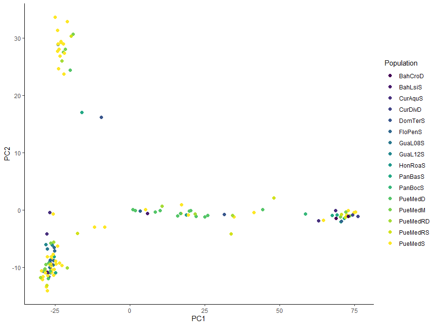
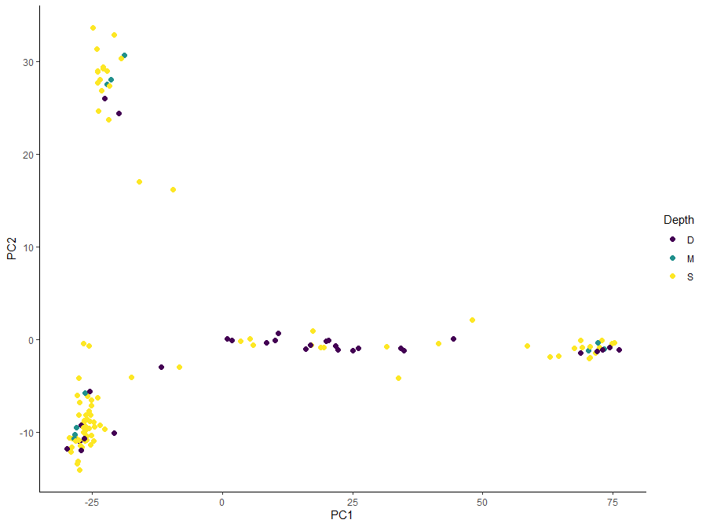
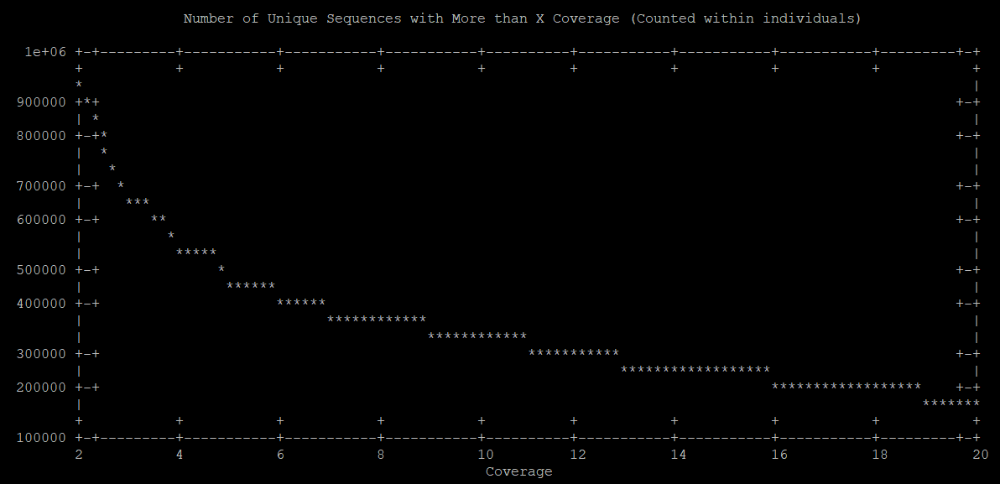
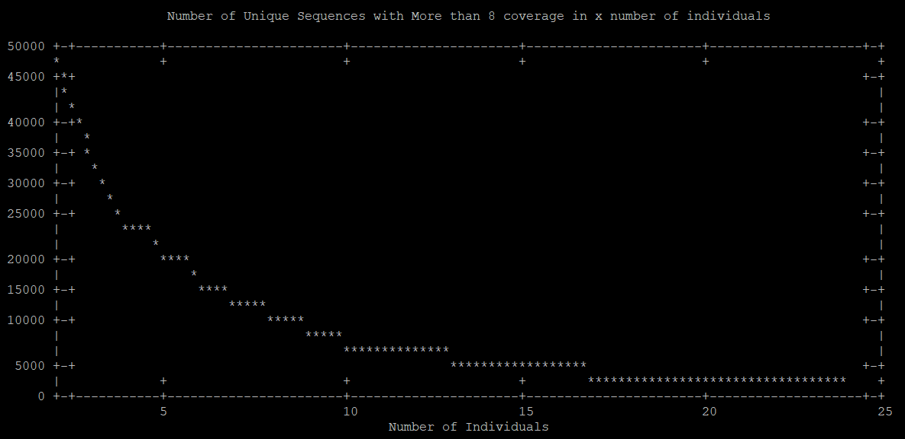

# Project Title: 
# Caribbean Scale Population Structure of Deep & Shallow Lineages of the Octocoral *Eunicea flexuosa*

Table of Contents

* [Project Rational](#project-rational)
* [Project Plan & Goals](#project-plan--goals)
* [Project Details](#project-details)
  * [Data](#data)
  * [Project Environments](#project-environments)
* [Final Project Summary](#final-project-summary)
  * [Comments on Goals 4 & 6](#comments-on-goals-4-and-6)
  * [Overall](#overall)
* [Start of Project](#start-of-project)
  * [Initial Set Up](#initial-set-up)
    * [Getting barcodes](#getting-barcodes-to-workspace)
  * [Test - Goals 1 & 2](#test---goals-12-creation-of-sam--bam-files--creation-of-de-novo-reference-in-one-plate)
    * [Setting coverage cutoff value](#setting-coverage-cutoff-value)
    * [Setting number of individuals cuttof value](#setting-number-of-individuals-cutoff-value)
    * [Converting sequences back to fasta format](#converting-sequences-back-to-fasta-format)
    * [Assembling Reference contigs](#assembling-reference-contigs)
    * [Clustering & Alignment](#clustering-and-alignment)
    * [Merging Divided Clusters](#merging-divided-clusters)
    * [Optimal & Suboptimal Contigs](#optimal--suboptimal-conitigs)
      * [Test Final dDocent single line](#test-final-ddocent-reference-single-line)
  * [Full Data Set Pipeline](#full-data-set-pipeline)
    * [Setting up full dd and epiRAD datasets](#setting-up-for-reference-creation-with-full-ddrad-and-epirad-data-sets)
    * [Making shell scripts and SLURM job submission](#making-shell-scripts-and-slurm-job-submission-for-ddocent-on-bluewaves)
      * [SLURM 7 Day Resubmission](#ddocent-slurm-submission-take-two-–-7-day-wall-time)
    * [Filtering Pipeline Test](#filtering-pipeline-–-test)
    * [Making popmap file](#making-a-popmap-file-for-later-analysis)
    * [Limiting SNPs to biallelic](#limiting-snps-to-those-that-are-biallelic-for-other-analyses)
  * [Visualization: PCA in R](#visualizing-data-as-pca-in-r)
  * [Admixture plot attempt](#attempting-admixture-plot-in-r)


## Project Rational
The Caribbean wide octocoral *Eunicea flexuosa* has been shown to posses morphologically and genetically distinct sympatric lineages that appear to segregate by depth. Work thus far has shown that there is minimal mixing of these lineages within islands. The proportion of individuals originating from deep or shallow lineages changes predictably with depth, and evidence suggests that if a hybrid zone exists it is small. The prevailing hypothesis is that these two lineages likely represent recently diverged cryptic species where the exchange of genetic material is minimal. The genetic barrier is thought to be maintained through immigrant inviability, and unsuccessful hybrids. Further evidence suggests that the genetic barrier is reinforced by a slight (hour scale) difference in gamete release during spawning. 

It is not known how these populations relate to one another across islands. This project seeks to explore the population structure of these two cryptic lineages across the Caribbean basin. If deep and shallow lineages are more like their respective lineage across islands compared to their opposing sympatric lineage that would be strong evidence in support of two cryptic species of *Eunicea flexuosa*.

## Project Plan & Goals
1. Creation of SAM/BAM files from demultiplexed ddRAD samples using `BWA` and `SAMtools` in `dDocent`

2. Creation of *de novo* reference using `dDocent` for comparison of individuals across and within islands from each lineage 

3.  Quality filtering of SNP reads using `dDocent` and `VCF tools`

------------------------------------------------------------------
4.  ~~Detection of outlier SNPs using `Bayscan`and removal of outlier SNPs through subsetting~~

5.  Creation of Fst population structure statistics from ddRAD samples of *Eunicea flexuosa* taken across the Caribbean basin (could test with `hierfstat` in `R`)

6. ~~Create an Fst structure plot of lineage by locality (island) (`OutFlank` may be a good place to start)~~

7. Generation of PCA figures to visualize population structure (could use `PCA adapt` or `adegenet` &
`vcfR`)
------------------------------------------------------------------
## Project Details

### Data

Individual octocorals were morphologically identified to lineage and sampled across various depths (<4m – ~30m) throughout the Caribbean basin (Puerto Rico, Florida, Bahamas, Panama, Honduras, Guadalup, Dominican Republic, & Curacao). Libraries were prepped using a ddRAD protocol where a combination of two unique adapters identifies individuals.

Data files are demultiplexed gziped fastq files of the forward and reverse reads of each individual. Examples ~~`bc10_pa_1-AGTCATCGG_f_pa.fq.gz`, `bc10_pa_1-AGTCATCGG_r_pa.fq.gz` ~~

### Project Environments
* Objectives 1–3, and parts of 4 will be performed on the URI Bluewaves server where the data is stored.
* Objectives 5–6, and parts of 4 will be performed in R

# Final Project Summary

PCA1 vs PCA2 of Eunicea samples by population




PCA1 vs. PCA2 of Eunicea samples by depth category



Overall it appears that there are three visually distinct clusters across these populations along PCA 1 and PCA 2. However, neither the depth lineages nor the sampling locations appear to define these clusters well. Assuming the `basic.stats` command in `heirfast` and the overall Fst value (0.078) from it can be trusted there is very little population structure across the Caribbean. This may be a product of not parsing out the comparisons well. The PCA shows distinct clusters and previous work has identified clear structure between deep and shallow lineages. A good start, yet certainly more work to do!

## Comments on Goals 4 and 6 

**For goal 4** `Pgdspider` was not loaded to bluewaves and when establishing my own conda environment I did not have luck loading in packages that weren't already on the cluster. This prevented outlier detection through `bayscan` – since the proper file types could not be created. Visualizing outliers using the PCAdapt pipeline from week07 was attempted. An error occured in R and recommended the software package `PLINK` for restructuring data to a useable point. [investigating PLINK](https://zzz.bwh.harvard.edu/plink/data.shtml) it appears to be another filtering QA/QC pipeline for SNPs. It is loaded on the `Bluewaves` cluster. However, it needs to work with `.ped` files which specifically require columns for "Family ID, Individual ID, Paternal ID, Maternal ID, and Phenotype" my data does not have this level of sample resolution. Multiple attempts were made to use `plink --file --recode` to generate `.ped` files. Errors continued saying that no `.ped` files could be found. Goal four was skipped.

**For goal 6** After some digging what I specified as an Fst structure plot is actually termed an admixture plot. After more searching, and various package documentation papers [this source](https://rpubs.com/tlama/scatterpie) seemed the most likely candidate to help me generate the figure without using `plink` or other unix based analysis pipelines (of which it seems there are many). At present I sadly do not have the time to figure out how to load these on `bluewaves` then teach myself how to use them. After some progress with the R script it broke down (see section [Admixture plot attempt](#attempting-admixture-plot-in-r)) After roughly 2-3 hours of troublshooting and searching for alternatives the code was still not working. Goal 6 was skipped.

## Overall
5/7 seems pretty good given where I started this semester! Lots of work and learning ahead of me if I want to continue on with genomics. Thanks for a great course Jon! It really pushed me to engage with topics and develop skills outside of my intellectual comfort zone.


_________________________________________________________
# Start of Project
_________________________________________________________

> For the most part everything should be able to run straight through. I have purposfully left chunks of non-running code and comments that no longer apply so that I can keep track of my mistakes and thought process. There was a lot of back and forth between `bluewaves`, google sheets, and Excel that I hope no one has to redo. Code that no longer runs has been blocked out with `#` and comments that no longer apply, or found to be inncorrect are ~~struck through~~.

## Initial Set Up

Working environment: Bluewaves cluster maintained by URI 

Code chunks in `bash` unless otherwise stated.

Data located in ~~`/data/pradalab/Eunicea-EPIRAD/demultiplexed`~~ `pradalab/mgomez/Eunicea-EPIRAD/`

Matias has already demultiplexed these data.

We have forward and reverse read files ~~`_pa.fq.gz`~~ named in this format ~~`bc#_pa_#-seq_f/r_pa.fq.gz`~~ `ID.1or2.fq.gz`

Making directory and creating a symbolic link to the full dataset.

```bash
interactive #allocates nodes for live sessions in bluewaves

mkdir eunicea

cd eunicea

ln -s /data/pradalab/Eunicea-EPIRAD/demultiplexed ./eunicea_epirad

mkdir work
cd work
mkdir making_sam
cd making_sam

module load ddocent/2.7.8-foss-2018b

module list #shows loaded packages
```

Downloading `Rename_for_dDocent.sh` to automate renaming the files before finding unique reads.

```bash
curl -L -O https://github.com/jpuritz/dDocent/raw/master/Rename_for_dDocent.sh #normal

curl -L -O https://github.com/jpuritz/dDocent/raw/master/Rename_for_dDocent_with-INDEX.sh # for samples with two bar codes
```

### Getting barcodes to workspace

Will need to get/make a the barcodes file for each of the plates 1 – 12 since they use the same combinations of barcodes for individuals.

**Remember** - odd numbered plates were EPIRAD and even numbered plates were ddRAD.

Barcode files can be found in each of the `Eunicea-EPIRAD` folders in the `mgomez` directory. 

> Example `pradalab/mgomez/Eunicea-EPIRAD/701-501/decloned_demultiplexed`

Seems like this would be a good job for a for loop...as I do not yet know how to do those I will manually move each file to the current working directory

```bash
cd ~/research/eunicea/work

mkdir barcodes

cd /data/pradalab/mgomez/Eunicea-EPIRAD

#701-501
cp ./701-501_S31/decloned_demultiplexed/barcodes_701_501_S31.txt /home/john_girard/research/eunicea/work/barcodes #first test - works

#making more general for all barcode files

# 702-502
cp ./702-502_S32/decloned_demultiplexed/barcodes* /home/john_girard/research/eunicea/work/barcodes

# 703-503
cp ./703-503_S33/decloned_demultiplexed/barcodes* /home/john_girard/research/eunicea/work/barcodes # works one file added to barcodes

# 704-504
cp ./704-504_S34/decloned_demultiplexed/barcodes* /home/john_girard/research/eunicea/work/barcodes

# 705-505
cp ./705-505_S35/decloned_demultiplexed/barcodes* /home/john_girard/research/eunicea/work/barcodes

# 706-506
cp ./706-506_S36/decloned_demultiplexed/barcodes* /home/john_girard/research/eunicea/work/barcodes

#707-507
cp ./707-507_S37/decloned_demultiplexed/barcodes* /home/john_girard/research/eunicea/work/barcodes

#708-508
cp ./708-508_S38/decloned_demultiplexed/barcodes* /home/john_girard/research/eunicea/work/barcodes

#709-509
cp ./709-509_S39/decloned_demultiplexed/barcodes* /home/john_girard/research/eunicea/work/barcodes

#710-510
cp ./710-510_S40/decloned_demultiplexed/barcodes* /home/john_girard/research/eunicea/work/barcodes

#711-511
cp ./711-511_S41/decloned_demultiplexed/barcodes* /home/john_girard/research/eunicea/work/barcodes

#712-512
cp ./712-512_S42/decloned_demultiplexed/barcodes* /home/john_girard/research/eunicea/work/barcodes

# check
ls /home/john_girard/research/eunicea/work/barcodes # success all barcode files present
```
Barcode files: columns 1 & 2 are barcodes. column 3 is the sample ID

## Test - Goals 1&2: Creation of SAM & BAM Files, & Creation of *de novo* reference in one plate

Using `Rename_for_dDocent_with-INDX.sh` to rename the demultiplexed files. I will need to do this once for each file since they each use a different barcode file.
This script has been modified to reflect the barcode files (names = -f3, barcode1 = -f1, barcode2 = -f2). 

~~The new version that will be used is `Rename_for_dDocent.doublebc.mod.sh`~~

The data files were changed to reflect each individaul sampled *(27-Apr-2022)* these files were already decloned and demultiplexed. Their naming convention follows "sampleID.1/2.fq.gz" where 1 or 2 refers to forward and reverse reads respectively. `Rename_for_dDocent_with-INDX.sh` was modified to search for the sample ID then change the name of the symbolic link such that 1s become Fs and 2s become Rs, respectively. The new file used is `Rename_dDocent_numberchange.sh`
> The double bar code combination issue raised earlier is resolved. They are not needed for this step and with the sample ID and Plate known their respective barcode combinations can be traced back.

**Some individuals are used more than two times – once for ddRad and once for Epirad (e.g. 5060)**

Running one plate through the entire pipeline, if successful will apply to other plates.

```bash
cd ~/research/eunicea/work/making_sam

# Setting up "batch"

mkdir 701_501

#ln -s /data/pradalab/Eunicea-EPIRAD/#demultiplexed/bc1_* ~/research/#eunicea/work/making_sam/701_501 # #worked all files linked to directory
#^^pipeline did not work with these files

#rm bc1*

# Linking data to individual demultiplexed samples
ln -s /data/pradalab/mgomez/Eunicea-EPIRAD/701-501_S31/decloned_demultiplexed/*.fq.gz ~/research/eunicea/work/making_sam/701_501 #trying with different files, to name properly need to change the 1s to Fs and 2s to Rs

#batch renaming files
cd 701_501

../Rename_dDocent_numberchange.sh ~/research/eunicea/work/barcodes/barcodes_701_501_S31.txt #worked

 ls *.F.fq.gz | wc -l # checking number of individuals on this plate
 # 47

## Starting dDocent pipeline for RAD assembly and thresholding. 

# Much of the code here is adapted from the Ref.ex activity used in week 5. 

# Although clunky I run this line by line to really understand what is going on.

ls *.F.fq.gz > namelist #creating name list
sed -i'' -e 's/.F.fq.gz//g' namelist # find and replace within namelist

#below this point setting variables...I cannot interpret this at present (JG23Feb2022) 

AWK1='BEGIN{P=1}{if(P==1||P==2){gsub(/^[@]/,">");print}; if(P==4)P=0; P++}'
AWK2='!/>/'
AWK3='!/NNN/'
PERLT='while (<>) {chomp; $z{$_}++;} while(($k,$v) = each(%z)) {print "$v\t$k\n";}'

#below this point creating new files using the variables defined above

cat namelist | parallel --no-notice -j 8 "zcat {}.F.fq.gz | mawk '$AWK1' | mawk '$AWK2' > {}.forward" #creates foreward reads removing quality scores

cat namelist | parallel --no-notice -j 8 "zcat {}.R.fq.gz | mawk '$AWK1' | mawk '$AWK2' > {}.reverse" &#creates PE reads same way as above

cat namelist | parallel --no-notice -j 8 "paste -d '-' {}.forward {}.reverse | mawk '$AWK3' | sed 's/-/NNNNNNNNNN/' | perl -e '$PERLT' > {}.uniq.seqs" & #puts both reads together with 10 N's between them, finds the unique reads, counts them

#Due to the nature of RADseq usually reads with _low copy_ numbers can be eliminated. This is because sequences with _low coverage_ tend to be sequence errors

#BASH for loop from Ref.Ex

cat *.uniq.seqs > uniq.seqs #Putting all sequences into the same file

for i in {2..20};
do
echo $i >> pfile
done

cat pfile | parallel --no-notice "echo -n {}xxx && mawk -v x={} '\$1 >= x' uniq.seqs | wc -l" | mawk  '{gsub("xxx","\t",$0); print;}'| sort -g > uniqseq.data #make sure dDocent module is loaded, otherwise mawk won't work

rm pfile
```

The output created above in uniqseq.data can be plotted directly to the terminal. Plot and code below

```bash
gnuplot << \EOF 
set terminal dumb size 120, 30
set autoscale
set xrange [2:20] 
unset label
set title "Number of Unique Sequences with More than X Coverage (Counted within individuals)"
set xlabel "Coverage"
set ylabel "Number of Unique Sequences"
plot 'uniqseq.data' with lines notitle
pause -1
EOF
```



> Based on the graph above I will use 8 as the coverage cutoff

### Setting coverage cutoff value

```bash
parallel --no-notice -j 8 mawk -v x=8 \''$1 >= x'\' ::: *.uniq.seqs | cut -f2 | perl -e 'while (<>) {chomp; $z{$_}++;} while(($k,$v) = each(%z)) {print "$v\t$k\n";}' > uniqCperindv &

wc -l uniqCperindv
#126777 seqs/idv
```
We can also subset sequences based on the number of different individuals in which a particular squence occures. We'll simply shoot for more than half here – 24

```bash
for ((i = 2; i <= 24; i++));
do
echo $i >> ufile
done

cat ufile | parallel --no-notice "echo -n {}xxx && mawk -v x={} '\$1 >= x' uniqCperindv | wc -l" | mawk  '{gsub("xxx","\t",$0); print;}'| sort -g > uniqseq.peri.data &

rm ufile
gnuplot << \EOF
set terminal dumb size 120, 30
set autoscale
set xrange [2:24]
unset label
set title "Number of Unique Sequences with More than 8 coverage in x number of individuals"
set xlabel "Number of Individuals"
set ylabel "Number of Unique Sequences"
plot 'uniqseq.peri.data' with lines notitle
pause -1
EOF

wc -l uniqseq.peri.data
#7597
```


Graph shows that sequence number drops off quite precipitously by 24. It may be best to reset the threasholds to 5x coverage and 10 individuals

```bash
parallel --no-notice -j 8 mawk -v x=5 \''$1 >= x'\' ::: *.uniq.seqs | cut -f2 | perl -e 'while (<>) {chomp; $z{$_}++;} while(($k,$v) = each(%z)) {print "$v\t$k\n";}' > uniqCperindv &

wc -l uniqCperindv
#168282 seqs/idv

for ((i = 2; i <= 24; i++));
do
echo $i >> ufile
done

cat ufile | parallel --no-notice "echo -n {}xxx && mawk -v x={} '\$1 >= x' uniqCperindv | wc -l" | mawk  '{gsub("xxx","\t",$0); print;}'| sort -g > uniqseq.peri.data &

rm ufile

gnuplot << \EOF
set terminal dumb size 120, 30
set autoscale
set xrange [2:24]
unset label
set title "Number of Unique Sequences with More than 8 coverage in x number of individuals"
set xlabel "Number of Individuals"
set ylabel "Number of Unique Sequences"
plot 'uniqseq.peri.data' with lines notitle
pause -1
EOF

wc -l uniqseq.peri.data
#9913 uniq seqs
```
Will push through with the pipeline using the 5x coverage and minimum 10 individuals. When creating the reference file I may take all of the ddRAD samples across the plates and run them through this pipeline. Then use that reference on individuals for mapping and analysis. For now I will continue with the pipeline test.

### Setting number of individuals cutoff value

Using `mawk` to specify a coverage cut off of 10 – this time for the minimum number of individuals

```bash
mawk -v x=10 '$1 >= x' uniqCperindv > uniq.k.10.c.5.seqs #Note the change from "<" to ">" k = individuals c = coverage

wc -l uniq.k.10.c.5.seqs #checking samples left 9913
```
### Converting sequences back to `fasta` format

```bash
cut -f2 uniq.k.10.c.5.seqs > totaluniqseq  #subset the 2nd col file and create new file
mawk '{c= c + 1; print ">Contig_" c "\n" $1}' totaluniqseq > uniq.fasta
```

### Assembling Reference Contigs

```bash
sed -e 's/NNNNNNNNNN/\t/g' uniq.fasta | cut -f1 > uniq.F.fasta #removing the 10 Ns added earlier and outputting the foreward read portion as a fasta file
```
### Clustering and Alignment
Starting process with low similarity (80%) and will use other functions to further filter the data.

Will be using `CD-HIT`

```bash
cd-hit-est -i uniq.F.fasta -o xxx -c 0.8 -T 0 -M 0 -g 1
```
> Surprisingly did not take to long running as an interactive session in bluewaves

Breaking it down
> To see `cd-hit` documentation type in the command with no options set.

* cd-hit-est — the "est" is specific for neucleotides. Otherwise  the progam assumes it is working with peptides
* -i — flag for input file
* -o — flag for output file
* -c — flag for proportion of similarity 1.00 = 100%
* -T — Sets the number of threads setting the value to 0 uses all available.
* -M — Memory, specifies the amount of RAM to use. Setting to 0 uses all available.
* -g — can be 1 or 0 (default). Changes how the algorithm clusters. 1 is slower yet more accurate according to the function documentation

Next taking `cd-hit` output and convert it into a format for `rainbow` to handle.

```bash
mawk '{if ($1 ~ /Cl/) clus = clus + 1; else  print $3 "\t" clus}' xxx.clstr | sed 's/[>Contig_,...]//g' | sort -g -k1 > sort.contig.cluster.ids

paste sort.contig.cluster.ids totaluniqseq > contig.cluster.totaluniqseq #joins these files horizontally i.e., line by line. Output file is tabdelimited 

sort -k2,2 -g contig.cluster.totaluniqseq | sed -e 's/NNNNNNNNNN/\t/g' > rcluster #The 10 N sequence was removed to make `uniq.F.fasta`, however it is retained in `totaluniqseq` and is being removed and replaced with a `tab`
```
Inspecting files

```bash
cut -f2 rcluster | uniq | wc -l #col 2 has the cluster ID
#5898 RAD loci
```
Clustering by Alleles with found RAD loci

```bash
rainbow div -i rcluster -o rbdiv.out #base, -f 0.2 as default

```
Breaking it down

* -f — minimum frequeny needed to divided an allele into a unique cluster
* -K – controls minimum number of alleles to split regarless of frequency

### Merging Divided Clusters

QA/QC check: Paired End reads should be very similar (i.e. the reading directions should not matter) Those with very different seqs are more likely to be "repetitive regions"

```bash
rainbow merge -o rbasm.out -a -i rbdiv.out #base: -r default is 5 - min number of reads to assemble (valid only when -a is opened)
```

### Optimal & Suboptimal Conitigs

First, the script looks at all the contigs assembled for a cluster.  If any of the contigs contain forward and PE reads, then that contig is output as optimal.     
If no overlap contigs exists (the usual for most RAD data sets), then the contig with the most assembled reads PE (most common) is output with the forward read contig with a 10 N spacer.
If two contigs have equal number of reads, the longer contig is output.

At this point, dDocent (version 2.0 and higher) will check for substantial overlap between F and PE reads in the contigs.

```bash
cat rbasm.out <(echo "E") |sed 's/[0-9]*:[0-9]*://g' | mawk ' {
if (NR == 1) e=$2;
else if ($1 ~/E/ && lenp > len1) {c=c+1; print ">dDocent_Contig_" e "\n" seq2 "NNNNNNNNNN" seq1; seq1=0; seq2=0;lenp=0;e=$2;fclus=0;len1=0;freqp=0;lenf=0}
else if ($1 ~/E/ && lenp <= len1) {c=c+1; print ">dDocent_Contig_" e "\n" seq1; seq1=0; seq2=0;lenp=0;e=$2;fclus=0;len1=0;freqp=0;lenf=0}
else if ($1 ~/C/) clus=$2;
else if ($1 ~/L/) len=$2;
else if ($1 ~/S/) seq=$2;
else if ($1 ~/N/) freq=$2;
else if ($1 ~/R/ && $0 ~/0/ && $0 !~/1/ && len > lenf) {seq1 = seq; fclus=clus;lenf=len}
else if ($1 ~/R/ && $0 ~/0/ && $0 ~/1/) {seq1 = seq; fclus=clus; len1=len}
else if ($1 ~/R/ && $0 ~!/0/ && freq > freqp && len >= lenp || $1 ~/R/ && $0 ~!/0/ && freq == freqp && len > lenp) {seq2 = seq; lenp = len; freqp=freq}
}' > rainbow.fasta
```
With optimized contigs we will now increase the similarity threashold

```bash
cd-hit-est -i rainbow.fasta -o referenceRC.fasta -M 0 -T 0 -c 0.9
```

Shell script for automating data exploration by varing the uniqe sequence and cluster cut off parameters

```bash
curl -L -O https://github.com/jpuritz/dDocent/raw/master/scripts/remake_reference.sh

bash remake_reference.sh 5 10 0.90 PE 2 #1st = coverge, 2nd = individuals, 3rd = similarity 
```
> dDocent assembled 9913 sequences (after cutoffs) into 5899 contigs

Pipeline works a reference fasta has been created.

#### Test Final dDocent reference Single Line

Running dDocent as a single line. Goal is to see if 

1. It runs smoothly
2. It produces the same results with the same settings

Settings: coverage 5x, individuals 10, similarity 90%, PE = 2

Desired output 5899 contigs

Further mods to get file naming convention correct for dDocent. The sampleIDs are repeated `ID_ID.F/R.fq.gz`. The sample IDs are specific for individuals and coded for locality and site. Since I am jummping into this research mid stream I'm electing to retain the rile naming convention. The new batch renaming file is `Rename_dDocent_numberchange_dbname.sh`

```bash
dDocent 
```
> dDocent assembled 9913 sequences (after cutoffs) into 5899 contigs

This seems to have worked!


## Full Data Set Pipeline

### Setting up for Reference creation with full ddRAD and epiRAD data sets

For the full analysis I will group all of the ddRAD and the epiRAD samples together. The ddRAD samples will be used to create the *de novo* reference for **both** data sets. The thinking is that the ddRAD will have the most complete genome across all of the samples since the epiRAD samples us a restrection enzyme that is sensitive to DNA methylations.

From there analysis will focus on the ddRAD samples.

> I will likely need to remove duplicate samples used more than once in each libray prep (dd or epi)

> I will also need to concatanate the barcodes for the epi and dd rad samples

Concatanating epi and dd rad barcodes
Epi = odd numbered plates, dd = even numbered plates

```bash
cd ~/research/eunicea/work/barcodes
 #epi 
cat barcodes_701_501_S31.txt barcodes_703_503_S33.txt barcodes_705_505_S35.txt barcodes_707_507_S37.txt barcodes_709_509_S39.txt barcodes_711_511_S41.txt > epibarcodes.txt

wc -l epibarcodes.txt #checking total barcodes
#282

sort -u epibarcodes.txt | wc -l # removing duplicates, sorting, and checking for barcode reduction
#137

sort -u epibarcodes.txt > epibarcodes.uniq.txt

grep A61 epibarcodes.uniq.txt #verify removal of a known duplicate, Only one line should print


#dd
cat barcodes_702_502_S32.txt barcodes_704_504_S34.txt barcodes_706_506_S36.txt barcodes_708_508_S38.txt barcodes_710_510_S40.txt barcodes_712_512_S42.txt > ddbarcodes.txt

wc -l ddbarcodes.txt #checking total barcodes
#282

sort -u ddbarcodes.txt | wc -l # removing duplicates, sorting, and checking for barcode reduction
#138

sort -u ddbarcodes.txt > ddbarcodes.uniq.txt

grep A69 ddbarcodes.uniq.txt #verify removal of a known duplicate, Only one line should print
```

Setting up ddRad and epiRad data directories

```bash
cd ~/research/eunicea/work/making_sam

mkdir ddrad
mkdir epirad

cp Rename_dDocent_numberchange_dbname.sh ./ddrad

cp Rename_dDocent_numberchange_dbname.sh ./epirad

cp ../barcodes/ddbarcodes.uniq.txt ./ddrad

cp ../barcodes/epibarcodes.uniq.txt ./epirad

#EpiRAD

# Linking data to individual demultiplexed samples
#701
ln -s /data/pradalab/mgomez/Eunicea-EPIRAD/701-501_S31/decloned_demultiplexed/*.fq.gz ~/research/eunicea/work/making_sam/epirad

#703
ln -s /data/pradalab/mgomez/Eunicea-EPIRAD/703-503_S33/decloned_demultiplexed/*.fq.gz ~/research/eunicea/work/making_sam/epirad # will not create files that already exist. This solves my duplicate problem. 

#705
ln -s /data/pradalab/mgomez/Eunicea-EPIRAD/705-505_S35/decloned_demultiplexed/*.fq.gz ~/research/eunicea/work/making_sam/epirad

#707
ln -s /data/pradalab/mgomez/Eunicea-EPIRAD/707-507_S37/decloned_demultiplexed/*.fq.gz ~/research/eunicea/work/making_sam/epirad


#709
ln -s /data/pradalab/mgomez/Eunicea-EPIRAD/709-509_S39/decloned_demultiplexed/*.fq.gz ~/research/eunicea/work/making_sam/epirad

#711
ln -s /data/pradalab/mgomez/Eunicea-EPIRAD/711-511_S41/decloned_demultiplexed/*.fq.gz ~/research/eunicea/work/making_sam/epirad

#ddRAD

# Linking data to individual demultiplexed samples
#702
ln -s /data/pradalab/mgomez/Eunicea-EPIRAD/702-502_S32/decloned_demultiplexed/*.fq.gz ~/research/eunicea/work/making_sam/ddrad

#704
ln -s /data/pradalab/mgomez/Eunicea-EPIRAD/704-505_S36/decloned_demultiplexed/*.fq.gz ~/research/eunicea/work/making_sam/ddrad # will not create files that already exist. This solves my duplicate problem. 

#706
ln -s /data/pradalab/mgomez/Eunicea-EPIRAD/706-506_S36/decloned_demultiplexed/*.fq.gz ~/research/eunicea/work/making_sam/ddrad

#708
ln -s /data/pradalab/mgomez/Eunicea-EPIRAD/708-508_S38/decloned_demultiplexed/*.fq.gz ~/research/eunicea/work/making_sam/ddrad

#710
ln -s /data/pradalab/mgomez/Eunicea-EPIRAD/710-510_S40/decloned_demultiplexed/*.fq.gz ~/research/eunicea/work/making_sam/ddrad

#712
ln -s /data/pradalab/mgomez/Eunicea-EPIRAD/712-512_S42/decloned_demultiplexed/*.fq.gz ~/research/eunicea/work/making_sam/ddrad
```
> I will have to talk to Carlos regarding how we will be handling duplicate plates

Renaming for dDocent

```bash
# ddRad

cd ~/research/eunicea/work/making_sam/ddrad

./Rename_dDocent_numberchange_dbname.sh ddbarcodes.uniq.txt #new names follow ID_ID.F or R.fq.gz, Errors for missing files can be ignored. The files are present and names properly transformed. Some duplicates still remain as the dual barcode specification for a given individual ID were different in some plates. The rename script transformed the name when it first encountered the ID. Subsequent encounters cannot find the old name and produce an error

cd ~/research/eunicea/work/making_sam/epirad

./Rename_dDocent_numberchange_dbname.sh epibarcodes.uniq.txt
```

### Making shell scripts and SLURM job submission for dDocent on bluewaves

Reading some of the documentation on how to use blue waves it seems it might have been better to not use my home directory for analysis. Thankfully the data files are linked and only a few shell scripts exist in the home directory. I will copy the ddrad and epirad folders to `/data/pradalab/JGirard` then submit the SLURM jobs to have them work within the new directory 

```bash
cd ~/research/eunicea/work/making_sam

cp -R  ddrad /data/pradalab/JGirard

cp -R  epirad /data/pradalab/JGirard
#worked

#ddrad - 135 individuals

cd /data/pradalab/JGirard/ddrad

# Making a configuration file for non-interactive dDocent input

nano

Number of Processors
20
Maximum Memory
0
Trimming
yes
Assembly?
yes
Type_of_Assembly
PE
Clustering_Similarity%
0.90
Minimum within individual coverage level to include a read for assembly (K1)
6
Minimum number of individuals a read must be present in to include for assembly (K2)
13
Mapping_Reads?
yes
Mapping_Match_Value
1
Mapping_MisMatch_Value
4
Mapping_GapOpen_Penalty
6
Calling_SNPs?
yes
Email
john_girard@uri.edu

#write out as ddrad_dDocent_configfile.txt

nano #writing shell script for SLURM job input

#!/bin/bash
#SBATCH -t 24:00:00
#SBATCH --nodes=1 --ntasks-per-node=20
#SBATCH --mail-type=BEGIN  --mail-user=john_girard@uri.edu
#SBATCH --mail-type=END  --mail-user=john_girard@uri.edu
#SBATCH --mail-type=FAIL  --mail-user=john_girard@uri.edu
cd /data/pradalab/JGirard/ddrad

module load ddocent/2.7.8-foss-2018b

dDocent ./ddrad_dDocent_configfile.txt

#write out as ddrad.job.sh

#submitting job

sbatch ddrad.job.sh #The job submitted and start was verified
#submission number: batch job 1984690

#checking job
squeue --job 1984690 #job running
```


```bash
# epirad - 137 individuals

cd /data/pradalab/JGirard/epirad

# Making a configuration file for non-interactive dDocent input

nano

Number of Processors
20
Maximum Memory
0
Trimming
yes
Assembly?
yes
Type_of_Assembly
PE
Clustering_Similarity%
0.90
Minimum within individual coverage level to include a read for assembly (K1)
6
Minimum number of individuals a read must be present in to include for assembly (K2)
13
Mapping_Reads?
yes
Mapping_Match_Value
1
Mapping_MisMatch_Value
4
Mapping_GapOpen_Penalty
6
Calling_SNPs?
yes
Email
john_girard@uri.edu

#write out as epirad_dDocent_configfile.txt

nano #writing shell script for SLURM job input

#!/bin/bash
#SBATCH -t 24:00:00
#SBATCH --nodes=1 --ntasks-per-node=20
#SBATCH --mail-type=BEGIN  --mail-user=john_girard@uri.edu
#SBATCH --mail-type=END  --mail-user=john_girard@uri.edu
#SBATCH --mail-type=FAIL  --mail-user=john_girard@uri.edu
cd /data/pradalab/JGirard/epirad

module load ddocent/2.7.8-foss-2018b

dDocent ./epirad_dDocent_configfile.txt

#write out as epirad.job.sh

#submitting job

sbatch epirad.job.sh #submitted running
#job ID: 1984692

squeue --job 1984692

```
Slurm job worked. However, the program ran into its wall time and quit afte 24 hours. `slurm` file has the last dDocent response as "creating alignment intervals". It appears that bam files were made for all the samples a reference fasta, and a `rainbow.fasta`. I do not know exactly what wasn't done. Although, no vcf files exist in this folder which ultimitely is what I need to continue filtering and eventually get the data into a format where it may be visualized in R. 

>Important output to note: "dDocent assembled 32330 sequences (after cutoffs) and 12934 contigs

After emailing the system admin I will resubmit the job to bluewaves with a 1 week Wall Time. At least this way I can be sure that dDocent performs everything it needs to before moving on. 

> For other URI researchers who may need to rerun this pipeline on this data, the system admin said that this job may run faster on the Andromeda cluster. There are more processor per node (32 instead of 20). URI documentation states that a VPN is needed to use Andromeda when not on campus. I am currently working with IT services to rectify VPN issues I am having with URI's recommended connection pathway. Therefore I will keep my analysis to Bluewaves which I can access off campus

#### dDocent SLURM submission take two – 7 day wall time

Resetting folders to run pipeline; retaining old folders

```bash

cd /home/john_girard/research/eunicea/work/making_sam

cp -R  ddrad /data/pradalab/JGirard

cp -R  epirad /data/pradalab/JGirard

#ddrad - 135idv

# Making a configuration file for non-interactive dDocent input

nano

Number of Processors
20
Maximum Memory
0
Trimming
yes
Assembly?
yes
Type_of_Assembly
PE
Clustering_Similarity%
0.90
Minimum within individual coverage level to include a read for assembly (K1)
6
Minimum number of individuals a read must be present in to include for assembly (K2)
13
Mapping_Reads?
yes
Mapping_Match_Value
1
Mapping_MisMatch_Value
4
Mapping_GapOpen_Penalty
6
Calling_SNPs?
yes
Email
john_girard@uri.edu

#write out as ddrad_dDocent_configfile.txt

#Note change from 24Hr to 168Hr
nano #writing shell script for SLURM job input

#!/bin/bash
#SBATCH -t 168:00:00
#SBATCH --nodes=1 --ntasks-per-node=20
#SBATCH --mail-type=BEGIN,END,FAIL,TIME_LIMIT_80 --mail-user=john_girard@uri.edu
cd /data/pradalab/JGirard/ddrad

module load ddocent/2.7.8-foss-2018b

dDocent ./ddrad_dDocent_configfile.txt

#write out as ddrad.job.sh

#submitting job

sbatch ddrad.job.sh #The job submitted and start was verified
#submission number: batch job 1984745

#checking job
squeue --job 1984745 #job running

squeue -t RUNNING -l # prints all the jobs currently running on the HPC


# epirad - 137 individuals

cd /data/pradalab/JGirard/epirad

# Making a configuration file for non-interactive dDocent input

nano

Number of Processors
20
Maximum Memory
0
Trimming
yes
Assembly?
yes
Type_of_Assembly
PE
Clustering_Similarity%
0.90
Minimum within individual coverage level to include a read for assembly (K1)
6
Minimum number of individuals a read must be present in to include for assembly (K2)
13
Mapping_Reads?
yes
Mapping_Match_Value
1
Mapping_MisMatch_Value
4
Mapping_GapOpen_Penalty
6
Calling_SNPs?
yes
Email
john_girard@uri.edu

#write out as epirad_dDocent_configfile.txt

nano #writing shell script for SLURM job input

#!/bin/bash
#SBATCH -t 168:00:00
#SBATCH --nodes=1 --ntasks-per-node=20
#SBATCH --mail-type=BEGIN,END,FAIL,TIME_LIMIT_80 --mail-user=john_girard@uri.edu
cd /data/pradalab/JGirard/epirad

module load ddocent/2.7.8-foss-2018b

dDocent ./epirad_dDocent_configfile.txt

#write out as epirad.job.sh

#submitting job

sbatch epirad.job.sh #submitted running
#job ID: 1984746

squeue --job 1984746

squeue -t RUNNING -l
```

> epirad completed in 2:24:00 GREAT! But how!? It didn't finish in 24 hours on Friday...

> ddrad completed in about 16 hours... the load on bluewaves must have been pretty heavy on Friday and over the weekend.

ddRad dDocent output
87822 sites out of 356354

epirad dDocent output
39241 sites out of 239152

### Filtering pipeline – Test

Using vcf tools to filter SNPs. Much of this pipeline follows our BIO5 594 week 7 protocol.

Setting up environment

```bash

cd /data/pradalab/JGirard

interactive #access computing power on a bluewaves node

module load ddocent/2.7.8-foss-2018b

#ddRad
mkdir ddradfilter

ln -s /data/pradalab/JGirard/ddrad/*.vcf /data/pradalab/JGirard/ddradfilter #works when the absolute path is specified

cd /data/pradalab/JGirard/ddradfilter

vcftools --vcf TotalRawSNPs.vcf --max-missing 0.5 --mac 0.001 --minQ 20 --recode --recode-INFO-all --out TRS &
#took two minutes to run
```

> Kept 135  of 135 individuals

> Kept 231091 of 356354 SNPs


* `--vcf` flag specifying the next input is a vcf file
* `--max-missing` filters genotypes called below 50% across all individuals
* `--minQ` setting minimum quality score
* `--maf` Filter SNPs with minor allele count of < x
* `--mac` Include  only  sites with Minor Allele Count greater than or equal
to the "--mac" value and less than or  equal  to  the  "--max-mac"
value.  One of these options may be used without the other. Allele
count is simply the number of times that allele appears  over  all
individuals at that site.
* `--recode` write a new vcf file with filters
* `--recode-INFO-all` keeps all info flags from old vcf file in new one
* `--out` name of output 

Adding minDP filter

```bash
vcftools --vcf TRS.recode.vcf --minDP 5 --recode --recode-INFO-all --out TRSdp5 & # might not change too much because the dDocent depth (coverage) was 6
```

* `minDP` setting the minimum depth e.g. < x reads

> Kept 231091 of 231091 – as expected no change 

### Making a popmap file for later analysis

~~...looks like I may need to make a rudimentatry pop map to continue on with the analysis.~~ Used in the analysis pipeline already (05-May-2022)
Manually building a popmap file: I will take individual ID codes assign them a population based on their "island location" and depth lineage. Depth lineage cutoff will be 50ft (15.24m) as the cuttoff between deep and shallow lineages
File will be set up as col1 = Individual ID "TAB" col2 = popn
Population codes are as follows first three letters of island, next three letters are reef location, last letter is the depth lineage distinction.

Ex. PueMedS = Puerto Rico, Media Luna, Shallow

Additional Notes: one popualtion is labeled PueMedM. The M was given because the sampling depth for these corals was 45ft - 55Ft which spans the 50ft cutoff for the Shallow (S) and Deep (D) distictions. If an "R" is present as the 7th letter this signifies a recruit population at this particular locality

Ex. PueMedRD = Puerto Rico, Media Luna, Recruit, Deep

```bash
cd /data/pradalab/JGirard

interactive

cat ./ddrad/namelist ./epirad/namelist | sort -u > ./dd.epi.namelist.uniq
```
`dd.epi.namelist.uniq` was copied into a text editor and the pop map labels for column 2 were added manually checking against the sample data sheet from this project. With the pop map file made if this analysis were to be run again it may be best to follow the normal dDocent naming convention (IndividualID_Popndesignation). Likely all that needs to be done is to remove the `_duplicate Individual ID` from the current name and replace it with `_population designation`

popmap file = `eunicea.prelim.popmap.txt`

```bash
cut -f2 eunicea.prelim.popmap.txt # output prints full lines the text file is not seeing the tabs I put in as delimiters. I will add these manually in nano and test again 
```
new file `eunicea.prelim.popmap.tab.txt`

```bash
# Checking that tabs are seen as delimiters 

cut -f1 eunicea.prelim.popmap.tab.txt | sort -u | wc -l #246 total individuals across dd and epirad sampling

cut -f2 eunicea.prelim.popmap.tab.txt | sort -u | wc -l #16 unique population distictions based on criteria above
```

Next: Filtering SNPs based on the percentatge of missing data. Using a 5%(0.05) cutoff value for this.

```bash
cp ../eunicea.prelim.popmap.tab.txt /data/pradalab/JGirard/ddradfilter

pop_missing_filter.sh TRSdp5.recode.vcf eunicea.prelim.popmap.tab.txt 0.05 16 TRSdp5p05
```
> kept 135 of 135 idv and 216132 of 231091 SNPs

> ~~Skipping this filter step because we do not have a popmap file at present. See quote below for context on poptential populations in this study~~

> The number after `0.05` represents the *a priori* poplation number. We don't actually know how many true populations there are. We could break these up by lineage (2, deep or shallow) across the Caribbean, we could break them up by "island" (11), sites within "islands" (31). Nesting these would be tricky since site and depth is usually confounded except in the case of Media Luna in Puerto Rico where samples were taken over a depth gradient. The command above retains more diversity (SNPs) when more populations are specified. Therefore it may be better to overestimate potential populations than underestimate. ~~For a ball park we'll split the middle and "assume" 15 populations.~~

> Had to make a prelim population map for some later steps (see section "Making a popmap file for later analysis"). Based on that file I have labeled 16 potentially different populations. If these steps are rerun with the popmap file use 16 as the number of populations 

* The above code may not even work because we don't have a `popmap` file. this may be something I make later as part of my Ph.D thesis.
* If a popmap file is used in a later analysis it is specified after the `.vcf` file

Further dDocet filtering

```bash
#dDocent_filters #type just the name of the function to get a print of its basic function

dDocent_filters TRSdp5p05.recode.vcf TRSdp5p05 # this may need to be run interactively. Jon may have set this up to take a configuration file
```

dDocent prompts 
>Are reads expected to overlap?  In other words, is fragment size less than 2X the read length?

I do not know in this dataset and will answer "no"
 
***Ask Carlos about this during our next meeting based on how he understands the libraries to have been prepped.***

> dDocent: Is this from a mixture of SE and PE libraries? A: no

Output: "Number of additional sites filtered based on properly paired status
3756 of 108366"
Number of sites filtered based on high depth and lower than 2*DEPTH quality score
10019 of 104610

Printed figure looks like exponential decay not a normal distribution as it suggests it should be. Of course the window was sized oddly and printed in an odd way. Program suggests a max mean depth cutoff of 140. Should be able to retain over 500 SNPs with a max mean depth of 70

~~More propmts follow~~
~~* changing max mean depth cutoff to 70~~

~~>Output:~~
 ~~Number of sites filtered based on maximum mean depth~~
 ~~35854 of 111329~~

 ~~Number of sites filtered based on within locus depth mismatch~~
 ~~357 of 75475~~

~~Total number of sites filtered~~
 ~~155973 of 231091~~

~~***Remaining sites***~~
 ~~***75,118***~~

I misinterpreted the graph. I will rerun this function with the recommended 95% cut off to see how many SNPs are retained.
Will output file as `TRSdp5p05`

```bash
#dDocent_filters TRSdp5.recode.vcf TRSdp5p138
```
> Output:

Number of sites filtered based on maximum mean depth
 6877 of 104610

Number of sites filtered based on within locus depth mismatch
 477 of 97733

Total number of sites filtered
 118876 of 216132

***Remaining sites***
 ***97,256***

> "Filtered VCF file is called Output_prefix.FIL.recode.vcf"
`TRSdp5p05.FIL.recode.vcf`

Interesting, there are ~ 30,000 more sites. I figured increasing the mean depth cutoff would further limit the SNPs not increase them...I have so much to learn!

For now we will push forward with the filtered version containing more SNPs.

Further vcf filtering - INDEL removal. Initially using Jon's code to change file names. 

```bash
vcfallelicprimitives -k -g TRSdp5p05.FIL.recode.vcf |sed 's:\.|\.:\.\/\.:g' > TRSdp5p05F.prim
vcftools --vcf TRSdp5p05F.prim --recode --recode-INFO-all --remove-indels --out SNP.TRSdp5p05F
```

> 109317 of 122268 Sites 

~~Will not perform Hardy-Weinburg Eq filter since we do not currenlty have a population map.~~

Hardy Weinburg Eq Filter

```bash
filter_hwe_by_pop.pl -v SNP.TRSdp5p05F.recode.vcf -p ./eunicea.prelim.popmap.tab.txt -c 0.5 -out SNP.TRSdp5p05FHWE
```
> 109317 of 109317

Back to vcf tools to add the maf filter (minor allele frequencies). Threshold set to 5%

```bash
vcftools --vcf SNP.TRSdp5p05FHWE.recode.vcf --maf 0.05 --recode --recode-INFO-all --out SNP.TRSdp5p05FHWEmaf05
```
> 36,154 of 109317 Sites – large drop here

### Limiting SNPs to those that are biallelic for other analyses

```bash
cd /data/pradalab/JGirard/ddradfilter

vcftools --vcf SNP.TRSdp5p05FHWEmaf05.recode.vcf --max-alleles 2 --recode --recode-INFO-all --out SNP.TRSdp5p05FHWEmaf05.2A
```
> kept 35809 of 36154 SNPs

## Visualizing Data as PCA in R


```bash

#module load R

#cd /data/pradalab/JGirard

#mkdir ddradR

#cp ./ddradfilter/SNP.TRSdp5p05FHWEmaf05.2A.recode.vcf ./ddradR

#cp ./eunicea.prelim.popmap.tab.txt ./ddradR

#cd ./ddradR

#Rscript ddrad.pca.R

```

Script below submitted to bluewaves as an R-script using the command `Rscript`. File saved as `ddrad.pca.R` in `ddradR` directory

> Does not work because I do not have permission to download packages. Setting up a conda environment didn't seem to work either. The soluiton may be to specify a new path for the R packages to reside in my conda environment. This could take a long time to figure out and not even work. I will try to run this visualization on my local PC in R using the code below

[Documentation for heirfstat package](https://cran.r-project.org/web/packages/hierfstat/hierfstat.pdf) for Fst statistic calculation

R code


```R
###Taking output from Bluewaves and attempting to R data visualizations on my personal PC in R

setwd("~/Documents/Documents/URI/Ph.D/Disertation_Classes_TA/Course Work/Spring 2022/Bio594_SpTopics_Puritz/594mdfiles/Final.Project/FinalProject_R")

install.packages ("adegenet") 
install.packages ("vcfR")
install.packages ("hierfstat")
# loading packages
library(adegenet)
library(vcfR)

#creating objects from data files 

my_vcf <- read.vcfR("./SNP.TRSdp5p05FHWEmaf05.2A.recode.vcf")


my_genind <- vcfR2genind(my_vcf) #making a gene ID file from original VCF
#str (my_genind)# returns ..@strata : NULL
#region ------------------------------------------------------------
#Ask about this block of code.

#"strata" needs to be created. Right now it appears to come from nothing and is filled with my_geneID

strata<- read.table("./ddrad.popmap.tab.txt", header=FALSE) #What is strata? It is not in the directory. "LibraryInfo"?
strata_df <- data.frame(strata)#turn to data frame


strata(my_genind) <- strata_df #set strata variable in my_genind to the strata dataframe
#error: number of idv is not equal between the data frame and the my_genid file. 
#one of the individuals was removed during the adegenet process this can be round in the first column of the @tab matrix in genid
 my_genind@tab[,1]
 idvremaining <- my_genind@tab[,1]
 idvremaining.dat <- as.data.frame(idvremaining)
 retainedidv <- row.names(idvremaining.dat)
 retained.dat <- as.data.frame(retainedidv)
 write.csv(retained.dat, "Retained.idv.csv")

# Used the match function in excel to find the missing individual – R18_R18
# R18_R18 is located in row 130
# Using a new popmap file with row 130 removed from the original ddrad.popmap.tab.txt

ddrad.popmap.sub <- strata_df[-130,]
strata_df <- ddrad.popmap.sub
strata_df <-`colnames<-`(strata_df, c("ID","Population"))# giving column names my_genind will recognize. "Population" is important

strata(my_genind) <- strata_df #set strata variable in my_genind to the strata dataframe
# worked!

setPop(my_genind) <- ~Population #worked
#------------------------------------------------------------------------------ 

#endregion-------------------------------------------------------------

#Test Population Structure
library("hierfstat")
#fstat(my_genind)

#matFst <- pairwise.fst(my_genind)

#PCA building

X <- tab(my_genind, freq = TRUE, NA.method = "mean")
pca1 <- dudi.pca(X, scale = FALSE, scannf = FALSE, nf = 3)
barplot(pca1$eig[1:50], main = "PCA eigenvalues", col = heat.colors(50)) #Creating barplot of eigenvectors (PCA axes?)
s.class(pca1$li, pop(my_genind))
title("PCA E.Flexuosa populations across the Caribbean Basin\naxes 1-2")
add.scatter.eig(pca1$eig[1:20], 3,1,2)

col <- funky(15)
s.class(pca1$li, pop(my_genind),xax=1,yax=2, col=col, axesell=FALSE, cstar=0, cpoint=3, grid=FALSE)# plots PCA

#Let's try ggplot I have a little more experience here

install.packages("ggplot2")
install.packages("ggfortify")
library(ggplot2)
library(ggfortify)

autoplot(pca1)# saddly autoplot does not play nice with this object type
# I should be able to pull out the points manually
# documentation says pca1@li are the principle component scores

pca1$li

pca1.2.dat <- pca1$li[,1:3] #take cols 1 - 3
pca1.2.dat # lookgs good

#Now to add the population data
#Thankfully data should already be in the same order as the popmap

pca1.2.dat$Population <- strata_df$Population
pca1.2.dat# looks good
#bringing in a table with the depth lineage variable
ddrad.popmap.depth <- read.table("ddrad.popmap.depth.tab.txt", header = FALSE, sep = "", col.names = c("ID", "Population","Depth"))
# Removing sample R18_R18
ddrad.popmap.depth.sub <- ddrad.popmap.depth[-130,]

# Adding depth lineage col to pca1.2 data set

pca1.2.dat$Depth <- ddrad.popmap.depth.sub$Depth
pca1.2.dat


install.packages("viridis")# color pallets for R many robust to colorblindness
library(viridis)

#By Population
ggplot(pca1.2.dat, aes(x = Axis1, y = Axis2, col=Population)) + geom_point(size = 2)+
  scale_color_viridis_d()+
  theme_classic()+ labs(x="PC1", y="PC2")

#By Depth
ggplot(pca1.2.dat, aes(x = Axis1, y = Axis2, col=Depth)) + geom_point(size = 2)+
  #scale_color_manual(aesthetics = c("Green", "Red", "Blue"))+
  scale_color_viridis_d()+
  theme_classic()+ labs(x="PC1", y="PC2")
```
PCA1 vs PCA2 of Eunicea samples by population


PCA1 vs. PCA2 of Eunicea samples by depth category


Overall it appears that there are three visually distinct clusters across these populations along PCA 1 and PCA 2. However, neither the depth lineages nor the sampling locations appear to define these clusters well. Assuming the `basic.stats` command in `heirfast` and the overal Fst value (0.078) from it can be trusted there is very little population structure across the Caribbean. This may be a product of not parsing out the comparisons well since the PCA shows distinct clusters and previous work has identified clear structure between deep and shallow lineages. A good start, yet certainly more work to do!

### Attempting admixture plot in R
[Source for attempt]((https://rpubs.com/tlama/scatterpie))

R Code

```r
##Attempting an admixture plot source (https://rpubs.com/tlama/scatterpie)
# Install packages
# Many of these I may not need since I do not plan on attaching these data to maps, yet.
library(vcfR)
library(adegenet)
library(adegraphics)
library(pegas)
library(StAMPP)
library(lattice)
library(gplots)
library(ape)
library(ggmap) 
#my machine needs BiocManager to install "LEA" package
if (!require("BiocManager", quietly = TRUE))
  install.packages("BiocManager")
BiocManager::install("LEA")
library(LEA)

library(maps)
library(mapdata)
library(maptools)
library(mapproj)
library(mapplots)
library(dismo)
library(plotrix)
library(dplyr)
library(rgdal)
library(ggplot2)
library(raster)
library(TESS)
library(ggforce)
install.packages('scatterpie')
library(scatterpie)

#Read in VCF
my_vcf <- read.vcfR("./SNP.TRSdp5p05FHWEmaf05.2A.recode.vcf")
head(my_vcf)
#Designate input file
input.file <- "./SNP.TRSdp5p05FHWEmaf05.2A.recode.vcf"

str(extract.gt(my_vcf, element = 'DP', as.numeric=TRUE))
dp<- extract.gt(my_vcf, element = 'DP', as.numeric=TRUE)##why was this done in the referene code. It never comes back and below the line it says they removed one of their samples

vcf2geno(input.file = "SNP.TRSdp5p05FHWEmaf05.2A.recode.vcf", output.file = "SNP.TRSdp5p05HWEFmaf05.2A.recode.vcf.geno", force = TRUE)
#Error: unable to read file SNP.TRSdp5p05FHWEmaf05.2A.recode.vcf. It seems that line 1 contains 102 columns instead of 135 (number of columns of line 1). ----- "how this program is seeing that line one contains 102 columns yet also it should contain 135 and then defines that as the number of columns in line 1 is baffeling me."

#Error in vcf2geno(input.file = "./SNP.TRSdp5p05FHWEmaf05.2A.recode.vcf",  : 
#internal error in trio library

###No clear documentation on how to fix this. After much trying I cannot figure out how to "look" at the vcf file in a way that helps me to solve the problem

#ce <- cross.entropy(my_vcf, K= 2)
#best <- which.min(ce)
#qmatrixK2 = Q(my_vcf, K = 2, run = best)
#barplot(t(qmatrixK2))
```