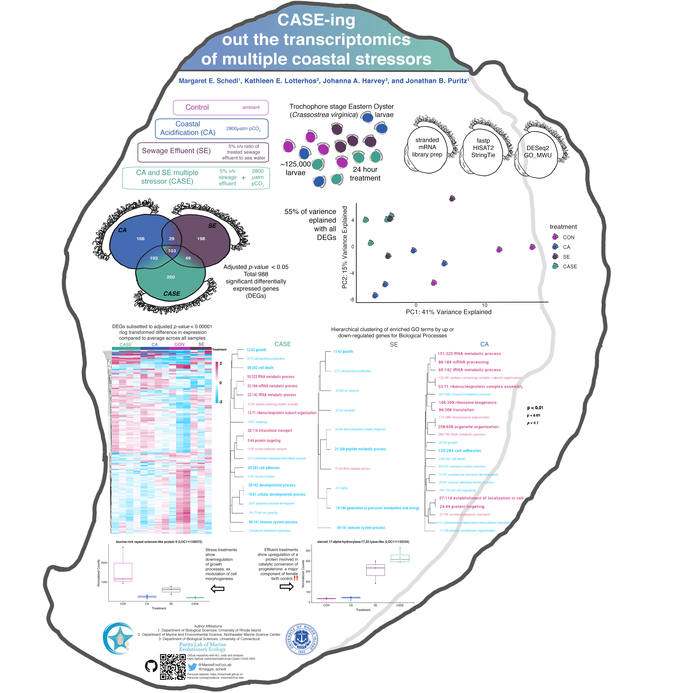
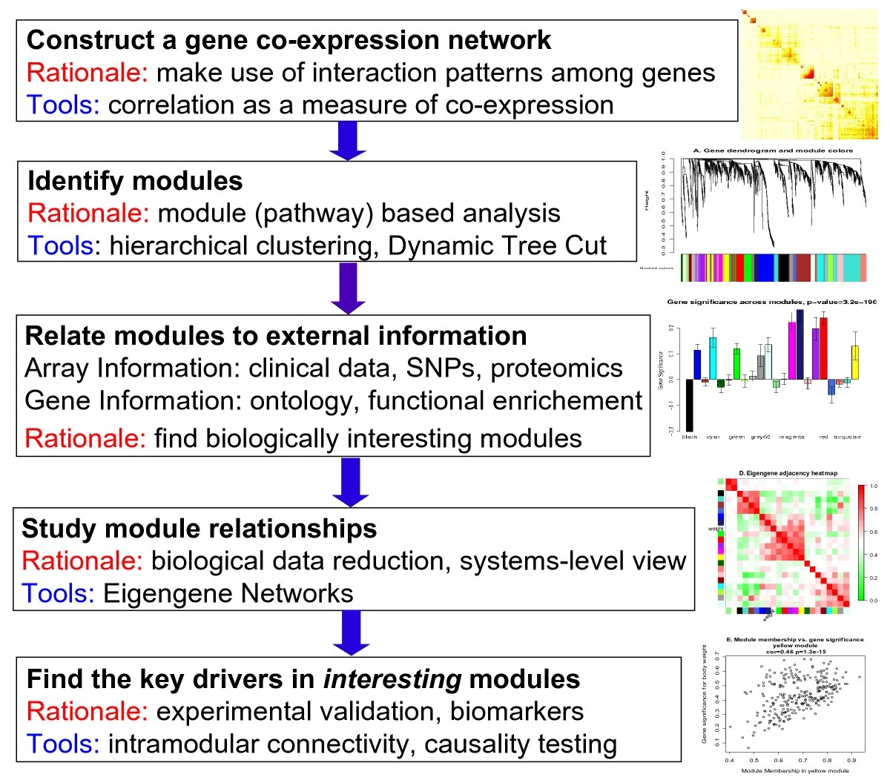

# BIO 594 Bioinformatics Final Project Outline
**Megan Guidry**

## Project Components 
following details pulled from Week 10 ppt

**Final Projects (50%)**
The culmination of this course will be the completion of a final Population Genomics Project. Each student must analyze a NGS data set from raw sequencing files to a completed population level analysis. Students are encouraged to use their own data sets, but students can also use an actual data set of Dr. Puritz or a simulated data set. Projects can be completed on a different computing system or may use software and packages not discussed in the course, but all analyses and results must be documented and repeatable.

**Project Plan and Approval (10 points)**
A detailed outline of the proposed data set and analyses must be submitted and approved by Dr. Puritz by 4/13/22

**Analysis (20 points)**
All bioinformatic are properly completed
Appropriate population genomic analyses are utilized and properly completed

**Documentation (20 points)**
All work must be fully documented and repeatable on the class Github account
This includes markdown style documentation and executable scripts for each analysis component

_________________________________________________________________________________________________

# Project Title: Weighted Gene Co-Expression Network Analysis on Larval Oyster RNASeq Data
For the final project, I will do a weighted gene co-expression network analysis (WGCNA) on an existing, processed RNASeq data set.

## Brief Study Background
This study is focused on how independent and simultaneous stressors impact the function of early life stage oysters. The experiment exposed pools of *Crassostrea virginica* oyster larvae (trocophore stage) to treatment conditions for 24 hours. The treatments included: Control (ambient seawater), Coastal Acidification (2800 µatm pCO2 seawater), Sewage Effluent (5% treated sewage water in seawater), and a combined Coastal Acidification & Sewage Effluent (2800 µatm pCO2 & 5% sewage water seawater). These treatments are abreviated CO, CA, SE, and CASE, respectively. Larval pool subsamples were taken and flash frozen before and immediately following exposure to preserve DNA and RNA. 

The data for this project originate from 1 replicate block of CON, CA, SE and CASE treatments. There are 14 samples (3 CON, 4 CA, 3 SE, 4 CASE). Extracted RNA from this replicate block was with the KAPA Biosystems Stranded mRNA Seq kit and sequenced on one Full HiSeq lane from Novogene. 

## Status of project
The RNASeq processing and inital analysis (QC, filtering, aligning reads to oyster genome, assembling alignments to transcripts, counting transcripts, DESeq2 pipeline, and gene ontology analysis) were completed by Maggie Schedl. That analysis and more detailed project background can be found in [Maggie's Larval-Oyster-CASE-RNA Github repository](https://github.com/mguid73/Larval-Oyster-CASE-RNA). 🙌

### Poster from Evolution Meeting 2019

## Applying a [Weighted Gene Co-Expression Network Analysis (WGCNA)](https://bmcbioinformatics.biomedcentral.com/articles/10.1186/1471-2105-9-559)
This analysis identifies clusters (called modules) of highly correlated genes, describes module characteristics (eigengene values and hub genes), relates modules to each other and sample metadata, and measures strength of module membership. Network correlations like this can be powerful tools to identify potential genes of interest after exposure to stress.

For this project, WGCNA may help to tease out interesting clusters of genes and how they relate to the individual and coupled stress treatments. In this *case* (pun intended), it will be interesting to see the spread of module associations with the two separate stress treatments (CA and SE) and the coupled treatment (CASE). This analysis may reveal synergystic interactions of the coupled stress treatments on select gene clusters that don't appear in the individual stress treatments.

### Basic Workflow

# Project Timeline
section for planning out goals and work flow deadlines

due 5/02/22